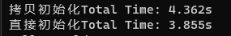
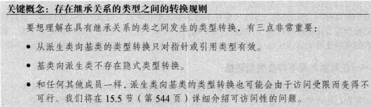
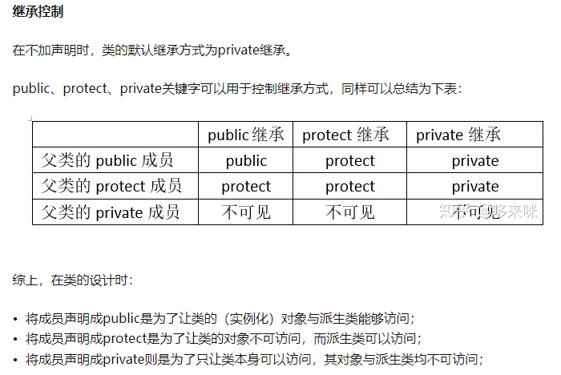

# 第十三章 拷贝控制

拷贝构造函数
拷贝赋值运算符
移动构造函数
移动赋值运算符
析构函数destructor
*Tips:如果一个类需要自定义析构函数，几乎可以肯定它也需要自定义拷贝赋值运算符和拷贝构造函数。*

## 13.1 拷贝构造函数

如果一个构造函数的第一个参数是自身类类型的引用，且任何额外参数都有默认值

```c
class MyEditor()
{
public:
    MyEditor();                 //默认构造函数
    MyEditor(const MyEditor&);  //拷贝构造函数
private:
    string name;
    uint age;
}
```

⭐ 注意：
    变量初始化有两种方式，分别是直接初始化和拷贝初始化。
    如果使用等号（=）初始化一个变量，则执行的是拷贝初始化；不用等号的，则是直接初始化。**相对来讲，直接初始化比拷贝初始化要快。**
    
    ***拷贝初始化一定是通过拷贝构造函数或者移动构造函数，直接初始化也可能通过拷贝构造函数。***
    拷贝初始化不经在使用=定义变量时会发生，在下列情况下也会发生：
    · 将一个对象作为实参传递给一个非引用类型的形参
    · 从一个返回类型为非引用类型的函数返回一个对象
    · 用花括号列表初始化一个数组中的元素或一个聚合类中的成员。

## 13.2 拷贝赋值运算符

是一种运算符重载，赋值运算符通常应该返回一个指向其左侧运算对象的引用。关键字oprator=

```c
MyEditor& MyEditor::oprator=(const MyEditor editor){
    this->age = editor.age;
    this->name = editor.age;
    return *this;
}
```

小结：当没有为类定义拷贝构造函数和拷贝复制运算符时，编译器会自动生成**合成拷贝构造函数**和**合成拷贝复制运算符**，若是想阻止拷贝，可将函数定义为delete函数，即MyEditor(const MyEditor&)=delete；

## 13.3 析构函数

无论何时一个***对象被销毁***，就会自动调用其析构函数

- 变量在离开其作用域时被销毁
- 当一个对象被销毁时，其成员被销毁
- 容器（无论时标准库容器还是数组）被销毁时，其元素被销毁
- 对于动态分配的对象，当对指向它的指针应用delete运算符时被销毁
- 对于临时对象，当创建它的完整表达式结束时被销毁

```c
~MyEditor();
```

若类的成员变量中含有指针，且在类的构造函数中，为该指针动态分配了内存，则需要在析构函数中delete掉该指针，防止内存泄露。

## 13.4 移动构造函数

右值引用的主要应用就是重载了移动构造函数，利用了将亡值，将将亡值的空间内容交换到要拷贝的对象中。减少了深拷贝。
移动构造函数首先将传递参数的内存地址空间接管，然后将内部所有指针设置为nullptr，并且在原地址上进行新对象的构造，最后调用原对象的的析构函数，这样做既不会产生额外的拷贝开销，也不会给新对象分配内存空间。即提高程序的执行效率，节省内存消耗。
当返回值是一个局部变量时，会调用该对象的移动构造函数。

```c
Base(const Base&& base){
    this->ptr = base->ptr;
    base->ptr = nullprt;
};
```

应用实例：

```c
Base(Base&& base) {
        this->arr = base.arr;
        base.arr=nullptr;
        std::cout << "调用一次移动拷贝函数" << std::endl;
    }
Base getBase() {
    Base base(1000);//此处base是一个局部变量，是一个将亡值，在return之后会销毁
    return base;
}  
int main(){
    Base base8(getBase());//此处调用了Base的移动构造函数，将右值引用传递给base8
}
```

## 13.5 移动赋值运算符

完成和移动构造函数一样的功能

```c
Base& operator=(Base&& base) {
        this->arr = base.arr;
        std::cout << "调用一次移动赋值运算" << std::endl;
        return *this;
    }
int main(){
    Base base8；
    base8 = getBase();//此处调用了Base的移动构造函数，将右值引用传递给base8
}   
```

# 第十五章 面向对象程序设计  
## 15.1 OOP概述  
⭐面向对象程序设计：object-oriented programming, oop，核心思想是数据抽象、继承和动态绑定。  
⭐继承：派生类可以继承基类的成员与函数，也可以重写自己的函数覆盖基类的函数。  
⭐下文笔记顺序：普通继承->类型转换与继承->虚函数->动态绑定->多态  

## 15.2 普通继承：即派生类可以使用基类的成员以及函数
⭐定义基类：
```c++
class Graphic{
public:
    Graphic()=default;
    double GetAera();
    double GetVolume();
public:
    unsigned sides;
    unsigned angles;
    bool isRegular;
}  
```  
⭐定义派生类：
```c++
class Triangle: public Graphic{
public:
    Triangle()=default;
}
```  
## 15.3 类型转换与继承  
⭐静态类型与动态类型：一个表达式的静态类型在编译时总是已知的，它是变量声明时的类型或表达式生成的类型；动态类型则是变量或表达式表示的内存中的对象的类型。例：Base *p = new Derived ()；  //指针p的静态类型是Base，而动态类型是Derived
**注：只有指针或者引用才会出现静态类型与动态类型不一致的情况。**  
⭐类型转换(派生类转换为基类)  
  
``Graphic* p = new Triangle();		//派生类转换为基类``
``Base *p = new Derived ()；      //派生类转换为基类``  
## 15.4 虚函数
⭐为什么要有虚函数
父类中不能调用子类的函数
https://www.jianshu.com/p/d07e0ac0ba3c  
⭐虚函数是virtual关键字修饰的成员函数，在某基类中声明为virtual并在一个或多个派生类中被重新定义的成员函数，只需要在声明的时候加virtual，例：  
```c++

class Graphic {
public:
	Graphic() = default;
	virtual std::string GetType(){ return "Graphic";}
};
class Triangle：public Graphic
{
public:
	Triangle() = default;
	std::string GetType(){ return "Triangle";}
};

int main()
{
	Graphic *p = new Triangle();        //派生类转换为基类
	cout<<p->GetType()<<endl;         //此时打印Triangle
	
	return 0;
}
```

⭐回避虚函数的机制：使用**作用域运算符**，Graphic::GetType();  
⭐**纯虚函数**：声明虚函数的时候令函数体=0，只能出现在类内部的虚函数声明语句处。  
``virtual void display()=0;  ``
⭐含有纯虚函数的类是抽象基类，不能创建抽象基类的对象， 此基类只能是一个接口，用于被继承，在子类中需要重写虚函数。  

## 15.5 动态绑定  
⭐动态绑定是在**运行期间**发生的绑定，发生动态绑定的函数的运行版本由**传入的实际参数类型**决定，在运行时选择函数的版本(**选择是基类的版本还是派生类的版本**)，所以动态绑定又称运行时绑定，动态绑定是C++的多态实现的一种形式。**在C++中，当使用基类的引用或指针调用一个虚函数时将发生动态绑定**。  
⭐如上15.4的例子，指针p在运行时选择用new Triangle所决定的版本，因此发生动态绑定。  

## 15.6 多态  
⭐使用基类引用或指针的静态类型与动态类型不同这一事实正是C++语言支持多态性的根本所在。  
⭐调用成员函数时，会根据调用函数的对象的类型来执行不同的函数。  

## 15.7 访问控制与继承  
  

# 第十六章 模板与泛型编程

模板——是一段带有类型参数的程序代码，可以通过给这些参数提供一些类型来得到针对不同类型的具体代码。
模板是规则，通过模板可以演化出多个具体的类或函数。

## 16.1 函数模板

注意：模板的声明和定义只能放在全局，命名空间或者类范围内进行，即不能在局部范围或者函数内部进行，比如不能在main函数中声明和定义一个模板。
模板定义以关键字template开始，后跟一个模板参数列表。

- 函数模板定义

```c
template <typename T>
int compare(const T &v1, const T &v2){
    if(v1 < v2)
        return -1;
    if(v2<v1)
        return 1;
    return 0;
}
template <Typename T1,Typename T2>
int add(const T1& v1,const T2& v2){
     if(v1 < v2)
        return -1;
    if(v2<v1)
        return 1;
    return 0;
}
```

- 函数模板实例化

```c
// 1.隐式实例化——根据函数调用时传入的数据类型，推演出模板形参类型
std::cout<<compare(1,0)<<std::endl;
// 2.显式实例化——通过显式声明形式指定模板参数类型，调用函数时会自动将参数转换为指定类型
template int compare<int>(int,int);     // 显示实例化的语法声明
cout<<compare<int>(1,2.4);  // 实际在调用的时候比较的是1和2
```

注意：
1.不提供隐式类型转换，必须是严格匹配。
2.函数模板和类模板成员函数的定义通常放在头文件中。
3.函数模板和普通函数构成重载时，调用规则如下：
```c
template<typename T>
void sum(T a,T b){
    cout<<"模板函数(2)"<<a+b<<endl;
}

template<typename T>
void sum(T a,T b,T c){
    cout<<"模板函数(3)"<<a+b+c<<endl;
}

void sum(int a,int c){
    cout<<"普通函数"<<a+c<<endl;
}

void Test(){
    sum(1,2);			//当函数模板和普通函数参数都符合时，优先选择普通函数
    sum<>(1,2);			//若显示使用模板函数，则使用<>类型列表
    sum(3.0,4.2);		//如果函数模板产生更好的匹配，则使用函数模板
    sum(5.0,6.5,8.2);	//只有一个合适
    sum('a',12);		//调用普通函数，可以隐式类型转换
}

```

## 16.2 类模板

类模板是对成员数据类型不同的类的抽象。

- 类模板定义

```c
// 模板的参数类型定义写在类的定义之前，在类里的任意位置都可以使用
template<typename T>
class Display
{
public:
	Display(T val) :_value(val){}
	void display(){
		cout << _value << endl;
	}
private:
	T _value;
};
```

- 类模板实例化
```c
Display<string> d("hello world");
d.display();
```
- 类模板中的成员函数同样可以在类模板的定义之外定义：
语法如下
```c
template<模板形参表>
函数返回类型 类名<模板形参名>::函数名（参数列表）｛｝
```
```c
template<typename T>   //类模板
class Array
{
private:
	int size;
	T* ptr;
public:
	Array(T arr[], int s);   //构造函数
	void show();
};
template<typename T>   //类模板外定义其成员函数
Array<T>::Array(T arr[], int s){
	ptr = new T[s];
	size = s;
	for (int i = 0; i < size; i++){
		ptr[i] = arr[i];
	}
}
template<typename T>   //类模板外定义其成员函数
void Array<T>::show(){
	for (int i = 0; i < size; i++)
		cout << *(ptr + i) << " ";
	cout << endl;
}
```

# 第十八章 异常处理
异常处理(exception handing)机制允许程序中独立开发的部分能够在运行时就出现的问题进行通信并作出相应的处理。
## 18.1 抛出异常
一个异常如果没有被捕获，则它将终止当前的程序。
通过throw操作创建一个异常对象并抛掷
```c
void OpenFile(){
    std::string path = "D:\\test.txt";
    std::ifstream fin;
    fin.open(path, std::ios::in);
    if (!fin.is_open())
    {
        throw "ERROR:Open file failed!";
    }
    fin.close();
}
```

## 18.2 捕获异常
1.在需要捕捉异常的地方，将可能抛出异常的程序段嵌在try块之中；
2.按正常的程序顺序执行到达try语句，然后执行try块{}内的保护段;
3.如果在保护段执行期间没有引起异常，那么跟在try块后的catch子句就不执行，程序从try块后跟随的最后一个catch子句后面的语句继续执行下去
4.throw抛出的异常类型与catch抓取的异常类型要一致；
5.使用catch(...)可以捕获所有类型的异常
```c
int main(){
    try {
        OpenFile();
    }
    catch (const char* msg) {
        std::cerr << msg << std::endl;
    }
    catch (const int err){
        std::cerr << "Error code:"<< err << std::endl;
    }
    catch (...){        // 可以捕获所有异常
        std::cerr << "ERROR!" << std::endl;
    }
    return 0;
}
```

## 18.3 代码示例（使用C++的Exception类及自己定义的异常类）
```c
#include<iostream>
#include<exception>
using namespace std;

const string errorCode = "I don't like this number.";

// 定义自己的异常处理类
class MyException : public logic_error {
public:
    explicit MyException(const string& s = errorCode) :logic_error(s) {}
};

int main() {
    int input;
    while (1) {
        try {
            cout << "Please type in a number between 1 and 100." << endl;
            cin >> input;
            if (!cin.good()) {
                cin.clear();
                cin.ignore();
                throw invalid_argument("The input should be a number!");
            }
            if (input >= 100)
                throw length_error("The input should be less than 100!");
            if (input < 0)
                throw out_of_range("The input should be Non-negative number!");
            if (input == 44)
                throw MyException();
            cout << "Your input is " << input << ". there isn't error\n";
        }
        catch (invalid_argument e) {
            cout << "*********************************" << endl;
            cout << "There is an invalid argument error occured" << endl;
            cout << "info:" << e.what() << endl;
            cout << "*********************************" << endl;
        }
        catch (length_error e) {
            cout << "*********************************" << endl;
            cout << "There is a length error occured" << endl;
            cout << "info:" << e.what() << endl;
            cout << "*********************************" << endl;
        }
        catch (out_of_range e) {
            cout << "*********************************" << endl;
            cout << "There is an out of range error occured" << endl;
            cout << "info:" << e.what() << endl;
            cout << "*********************************" << endl;
        }
        catch (MyException e) {
            cout << "*********************************" << endl;
            cout << "There is an error occured" << endl;
            cout << "info:" << e.what() << endl;
            cout << "*********************************" << endl;
        }
        catch (exception e) {
            cout << "*********************************" << endl;
            cout << "There is an undefined error occured" << endl;
            cout << "info:" << e.what() << endl;
            cout << "*********************************" << endl;
        }
        cout << endl;
    }
    return 0;
}
```