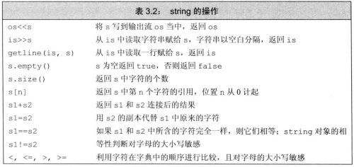
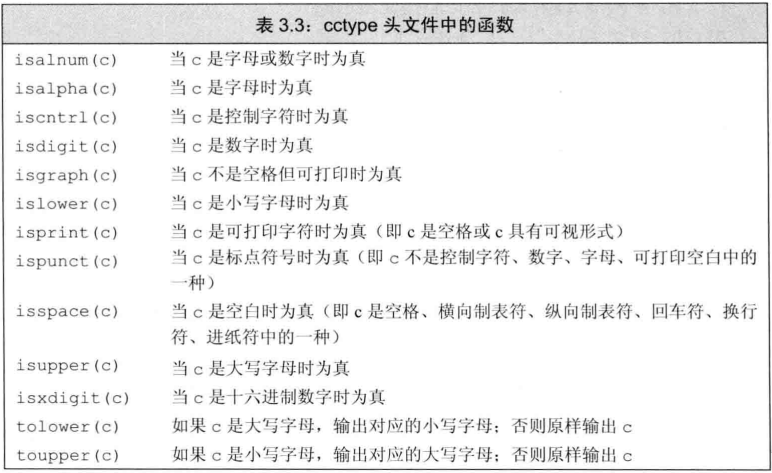
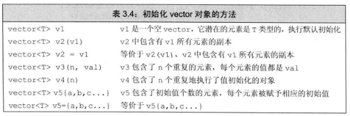
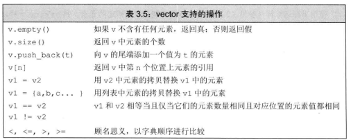
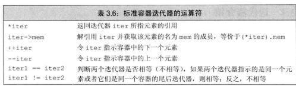
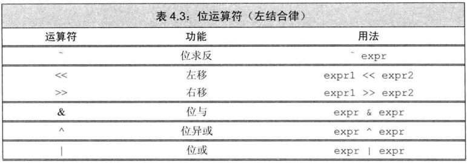
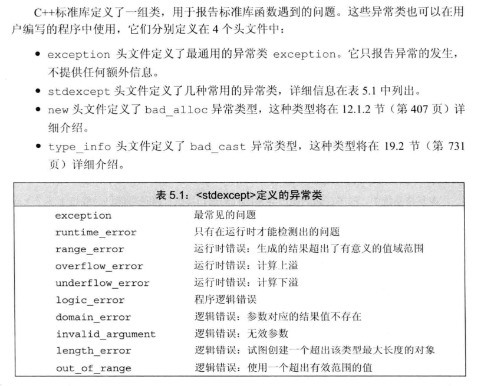
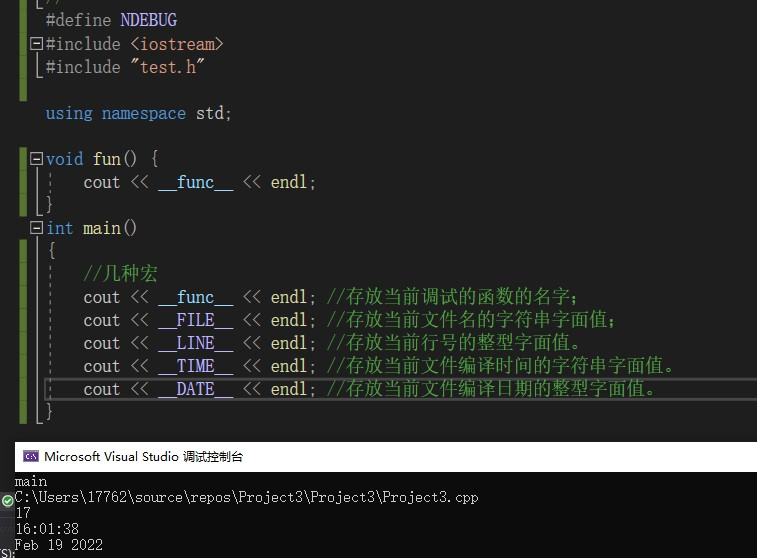

# 第二章 变量和基本类型  
## 2.1 基本内置类型  
⭐当我们赋给无符号类型一个超出它表示范围的值时，结果是初始值对无符号类型标识总数取模后的余数。  
⭐字符串""的结尾有一个空字符'\0'，比如"Hello World"的实际长度是12，而不是11。  
## 2.2 变量  
⭐**初始化不是赋值，初始化的含义是创建变量时赋予其一个初始值，而赋值的含义是把对象的当前值擦除，而以一个新的值来替代。**
⭐变量的声明(需要加extern)，使得名字为程序所知，而定义负责创建与名字关联的实体。  
```c++
extern int i;   //声明i而非定义i
int j;          //声明并定义j，变量能且只能被定义一次，但是可以被多次声明  
```  
## 2.3 复合类型  
⭐引用：&d的形式出现，引用即别名，需跟对象绑定在一起，int &r=i;//r是i的另外一个名字，引用必须被初始化为某个对象，但是引用并非对象。  
⭐指针：*d的形式出现，指针本身也是一个对象，int *p;//p是一个指向int型对象的指针，无须在定义时赋初值。  
⭐无类型指针void * 是一种特殊的指针类型，可用于存放任意对象的地址。  
⭐int *p;而不是int* p；  int *p1,p2;//p1是int指针，p2是int变量  
⭐int *p;  int *&r=p;  //若要理解此时r是什么，从r开始从右往左读，&r表示r是一个引用，int*表示引用的的目标是int*类型(即一个指针)。  **为什么需要指针的引用，这种语法常用于需要直接修改外部指针的场景（如函数参数传递），避免了二级指针的复杂性**  
## 2.4 const限定符  
⭐const对象必须初始化。  
⭐不能通过常量引用改变被引用的值(**常量引用的语义是"只读别名"**)，但是对被引用的值没有影响。
```c++
int i=0;
int &r1=i；
const int &r2=i;
r1 =5;      //则此时i=5，r2=5
r2 =10;     //非法
```  
⭐常量指针：double *const p=&r；//p本身是一个常量指针，指向一个double对象  
⭐指向常量的指针：const double *p=&r；//p指向一个常量对象，不能通过p改变对象的值  
⭐指向常量的常量指针：const double *const p=&r；//p指向一个常量对象，不能通过p改变对象的值  
⭐  
顶层const：本身是个const，本身不能改变；如果指向的是个const，则俩都不能改变；如果指向的是个普通变量，则可以通过控制自己改变被指向的对象的值。  
底层const：本身不是个const，指向的或者引用的是个const，不能通过自己改变被引用或者指向的值。  
⭐常量表达式：值不会改变并且在编译过程中就能得到计算结果的表达式。  
⭐constexpr 声明中如果定义了一个指针，则限定符constexpr仅对指针有效。  
且constexpr指针的初始值必须是nullptr或者0，或者是存储于某个固定地址中的对象（比如函数（包括main）之外的对象或者函数内的局部静态对象）。  
## 2.5 处理类型  
⭐typedef double dl;    //给double取一个别名dl  
using dl=double;        //同理  
⭐auto类型说明符：编译器替我们分析表达式的类型，auto i=5;//则i是int类型  
auto碰上引用时，会指定被引用的对象作为推断的数据类型；  
auto 一般会忽略掉顶层const，同时底层const则会保留下来。  
```c++
const int ci = i, &cr = ci;//ci是一个常量，cr是一个常量引用
auto b = ci; //b是一个整数（ci的顶层const特性被忽略掉了）
auto c = cr; //c是一个整数
auto d = &i; //d是一个整型指针，整数的地址就是指向整数的指针
auto e = &ci; //e是一个指向整数常量的指针，相当于const int *e=&ci；，对常量对象取地址是一种底层const  
```  
⭐decltype类型说明符：编译器替我们取得表达式的返回类型，decltype(fun()) i=5;//则i是fun()的返回类型  
decltype处理顶层const和引用的方式跟auto不同，如果decltype使用的表达式是一个变量，则decltype返回该变量的类型（包括顶层const和引用在内）  
！！！只有用在decltype处的时候，引用才不会作为其所指对象的同义词出现。  
如果表达式的内容是解引用操作，则decltype将得到引用类型！！  
如果给表达式外层套上一层或多层括号，则一定会得到引用类型。decltype((value))  
## 2.6 自定义数据结构  
⭐struct Sales {/*   */};
⭐typedef struct SALES_BOOK {/* */}BOOK;//定义一个结构体 SALES_BOOK，同时起另外一个名字BOOK
⭐头文件保护头：
```c++
#ifndef SALES_ITEM_H
#define SALES_ITEM_H
/*

*/
#endif //SALES_ITEM_H
```  


# 第三章 字符串、向量和数组  
## 3.1 命名空间的using声明  
``using namaspace std;``  
## 3.2 标准库类型string  
  
⭐标准输入的内容读取到string的时候，自动忽略开头的空白。  
⭐
```c++
string line；
while(getline(cin,line))        //getline(cin,line);//读取一整行到line中
	if(!line.empty())
	    cout<<line<<endl;
```  
⭐string::size_type类型，例如size_type length=line.size();
⭐string类型相加时，把多个串在一起，但是必须确保每个加法运算符（+），的两侧的运算对象至少有一个是string。  
例如：string str = "Hello"+"world";     //是错误的，不能把两个字符串字面值直接相加。  
⭐处理string对象中的字符：  
  
(1)处理每个字符时用for关键字(即遍历所有字符)  
使用“范围for”语句  
```c++
for(declaration:expression)
    statement
```  

例子：  
①字符不需要改变时：  
```c++
string str("there is some strings!!!!");
decltype(str.size()) punct_cnt = 0; // 标点符号计数
for(auto c : str)
    if(ispunct(c))//判断每个字符是不是标点符号
       ++punct_cnt;//计数+1
cout<<punct_cnt<<endl;
```  

②字符需要改变时(要取引用)：  
```c++
string str("there is some strings!!!!");
for(auto &c : str) //循环变量定义成引用类型
    c.toupper(c);//变成大写字符
```  

(2)非处理每个字符时，即不需要遍历  
下标运算符[\]：[\]内的参数是string::size_type类型，下标不能越界！！！  
迭代器  
⭐逻辑与运算符&&：只有当左侧运算对象为真时才会检查右侧运算对象的情况。  
## 3.3 标准库类型vector  
⭐初始化vector的一些方法：  
  
⭐**WARNING:如果循环体内部包含有向vector对象添加元素的语句，则不能使用范围for循环，范围for语句体内不应改变其所遍历序列的大小。**  
⭐类似string的size()返回的是string::size_type，vector的size()返回的类型也是vector<T> ::size_type，本质上都是unsigned int  
⭐vector的一些重要操作：  
  
⭐vector不能用下标形式添加元素，也不能下标越界。  
## 3.4 迭代器介绍  
⭐有效的迭代器指向某个元素；或者指向容器中尾元素的下一位置（尾后迭代器）。  
⭐基本运算符:  
  
⭐迭代器类型为iterator，如果对象是常量，则是const_iterator  
⭐解引用迭代器所指对象 *it ，箭头运算符->把解引用和成员访问两个操作结合在一起。it -> mem相当于(*it).mem  
⭐使用例子：  
```c++
for(auto it = text.begin(); it != text.end(); ++it)
{
    cout<<*it<<endl;
}
```  
⭐**使用了迭代器的循环体，不可添加元素。**  
⭐两个迭代器相减，类型为difference_type  
## 3.5 数组  
⭐存放类型相同的对象的容器，大小不变，不允许使用一个数组对另一个数组进行拷贝和赋值。  
⭐理解数组声明的时候，应从数组的名字开始按照由内而外的顺序阅读。  
⭐在大多数表达式中，使用数组类型的对象其实是使用一个指向该数组首元素的指针。  
⭐标准库函数begin和end：使用语法跟vector以及string不同，如下：  
```c++
//实现数组遍历
int *beg = begin(arr),*last = end(arr);
while(beg!=last && *beg>=0)
    ++beg;
```  
也可以使用范围for循环进行遍历，类似vector，string  
⭐混用string对象和C风格字符串：  
```c++
string s = "Hello World";
char *str = s;              //错误，不能用string对象初始化char* 
const char *str = s.c_str();//正确，c_str()函数的返回值是一个C风格的字符串
```  
⭐使用数组初始化vector对象：
```c++
int arr[] = {0,1,2,3,4,5};
vector<int> ivec(begin(arr), end(arr) );//用数组初始化vector
```  
## 3.6 多维数组  
⭐多维数组就是数组的数组。  
⭐**使用范围for语句处理多维数组时，除了最内层的循环外，其他所有循环的控制变量都应该是引用类型。如果外层循环的控制变量不使用引用（如 auto row），C++ 会触发数组到指针的隐式退化，内层数组从数组退化到指针 col[]->row\***
```c++
for(auto &row : arr)
    for(auto col : row)
        cout<<col<<endl;
```  

# 第四章 表达式  
## 4.1 基础  
⭐拿不准求值顺序的时候最好使用括号来强制让表达式的组合关系符合程序逻辑的要求。  
## 4.2 算数运算符  
⭐ + - * / %  
## 4.3 逻辑和关系运算符  
⭐ 短路求值策略：逻辑与&&和逻辑或||都是当且仅当左侧运算对象无法确定表达式的结果时才会计算右侧运算对象的值。  
  --对于逻辑与运算符来说，当且仅当左侧运算对象为真时才对右侧运算对象求值。  
  --对于逻辑或运算符来说，当且仅当左侧运算对象为假时才对右侧运算对象求值。  
## 4.4 赋值运算符  
## 4.5 递增和递减运算符
⭐尽量用前置版本的递增递减  ++i/--i  
## 4.6 成员访问运算符  
⭐点运算符point.x   箭头运算符point->x   ptr->mem 等价于(*ptr).mem  
## 4.7 条件运算符  
⭐cond?expr1:expr2  
```c++
string str = (grade>60)?"success":"fail"
```  
## 4.8 位运算符  
  
+ 位与：运算规则是如果两数对应的二进制位都为 1，那么结果为 1， 否则结果为 0。  
+ 位或：运算规则是如果两数对应的二进制位有一个为 1，那么结果为 1， 否则结果为 0。  
+ 位异或：运算规则是如果两数对应的二进制位不同，那么结果为 1， 否则结果为 0。  
+ 位求反：运算规则是所有的二进制位取反。  
+ 左移<<：功能是把运算符 << 左边的运算数的各二进制位全部左移若干位，高位丢弃，低位补 0。  
+ 右移>>：功能是把运算符 >> 左边的运算数的各二进制位全部右移若干位。  
## 4.9 sizeof运算符  
⭐返回一条表达式或一个类型名字所占的字节数，单位是B。
⭐**对指针执行sizeof运算得到指针本身所占空间的大小，而不是指针所指向的对象或数据的大小。**  
## 4.10 逗号运算符  
⭐二目运算符，先对左侧的求值之后，丢弃求值结果，取右侧的表达式的值。
例:
```c++
for(int i=0,j=0;i<5,j<8;++i,++j)
{
	cout<<i<<"    "<<j<<endl;
}
/*输出结果是
0  0
1  1
2  2
3  3
4  4
5  5
6  6
7  7
会按照j<8（也就是后者）作为判断条件*/
```  
## 4.11 类型转换  
⭐显示转换：  
``cast_name<type>(expression)``  
cast_name有几种形式：**static_cast**、**dynamic_cast**、**const_cast**、**reinterpret_cast**  
⭐**static_cast**:任何具有明确定义的类型转换，只要不包含底层const，都可以使用static_cast。  
``double slope = static_cast<double>(j);``  
⭐**const_cast**:只能改变运算对象的底层const，去掉const性质，是指让自己所指向的对象不再是const常量，不能改变表达式的类型。  
⭐**dynamic_cast**:将基类的指针或引用安全地转换成派生类的指针或引用。  
当父类指针实际指向子类对象时，则dynamic_cast将会成功：  
```c++
Son s；
Base*base = &s;//父类指针实际指向子类对象
Son *son = dynamic_cast<Son*>(base)//成功，此时son可以正常使用
```  
当父类指针实际指向父类对象时，则dynamic_cast将会失败，返回NULL值：
```c++
Base b；
Base*base = &b;//父类指针实际指向子类对象
Son *son = dynamic_cast<Son*>(base)//失败，此时son为NULL
```  
因此可以通过dynamic_cast来判断是否转化成功，以此规避不必要的错误。  

⭐ reinterpret_cast:没看懂，少用。  


# 第五章 语句  
⭐case标签必须是整型常量表达式（const  宏  数值等）  
⭐for循环中的定义可以定义多个对象，但是必须是同一类型；  
⭐跳转语句：  
break：终止最近的循环体。  
continue：跳过本次循环，进行下一次循环。  
⭐goto 语句：（尽量不在程序中使用goto语句）  
```c++
Goto label；
*******
*******
label：
    return；
```

⭐异常处理：try语句写正常语句，throw用来抛出异常，catch用来进行异常处理
使用方法：
```c++
#include <iostream>
#include <stdexcept> // 包含标准异常类

int main() {
    int number;

    std::cout << "请输入一个正整数: ";
    std::cin >> number;

    try {
        // 检查输入是否为负数
        if (number < 0) {
            // 抛出一个异常，使用标准异常类 std::invalid_argument
            throw std::invalid_argument("输入的数字不能是负数！");
        }

        // 如果输入合法，输出结果
        std::cout << "你输入的数字是: " << number << std::endl;
    }
    catch (const std::invalid_argument& e) {
        // 捕获并处理异常
        std::cerr << "错误: " << e.what() << std::endl;
    }
    catch (...) {
        // 捕获所有其他类型的异常
        std::cerr << "发生了未知错误！" << std::endl;
    }

    std::cout << "程序继续执行..." << std::endl;
    return 0;
}
```

异常类  
  

# 第六章 函数(ps:引用数组形参指针没看懂)  
## 6.1 函数基础  
⭐函数的返回类型不能是数组类型或者函数类型，但是可以是指向数组或者函数的指针。
⭐局部静态对象在程序的执行路径第一次经过对象定义语句时初始化，并且直到程序终止才被销毁，在此期间即使对象所在的函数结束执行也不会对它有影响。  
⭐函数的声明可以无需形参的名字，例如:  
``int add(int, int);`` 一般还是加上好  
⭐**含有函数声明的头文件应该被包含到定义函数的源文件中。(一一对应)**  
## 6.2 参数传递  
⭐值传递(不能改变实参的值)：  
```c++
int add(int a,int b){
    return a+b;
    }；
int a=5,b=7;  
add(a,b);       //结果：a=5 b=7
```  
⭐引用传递(可以改变实参的值)：  
```c++
int add(int &a, int &b){ 
    a+=1; b+=2; 
    return a+b;
    }  
int a=5,b=7; 
add(a,b);       //结果：a=6 b=9
```  
⭐**在C++语言中，建议使用引用类型的形参替代指针**。  
⭐尽量使用常量引用而非普通引用，  
例如find_char(const string &str){}，这样可以传入常量实参(包括字面值Hello World与const对象)与非常量实参；  
如果是string &str ，则只能传入非常量实参。  
指针同上。  
⭐程序主函数形参传入：  
```c++
int main(int argc, char *argv[]){
//argc表示参数数组中字符串的数量，argv数组是字符串参数数组，argv[0]保存程序的名字，argv[1:n]表示程序的输入。
};
```  
## 6.3 返回类型和return语句  
⭐函数的返回类型决定函数调用是否是左值。  
如果调用一个返回值为引用的函数，则得到左值（可以理解为左值是能够放在等号左边的），其他类型得到右值。
有意思的是，能为返回类型是非常量引用的函数的结果赋值。  
```c++
char& get_val(string& str, string::size_type ix)
{
	return str[ix];
}
int main()
{
	std::string s("abcd");
	get_val(s, 0) = 'A';//此时s变为"Abcd"，s[0]从变成A
	return 0;
}
```  
## 6.4 函数重载  
⭐ 同一作用域内的几个函数名字相同但形参列表不同，则称为重载函数。  
⭐在C++语言中，名字查找发生在类型检查之前。  
## 6.5 特殊用途语言特性  
⭐默认实参：  
```c++
string screen(int ht=24,int wid = 80,char background = ' ');//声明函数的时候给每一个形参都赋予了默认实参
```  
**需要注意的是：一旦某个形参被赋予了默认值，他后面的所有形参都必须有默认值，也就是有默认值的形参都靠后写。**  
**通常是将默认形参写在函数的声明内，写在头文件内(有的话)。**  
⭐用于调试：
(1)assert:预处理宏，需要使用的话需要包含一下头文件
```c++
#include <cassert>
assert(exp);  
```  
(2)NDEBUG:预处理变量，定义此变量后，assert将失效。  
(3)预处理器定义的几种程序调试工具：  
```c++
_ _func_ _ ： //存放当前调试的函数的名字；
_ _FILE_ _ ：//存放当前文件名的字符串字面值；
_ _LINE_ _：//存放当前行号的整型字面值。
_ _TIME_ _ ： //存放当前文件编译时间的字符串字面值。
_ _DATE_ _ ： //存放当前文件编译日期的整型字面值。
```  
使用示例：
  
## 6.7 函数指针  
⭐二刷函数指针：函数指针一般用于回调，例如信号处理，libcurl等会应用到回调。回调是比较常用的技术，而回调就要涉及函数指针。
1.函数指针概述  
函数指针指向的是函数而非对象，函数指针指向某种特定类型，**被指向函数的类型由它的返回类型和形参类型共同决定**，与函数名无关，也就是说函数指针的要素有两个，**一个是函数的返回类型，一个是函数的形参列表**！！！  
2.函数指针的声明  
类型名 (*指针名)(指向的函数的形参列表);  
例如：  
```c++
int (*p)(const int,const int);
```  
3.函数指针的使用  
```c++
// 定义一个普通函数
int Add(const int a,const int b){
	return a+b;
}

// 定义函数指针并赋值
int (*ptr)(const int,const int);        // 函数指针的声明，ptr是一个指向某函数(返回类型为int 形参为[const int, const int])的指针
ptr=&Add;                               // 函数指针的赋值，使用p=Add也是可以的

// 函数指针的使用
(*ptr)(5,7);                                      // 也可以是ptr(5,7)，都等价于Add(5,7);
```  

4.重载函数的指针  
```c++
// 有两个重载函数
int Add(const int a, const int b);
int Add(const unsigned int a, const unsigned int b);

// 定义相对应的函数指针
int (*ptr1)(const int, const int);
int (*ptr2)(const unsigned int, const unsigned int);

// 检验赋值的正确性
int (*ptr1)(const int, const int) = &Add;                        // 正确
int (*ptr1)(const double, const double) = &Add;                  // 错误，没有任何一个Add与该形参列表匹配
double (*ptr2)(const unsigned int, const unsigned int) = &Add;   // 错误，Add和ptr2的返回类型不匹配
```  
5.函数指针形参
函数类型本来不可作为形参，但是可以是指向函数的函数指针。  
```c++
// 函数指针作为形参
int operateFun(const int a, const int b, int (*ptr)(const int, const int)){
	return ptr(a,b);
}
// 调用该函数
int (*ptr)(const int, const int)=&Add;
std::cout<<operateFun(5,7,ptr)<<std::endl;         // 输出为12
```  
⭐ps:在operatFunc中的形参中直接使用函数指针显得冗长而烦琐，可以使用类型别名来简化  
示例如下：  
```c++
//定义一个函数指针，指向的函数具有如下特征——1.返回类型为int 2.形参是(const int, const int)
typedef int (*Func_ptr)(const int, const int);        //为该函数指针起一个别名，Func_ptr
Func_ptr ptr=&Add;
int operateFun(const int a, const int b, Func_ptr ptr){
	return ptr(a,b);
}
```  
6.回调函数使用示例  
A作为一个底层库的类，写好了Start用以注册回调函数。  
B作为应用的一个类，使用了A的一个对象作为成员变量， 需要调用excute来调用a的注册函数，并把printMsg的函数指针塞给a的注册函数，于是a就立刻调用B的printMsg来打印消息。  
整个过程中，printMsg成为回调函数。  
⭐testForCallback.h  
```c++
#pragma
#include <stdio.h>
template<typename T>
class A {
public:
	typedef unsigned int(T::* CallBackFun)();       //定义一个名为 CallBackFun 的类型，表示指向 T 类成员函数的指针，T::*：表示该指针属于类 T 的成员
	A();
	~A();

public:
	void Start(T*, CallBackFun);		// 设置回调函数
};

template<typename T>
A<T>::A() {

}

template<typename T>
A<T>::~A() {

}

template<typename T>
void A<T>::Start(T* pObject, CallBackFun fun) {
	(pObject->*fun)();		// 调用回调函数
}


class B {
public:
	B();
	~B();

public:
	A<B> a;
	unsigned int printMsg();
	void excute();
};


B::B() {

}
B::~B() {

}

unsigned int B::printMsg() {
	printf("This is a print fun called by B.\n");
	return 0;
}

void B::excute() {
	printf("A callback B::prinrMsg.\n");
	a.Start(this, &B::printMsg);
}
```  
⭐main.cpp
```c++
#include <iostream>
#include "testForCallback.h"
int main() { 
    B b;
    b.excute();
    return 0;
}
```  

# 第七章 类(ps:7.3 7.4 7.5看的很粗略)  
## 7.0 类的基础知识  
⭐类的构造函数：
1）默认构造函数  
编译器在发现类没有任何的构造函数的情况下替我们生成一个默认的构造函数。   
2）一般构造函数  
```c++
//内部赋值构造函数  
Student::Student(std::string name,unsigned int age)
{
    this->m_name = name;
    this->m_age = age;
}
//初始化列表构造函数（用括号内的变量给括号外的赋值）
Student(std::string name, unsigned int age) :m_name(name), m_age(age) {}
3）拷贝构造函数（用已有的对象给新对象构造）
Student::Student(Student& s)
{
    this->m_name = s.m_name;
    this->m_age = s.m_age;
	}
```  
⭐类的析构函数：  
```c++
Student::~Student(){}  
```  
## 7.1 定义抽象数据类型  
⭐内联函数：(一般放置在头文件中)  
``inline const string shorterString(const string &s1, const string &s2)[ return s1.size()<=s2.size()?s1:s2;} `` 
⭐**类的基本思想是数据抽象和封装**。  
⭐this：成员函数通过一个名为this的额外的隐式参数来访问调用它的那个对象。
this是一个常量指针（顶层const）
使用示例：  
``string isbn(){return this->bookNo};``  
⭐const成员函数：  
```c++
std::string isbn()const{return this->bookNo};
```  
紧跟在参数列表后面的const表示this是一个指向常量的指针，此const具有底层const作用。
像这样使用const的成员函数被称为常量成员函数。  
## 7.2 访问控制与封装  
⭐访问说明符：（默认情况下是private）  
+ public:在程序中类的外部也是可以访问的。  
+ private:可以被该类中的成员函数、友元函数访问，其他不可以。  
+ protected:可以被该类中的成员函数、子类的成员函数以及其友元函数访问，但不能被该类的对象访问。  
⭐友元：  
在本类中添加自己的友元类或者友元函数，使其他函数或者类可以访问自己的私有变量成员。  
``friend add(const Sales_data&,const Sales_data&);//友元声明  ``  
## 7.6 类的静态成员  
⭐类的静态成员数据：用 static 关键字来把类成员定义为静态的。当我们声明类的成员为静态时，这意味着无论创建多少个类的对象，静态成员都只有一个副本。static int age;  
不能把静态成员的初始化放置在类的定义中，一种特殊情况是static constexpr int period = 30;    
一般在类的外部使用范围解析运算符::来重新声明并初始化，此时不能重复加static，如：  
```c++
class Student
{
public:
    static int gender;
}
int Student::gender = 1;
```  
⭐类的静态成员函数：静态成员函数即使在类对象不存在的情况下也能被调用，静态成员函数只要使用类名加范围解析运算符::就可以访问。A::a(ssss);  
⭐**静态成员函数只能访问静态成员数据、其他静态成员函数和类外部的其他函数。**  
**静态成员函数没有this指针(根本区别)**  
⭐const对象不能调用本类的非const成员函数，只能调用诸如此类的成员函数
```c++
int add(school s1,school s2)const {函数体}
```  
非const对象既可以调用const成员函数，也可以调用非const成员函数  