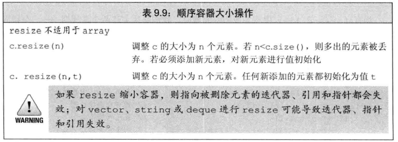
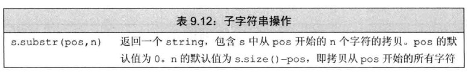
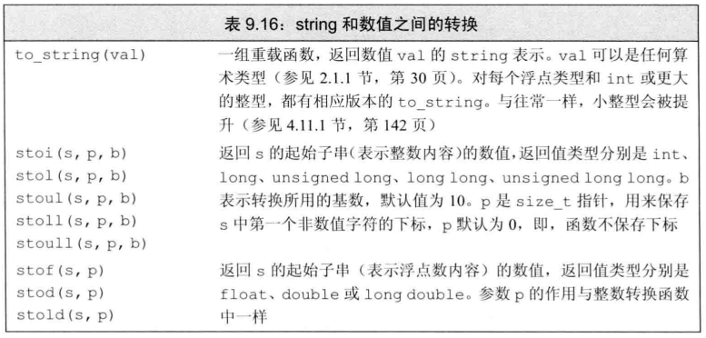

# 第八章 IO库  
```c++
#define _CRT_SECURE_NO_WARNINGS
#define _SILENCE_FPOS_SEEKPOS_DEPRECATION_WARNING
#include <iostream>
#include <vector>
#include <fstream>
#include <boost/iostreams/device/mapped_file.hpp>
using namespace std;
struct Points
{
	double x = 0.0;
	double y = 0.0;
	double z = 0.0;
};

void PrintVec(const vector<Points>& points);

void fstreamReadText(const string& inPath,vector<Points>& points);
void FILEReadText(const string& inPath, vector<Points>& points);
void fstreamWriteText(const vector<Points>& points, const string& outPath);
void FILEWriteText(const vector<Points>& points, const string& outPath);

void fstreamReadBinary(const string& inPath, vector<Points>& points);
void FILEReadBinary(const string& inPath, vector<Points>& points);
void fstreamWriteBinary(const vector<Points>& points, const string& outPath);
void FILEWriteBinary(const vector<Points>& points, const string& outPath);


void fun();

int main()
{
	string inPath = "D:\\zy.txt";
	string outPath = "D:\\zy.txt";

	vector<Points> points;
	for (int i = 0; i < 2191; ++i)
	{
		Points point;
		point.x = 1.25;
		point.y = 2.256;
		point.z = 3.3458;
		points.push_back(point);
	}
	Points point;
	point.x = 9.99; point.y = 9.99; point.z = 9.99;
	points.push_back(point);
	fstreamWriteText(points,outPath);
	//fstreamReadText(inPath, points);
	//FILEWriteText(points, outPath);
	//FILEReadText(inPath, points);

	//fstreamWriteBinary(points,outPath);
	//FILEWriteBinary(points,outPath);
	//fstreamReadBinary(inPath, points);
	//FILEReadBinary(inPath, points);
	fun();

	return 0;
}

//文本文档读写
void fstreamReadText(const string& inPath, vector<Points>& points) {
	/*
	* fstream/ifstream
	* 读取文本格式数据
	*/
	if (points.size())
		points.clear();
	ifstream infile(inPath, ios::in);
	//vector<Points> points;
	if (infile.is_open() == false)		//判断是否打开成功
	{
		return;
	}
	while (infile.peek() != EOF)
	{
		//此种方法会忽略空行
		Points point;
		infile >> point.x >> point.y >> point.z;
		points.push_back(point);
	}
	PrintVec(points);
	infile.close();		//关闭文件
}
void FILEReadText(const string &inPath, vector<Points>& points) {
	/*
	* fstream/ifstream
	* 读取文本格式数据
	*/
	if (points.size())
		points.clear();
	FILE* fp = fopen(inPath.c_str(), "rt");
	if (fp == NULL)
	{
		return;
	}
	while (!feof(fp))
	{
		Points point;
		fscanf(fp, "%lf%lf%lf\n", &point.x, &point.y, &point.z);
		points.push_back(point);
	}
	PrintVec(points);
	::fclose(fp);
}
void fstreamWriteText(const vector<Points>& points, const string& outPath) {
	/*
	* fstream/ofstream
	* 写入文本格式数据
	*/
	ofstream outfile(outPath, ios::out | ios::trunc);//打开并覆盖旧文件，注意是位或|操作而非||
	if (outfile.is_open() == false)		//判断是否打开成功
	{
		return;
	}
	for (auto& point : points)
		outfile << point.x << "  " << point.y << "  " << point.z << endl;
	outfile.close();		//关闭文件
}
void FILEWriteText(const vector<Points>& points, const string& outPath) {
	/*
	* FILE*
	* 写入文本格式数据
	*/
	FILE* fp = fopen(outPath.c_str(), "wt");
	if (fp == NULL)
		return;
	for (auto& point : points)
		fprintf(fp, "%g %g %g\n", point.x, point.y, point.z); //%g是用来输出实数，它根据数值的大小，自动选f格式或e格式，且不输出无意义的0。
	::fclose(fp);
}
//二进制读写
void fstreamReadBinary(const string& inPath, vector<Points>& points) {
	/*
	* fstream/ifstream
	* 读取二进制格式数据
	*/
	if (points.size())
		points.clear();
	fstream infile;
	infile.open(inPath.c_str(), ios::in | ios::binary);

	Points point;
	while(infile.peek() != EOF)
	{
		infile.read((char*)&point, sizeof(Points));
		points.push_back(point);
	}
	PrintVec(points);
	infile.close();		//关闭文件
}
void FILEReadBinary(const string& inPath, vector<Points>& points) {
	/*
	* fstream/ifstream
	* 读取二进制格式数据
	*/
	if (points.size())
		points.clear();
	FILE* fp = fopen(inPath.c_str(), "rb");
	fseek(fp, 0, SEEK_END);
	auto fileLength = ftell(fp);//计算总字节长度
	fseek(fp, 0, SEEK_SET);
	for (int i = 0; i < fileLength /sizeof(Points); i++)
	{
		Points point;
		fread(&point, sizeof(Points), 1, fp);
		points.push_back(point);
	}
	PrintVec(points);
	::fclose(fp);
}
void fstreamWriteBinary(const vector<Points>& points, const string& outPath) {
	/*
	* fstream/ofstream
	* 写入二进制格式数据
	*/
	fstream fs;
	fs.open(outPath.c_str(), ios::out| ios::trunc | ios::binary);
	if (fs.is_open() == false)		//判断是否打开成功
		return;
	Points ln;
	for(auto &point : points)
	{
		ln.x = point.x;
		ln.y = point.y;
		ln.z = point.z;
		fs.write((char*)&ln, sizeof(Points));
	}
	fs.close();
}
void FILEWriteBinary(const vector<Points>& points, const string& outPath) {
	/*
	* FILE*
	* 写入二进制格式数据
	*/
	FILE* fp = fopen(outPath.c_str(), "wb");
	if (fp == NULL)
		return;
	Points ln;
	for (auto& point : points)
		fwrite(&point, sizeof(point), 1, fp);
	::fclose(fp);
}

//内存映射读文件
void mappedFileReadText(const string& inPath, vector<Points>& points) {
	boost::iostreams::mapped_file mmap;
	try
	{
		mmap.open(inPath, boost::iostreams::mapped_file::readonly);
	}
	catch (std::exception& e)
	{
		return;
	}
	auto p_begin = mmap.const_data();// mmap.const_data()是文件内所有的数据allData，p_begin指向allData的首地址
	auto p_end = p_begin + mmap.size();	//mmap.size()是文件内的所有字节个数count（包括空格以及每次换行后面的\r\n），p_end指向p_begin向后移count个位置
	auto p_next = p_begin;
	uintmax_t m_numLines = 0;
	char buf[200];
	string strSeprate = " ";
	char* seprate = const_cast<char *>(strSeprate.c_str());


	while (p_begin && p_begin != p_end)
	{
		//C 库函数 void *memchr(const void *str, int c, size_t n) 在参数 str 所指向的字符串的前 n 个字节中搜索第一次出现字符 c（一个无符号字符）的位置，返回指向该位置的指针
		if (p_next = static_cast<const char*>(memchr(p_begin, '\n', p_end - p_begin)))
		{
			//C 库函数 void *memset(void *str, int c, size_t n) 复制字符 c（一个无符号字符）到参数 str 所指向的字符串的前 n 个字符。
			memset(buf, 0, 200);
			size_t n = p_next - p_begin - 1;//-1是为了去掉末尾的\r
			//C 库函数 void *memcpy(void *str1, const void *str2, size_t n) 从存储区 str2 复制 n 个字节到存储区 str1。
			memcpy(buf, p_begin, n);
			buf[n] = '\0';

			double pos[3] = { 0.0};
			char* p;
			//C 库函数 char *strtok_s(char *str, const char *delim, char **_Context) 分解字符串 str 为一组字符串，delim 为分隔符，分割处理后的str的去向，记录分割一次之后_String中下一个字符串的位置
			//返回值是该函数返回被分解的第一个子字符串，如果没有可检索的字符串，则返回一个空指针。
			char* tokenPtr = strtok_s(buf, seprate, &p);
			int i = 0;
			while (tokenPtr != NULL)
			{
				pos[i++] = atof(tokenPtr);
				tokenPtr = strtok_s(NULL, seprate, &p);//第一个参数传入NULL，则从上一次的分割位置开始分割，子字符串的起点是第1个不含分隔符的字符
			}
			Points pt;
			pt.x = pos[0];
			pt.y = pos[1];
			pt.z = pos[2];
			
			points.push_back(pt);

			++p_next;	//p_next跳过当前指向的\n字符，到达下一行
			if (p_next == p_end)
				break;
			p_begin = p_next;
		}
		else
			break;
	}
	mmap.close();
	PrintVec(points);
}

//打印vector
void PrintVec(const vector<Points>& points)
{
	for (const auto& point : points)
	{
		cout << point.x << "   " << point.y << "    " << point.z << endl;
	}
	cout << points.size() << endl;
}

/*fstream用法
打开模式mode：
	ios::app：　　　以追加的方式打开文件
	ios::ate：　　　文件打开后定位到文件尾，ios:app就包含有此属性
	ios::binary： 　以二进制方式打开文件，缺省的方式是文本方式。两种方式的区别见前文
	ios::in：　　　 文件以输入方式打开（文件=>程序）
	ios::out：　　　文件以输出方式打开 （程序=>文件）
	ios::nocreate： 不建立文件，所以文件不存在时打开失败　
	ios::noreplace：不覆盖文件，所以打开文件时如果文件存在失败
	ios::trunc：　　如果文件存在，把文件长度设为0，覆盖旧文件
*/
/*FILE用法
fread() 和 fwrite() 一般用于二进制文件的输入输出
    size_t fread(void *buffer, size_t size, size_t count, FILE * stream);//从给定流 stream 读取数据到 ptr 所指向的数组中。
		ptr -- 这是指向带有最小尺寸 size*nmemb 字节的内存块的指针。
		size -- 这是要读取的每个元素的大小，以字节为单位。
		nmemb -- 这是元素的个数，每个元素的大小为 size 字节。
		stream -- 这是指向 FILE 对象的指针，该 FILE 对象指定了一个输入流。

	size_t fwrite(const void *ptr, size_t size, size_t nmemb, FILE *stream);//把 ptr 所指向的数组中的数据写入到给定流 stream 中。
		ptr -- 这是指向要被写入的元素数组的指针。
		size -- 这是要被写入的每个元素的大小，以字节为单位。
		nmemb -- 这是元素的个数，每个元素的大小为 size 字节。
		stream -- 这是指向 FILE 对象的指针，该 FILE 对象指定了一个输出流。


fopen() 打开流
fclose() 关闭流
fputc() 写一个字符到流中
fgetc() 从流中读一个字符
fseek() 在流中定位到指定的字符
fputs() 写字符串到流
fgets() 从流中读一行或指定个字符
fprintf() 按格式输出到流
fscanf() 从流中按格式读取
feof() 到达文件尾时返回真值
ferror() 发生错误时返回其值
rewind() 复位文件定位器到文件开始处
remove() 删除文件
fread() 从流中读指定个数的字符  size_t fread(void *ptr, size_t size, size_t n, FILE *stream);
fwrite() 向流中写指定个数的字符 size_t fwrite(const void *ptr, size_t size, size_t n, FILE *stream);
tmpfile() 生成一个临时文件流
tmpnam() 生成一个唯一的文件名

打开模式mode：
	r 打开只读文件，该文件必须存在。
　　r+ 打开可读写的文件，该文件必须存在。
　　rb+ 读写打开一个二进制文件，只允许读写数据。
　　rt+ 读写打开一个文本文件，允许读和写。
　　w 打开只写文件，若文件存在则文件长度清为0，即该文件内容会消失。若文件不存在则建立该文件。
　　w+ 打开可读写文件，若文件存在则文件长度清为零，即该文件内容会消失。若文件不存在则建立该文件。
　　a 以附加的方式打开只写文件。若文件不存在，则会建立该文件，如果文件存在，写入的数据会被加到文件尾，即文件原先的内容会被保留。（EOF符保留）
　　a+ 以附加方式打开可读写的文件。若文件不存在，则会建立该文件，如果文件存在，写入的数据会被加到文件尾后，即文件原先的内容会被保留。 （原来的EOF符不保留）
　　wb 只写打开或新建一个二进制文件；只允许写数据。
　　wb+ 读写打开或建立一个二进制文件，允许读和写。
　　wt+ 读写打开或着建立一个文本文件；允许读写。
　　at+ 读写打开一个文本文件，允许读或在文本末追加数据。
　　ab+ 读写打开一个二进制文件，允许读或在文件末追加数据。
*/
```
# 第九章 顺序容器（9.6容器适配器看的不是很明白）  
## 9.1 顺序容器概述  
  
## 9.2 容器库概览  
⭐容器的操作  
  
⭐当不需要写访问时，应使用cbegin和cend  
⭐容器定义和初始化  
  
特别是用迭代器之间的值来初始化另一个容器。  
⭐容器赋值运算  
  
## 9.3顺序容器操作  
⭐向顺序容器添加元素  
  
⭐emplace函数在容器中直接构造函数，例如：  
c.emplace_back("978-0564",25,15.99);  
等同于c.push_back(Sacles_data("978-0564",25,15.99));  
 
⭐删除元素  
  

⭐改变大小  
  
  
⭐vector大小  
**size()**函数返回的是已用空间大小 ；  
**capacity()**返回的是总空间大小，当size()和capacity()相等，说明vector目前的空间已被用完，如果再添加新元素，则会引起vector空间的动态增长。   
**reserve(n)**预先分配一块较大的指定大小的内存空间，其中n为分配空间大小；使用reserve()预先分配一块内存后，在空间未满的情况下，不会引起重新分配，从而提升了效率。  
**resize(n)**成员函数只改变元素的数目为n个，不改变vector的容量。  
 
⭐string额外操作:  
  
  


 
⭐string的搜索操作:  
  
```c++
string name("abcdefghijklmn");  
string::size_type pos =  name.find("g"); // pos值为6  
```  
⭐可以利用find以及迭代器以及容器的赋值（使用两个迭代器之间赋值）配合使用达到提取string字符串中的part的作用。  
```c++
const string name("姓名：纪国同；性别：男；年龄：23");
string::size_type posGender = name.find("性别"); 
string::size_type posAge = name.find("年龄"); 
auto itbegin = name.begin();
auto itend = name.begin();
itbegin += posGender;
itbegin += 6;
itend += posAge;
itend -= 2;
string a(itbegin, itend);
```   
或者！！！  
用string b = name.substr(posGender+6, 2);  //substr返回pos后面n个字符的子字符串  
⭐谨记：一个汉字相当于两个字符，即一个汉字占两个字节。  
 
⭐string数值转换：  
  
## 9.6 容器适配器
  

⭐栈适配器  
  
⭐队列适配器  
  
  

# 第十章 泛型算法  
## 10.1 概述  
⭐大多数算法都定义在头文件algorithm中，另外还有头文件numeric   
``include <algorithm>`` 
⭐算法不依赖于容器类型，大多数是利用迭代器完成。  
## 10.2 初识泛型算法  
⭐算法众多，不一一列举。  
## 10.3 定制操作  
### 10.3.1 向算法传递函数  
⭐谓词：可调用的表达式，一元，二元，能作为判断条件
sort(words.begin(),words.end(),isShorter);  //isShorter是一个函数，比较长短
### 10.3.2 lambda表达式
⭐一个lambda表达式表示一个可调用的代码单元。lambda形式如下：
[capture list](parameter list)->return type {function body}
capture list 是一个lambda所在函数中定义的局部变量的列表（通常为空）
必不可缺少的是捕获列表和函数体。
⭐一个lambda只有在其捕获列表捕获一个它所在函数中的局部变量，才能在函数体中使用该变量。
auto wc = find_if(words.begin(),words.end(),[sz](const string &a){return a.size()>=sz;});
### 10.3.3 lambda捕获和返回
⭐值捕获：  
```c++
void fun(){
size_t v1 = 42;
auto f = [v1]{return v2;};
v1 = 0;
auto j = f();  //j为42，f保存了我们创建它时v1的拷贝 
}
```
⭐引用捕获：  
```c++
void fun(){
size_t v1 = 42;
auto f = [&v1]{return v2;};
v1 = 0;
auto j = f();  //j为0，f保存了v1的引用
}
```  
⭐lambda可捕获列表  
  
### 10.3.4 参数绑定（没咋看）  
## 10.4 再探迭代器（暂时略过）  


# 第十一章 关联容器  
## 11.1 关联容器类型  
  
```c++
#include <map>        //可以使用map、multimap    基于红黑树
#include <set>          //可以使用set、multiset          基于红黑树 
#include <unordered_map>    //可以使用unordered_map、unordered_multimap         基于哈希函数
#include <unordered_set>    //可以使用unordered_set、unordered_multiset             基于哈希函数
```  
 
## 11.2 使用关联容器  
⭐map使用概述（用于字典）  
```c++
map<string, unsigned> word_count;
string word;
while (cin >> word)
    ++word_count[word];
for (const auto& w : word_count)
    cout << w.first << " occurs" << w.second << ((w.second > 1) ? " times" : " time") << endl;
```

⭐set使用概述（类似枚举）  
```c++
map<string, unsigned> word_count;
set<string> exclude = { "a","an","the","A","An","The" };        //定义一个只包含冠词的set
string word;
while (cin >> word)
{
    if (exclude.find(word) == exclude.end())//find返回给定关键字在set中的迭代器，
    //如果没有找到该关键字，则返回尾后迭代器end
    {//若不是冠词，则统计该单词的出现个数
        ++word_count[word];
    }
}
for (const auto& w : word_count)
    cout << w.first << " occurs " << w.second << ((w.second > 1) ? " times" : " time") << endl;
```  
## 11.3 关联容器概述  
⭐关联容器也可以使用容器普遍的操作，如迭代器等等。  
⭐**关联容器定义**  
(1)初始化  
```c++
map<string,string> authors = {{"j","gt"},{"z","y"},{"s","yq"}};  //一个pair为{key,value}
set<string> names={"jgt","zy","syq","lps"};//初始化set
```  
(2)pair:标准库类型，定义在头文件<utility>中，键值对  
```c++
pair<string,string> anon;
pair<string, size_t> word_count;
pair<string, vector<int>> line;  //保存string和vector<int>
pair<string, string> author{ "j","gt" }; //初始化pair容器
```  
pair操作：  


⭐**关联容器操作**  
(0)类型别名  
  
(1)迭代器(使用方法跟顺序容器类似)  
map与set中的关键字是const类型，不可改变。  
```c++
auto map_it = word_count.cbegin();
while(map_it != word_count.cend()){
    cout<<map_it->first<<" occurs "<<map_it->second<<" times"<<endl;
    ++map_it;  //遍历关联容器
}
```  
(2)添加元素  
  
使用示例：  
①set  
```c++
vector<int> ivec = { 2,4,6,8,2,4,6,8 };
set<int> setInt;
setInt.insert(ivec.cbegin(), ivec.cend());  //setInt有4个元素
setInt.insert({ 1,3,5,7,1,3,5,7 });                        //setInt有8个元素
```  
②map  
```c++
word_count.insert({word,1});
word_count.insert(make_pair(word,1));
word_count.insert(pair<string,size_t>(word,1));
word_count.insert(map<string,size_t>::value_type(word,1));
```  
对于不包含重复关键字的容器，添加单一元素的insert和emplace版本返回一个pair，其first成员是一个迭代器，指向具有给定关键字的元素；second成员是一个bool值，若插入成功，为true；插入失败，为false。  
(3)删除元素  
  
``c.erase("the");``
 
(4)下标操作(set没有此类操作)  
  
注意：若k不在c中，会添加一个关键字为k的元素。  
(5)下标操作(set没有此类操作)  
  
## 11.4 无序容器  
⭐拥有与有序关联容器相同的操作，如find、erase、insert等。  
  


# 第十二章 动态内存  
⭐static用法：  
(1)局部静态对象  
```c++
void fun(){
    static num=10;      //直到程序终止num才被销毁
}
```  
(2)静态成员变量、静态成员函数  
```c++
class A{
    public:
    static int fun();   //静态成员函数
    static int num;     //静态成员变量
}
```  
## 12.1 动态内存  
⭐new和delete  
(1)普通指针
```c++
double* pvalue = new double;   // 请求一块内存，pvalue指向这块内存
*pvalue = 29494.99;     // 在分配的地址存储值
cout << "Value of pvalue : " << *pvalue << endl;
delete pvalue;         // 释放内存
```  
(2)数组指针
```c++
//一维数组
 int *array=new int [m]; 
 delete [] array;//释放内存

//二维数组
int** array
// 假定数组第一维长度为 m， 第二维长度为 n
// 动态分配空间
array = new int* [m];
for (int i = 0; i < m; i++)
{
	array[i] = new int[n];
}
//释放
for (int i = 0; i < m; i++)
{
	delete[] array[i];
}
delete[] array;
```  
## 12.2 智能指针（shared_ptr、weak_ptr、unique_ptr）  
⭐使用概况（均定义在头文件<memory>中）  
(1)初始化  
```c++
shared_ptr<string> p1;          //可以指向string  
shared_ptr<list<int>> p2;       //可以指向int的list  
```  
(2)支持的操作  
  

(3)make_shared用法  
```c++
shared_ptr<int> p3 = make_shared<int>(42);              //指向一个值为42的int的shared_ptr
shared_ptr<string> p4 = make_shared<string>(10,'9');    //指向一个值为"9999999999"的string
shared_ptr<int> p5 = make_shared<int>();                //指向一个值初始化的int，值为0
```  
(4)shared_ptr的拷贝和赋值  
！！！每一个shared_ptr都有一个关联的计数器(引用计数)，当一个shared_ptr的计数器变为0时，它会自动释放自己所管理的对象。  
拷贝计数器会递增，改变智能指针的值或者销毁(离开局部作用域)，计数器会递减。  
(5)使用案例  
```c++
std::shared_ptr<GraphicsViewer::CGraphicsWindowWin32> pWinContext = 
		dynamic_pointer_cast<GraphicsViewer::CGraphicsWindowWin32>(pViewer->GetContext());
        //其中pViewer->GetContext()返回的是CGraphicsWindowWin32的基类，dynamic_pointer_cast类似于dynamic_cast，只不过是适用于指针的转换，父类转子类。
```  
(6)shared_ptr和new结合使用
我们不能将一个内置指针隐式转换为一个智能指针，必须使用直接初始化形式来初始化一个只能指针：  
```c++
shared_prt<int> p1 = new int(1024);     // 错误：必须使用直接初始化形式
shared_ptr<int> p2(new int(1024));      // 正确：使用了直接初始化形式
```  
  
  
  
(7)unique_ptr用法  
⭐不支持普通的赋值或拷贝操作  
  
(8)weak_ptr用法（没咋看明白）  

## 12.3 动态数组（没咋看）  
## 12.4 文本查询程序  
**textquery.h**  
```c++
/*
* 作者：纪国同
* 1、允许用户在一个文件中查询某个单词。
* 2、查询结果是该单词在文件中出现的次数，以及其所在行的列表。
* 3、如果一个单词在一行中出现多次，则只列出一次，且行会按照升序输出。
* 使用map、set、智能指针操作
* 实例：print(cout, tq.query(str));
* element occurs 112 times
* (line 36) A set element contains only a key.
* (line 78) … element …
*/
#pragma once
#include <iostream>
#include <vector>
#include <map>
#include <set>
#include <string>
class QueryResult;
class TextQuery {
public:
	using line_num = std::vector<std::string>::size_type;	//行号类型别名
	TextQuery(std::ifstream&);								//构造函数
	QueryResult query(const std::string&);					//查询函数，返回Query类
private:
	std::shared_ptr<std::vector<std::string>> p_allLines;	//存储所有文本信息
	std::map<std::string, std::shared_ptr<std::set<line_num>>> m_wordsMap;//每一个word的map
};

//查询结果类
class QueryResult
{
	friend std::ostream& print(std::ostream&, const QueryResult&);  //print是本类的友元，print可以访问本类的非共有成员
public:
	QueryResult(std::string s, 
		std::shared_ptr<std::set<TextQuery::line_num>> p, 
		std::shared_ptr<std::vector<std::string>> f) : 
		sought(s), p_lines(p), p_allLines(f) { }//列表初始化构造
private:
	std::string sought;										//要查询的单词
	std::shared_ptr<std::set<TextQuery::line_num>> p_lines;	//该单词对应的set容器，储存着单词出现的行号
	std::shared_ptr<std::vector<std::string>> p_allLines;	//存储所有文本信息
};
```  
**textquery.cpp**  
```c++
#include <fstream>
#include <sstream>
#include "textquery.h"
using namespace std;
TextQuery::TextQuery(ifstream& ifs) : p_allLines(new vector<string>)
{
	std::string text;
	while (getline(ifs, text)){
		p_allLines->push_back(text);			//存储每一行文本
		int n = p_allLines->size() - 1;			//当前行号
		istringstream line(text);
		string word;

		while (line >> word) {					//对行中每一个单词
			auto& lines = m_wordsMap[word];		//lines是一个指向set<line_num>的智能指针，若word此时不在map中，则lines为空，此时map也添加新元素（下标的作用）
			if (!lines)
				lines.reset(new set<line_num>);  //p.reset(q)，令p指向q
			lines->insert(n);					//把行号n放在set中
		}
	}
}

QueryResult TextQuery::query(const string& word)
{
	static shared_ptr<set<TextQuery::line_num>> no_data(new set<TextQuery::line_num>);//指向一个空的set
	auto loc = m_wordsMap.find(word);
	if (loc == m_wordsMap.end())							//如果没找到指定单词，则返回一个空的set
		return QueryResult(word, no_data, p_allLines);
	else
		return QueryResult(word, loc->second, p_allLines);	//如果找到了，构造QueryResult对象
}

std::ostream& print(std::ostream& os, const QueryResult& qr)
{
	string times = qr.p_lines->size() > 1 ? " times" : " time";						
	os << qr.sought << " occurs " << qr.p_lines->size() <<times << std::endl;	//该单词出现了多少次

	for (auto num : *qr.p_lines)												//遍历set中的每一个行数
		os << "\t(line " << num + 1 << ") " 
			<< *(qr.p_allLines->begin() + num) << std::endl;
	return os;
}
```  