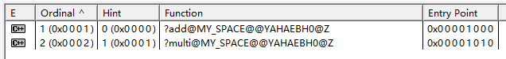

## 动态链接库DLL的两种调用方式
### 1、静态加载调用
（1）概述
dll的静态加载需要.h .dll .lib三个文件
静态加载发生在程序运行之前，故如果缺少dll文件，程序运行不起来。如果程序体积较大，功能较为复杂，静态加载会导致程序启动时间长。
（2）文件的生成
设置项目生成dll
testAPI.h
```C
// File:testAPI.h
#ifndef _TESTAPI_H
#define _TESTAPI_H

namespace MY_SPACE {
	int __declspec(dllexport) add(const int&, const int&);
	int __declspec(dllexport) multi(const int&, const int&);
}

#endif   //_TESTAPI_H
```
testAPI.cpp
```C
#include <iostream>
#include "testAPI.h"

namespace MY_SPACE {
	int __declspec(dllexport) add(const int& lhs, const int& rhs) {
		return lhs + rhs;
	}
	int __declspec(dllexport) multi(const int& lhs, const int& rhs) {
		return lhs * rhs;
	}
}
```
（3）文件的调用
添加包含目录
添加库目录
添加依赖项
main.cpp
```c
#include "testAPI.h"
#include <iostream>

int main()
{
    int result = MY_SPACE::add(15, 17);
    std::cout << result << std::endl;
    result = MY_SPACE::multi(5, 7);
    std::cout << result << std::endl;
    std::cout << "Hello World!\n";
}
```

### 2、动态加载调用
（1）概述
dll的动态加载仅需要.dll文件
动态加载发生在程序运行过程中（由编程者决定何时加载），不会因为缺少dll，导致整个程序运行不起来。动态加载可将较大的程序分开加载的，程序运行时只需要将主程序载入内存，程序启动快。

（2）文件的生成
跟静态调用的生成方法一样，需要注意的是在函数导出的过程中名字可能会改变，所以需要指定一下导出函数名字

testAPI.def
```c
:testAPI.def : 声明DLL的模块参数
LIBRARY

EXPORTS
add
multi
```

（3）文件的调用
动态加载需主要用到LoadLibrary（加载DLL）、GetProcAddress（获得DLL中API函数的地址）、FreeLibrary（释放DLL）这几个系统函数。
main.cpp
```c
// main.cpp : 此文件包含 "main" 函数。程序执行将在此处开始并结束。
#include <iostream>
#include <shlwapi.h>
typedef int			(*LPDLLFUNC_OPERATOR)(int&, int&);		// 函数指针

int main()
{
	HMODULE  hDll = NULL;
	const wchar_t* szPath = L"..\\x64\\Release\\TestForDLL.dll";
	LPDLLFUNC_OPERATOR pFuncAdd = NULL;
	LPDLLFUNC_OPERATOR pFuncMulti = NULL;
	if (hDll == NULL) {
		hDll = LoadLibrary(szPath);
		if (hDll != NULL) {
			pFuncAdd = (LPDLLFUNC_OPERATOR)GetProcAddress(hDll, "_add");		//获取函数地址
			pFuncMulti = (LPDLLFUNC_OPERATOR)GetProcAddress(hDll, "_multi");
			// 判断从dll中加载函数是否成功
			if(pFuncAdd==NULL|| pFuncMulti==NULL){
				printf("Load func error:[%d]\n", GetLastError());

				FreeLibrary(hDll);
				hDll = NULL;
				pFuncAdd = NULL;
				pFuncMulti = NULL;	
				return NULL;
			}
		}
		else{
			printf("Load DLL error:[%d] %s\n", GetLastError(), szPath);
			return NULL;
		}
	}
	int a = 17;
	int b = 15;

	std::cout << pFuncAdd(a, b) << std::endl;		// 利用函数指针直接调用函数
	std::cout << pFuncMulti(a, b) << std::endl;

	FreeLibrary(hDll);
	return 0;
}
```


