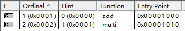

## 动态链接库DLL的两种调用方式

### 1、静态加载调用

（1）概述

dll的静态加载需要.h .dll .lib三个文件
静态加载发生在程序运行之前，故如果缺少dll文件，程序运行不起来。如果程序体积较大，功能较为复杂，静态加载会导致程序启动时间长。


（2）文件的生成

设置项目生成dll

testAPI.h

```C
// File:testAPI.h
#ifndef _TESTAPI_H
#define _TESTAPI_H

namespace MY_SPACE {
	int __declspec(dllexport) add(const int&, const int&);
	int __declspec(dllexport) multi(const int&, const int&);
}

#endif   //_TESTAPI_H
```

testAPI.cpp

```C
#include <iostream>
#include "testAPI.h"

namespace MY_SPACE {
	int __declspec(dllexport) add(const int& lhs, const int& rhs) {
		return lhs + rhs;
	}
	int __declspec(dllexport) multi(const int& lhs, const int& rhs) {
		return lhs * rhs;
	}
}
```

（3）文件的调用

添加包含目录
添加库目录
添加依赖项
main.cpp

```c
#include "testAPI.h"
#include <iostream>

int main()
{
    int result = MY_SPACE::add(15, 17);
    std::cout << result << std::endl;
    result = MY_SPACE::multi(5, 7);
    std::cout << result << std::endl;
    std::cout << "Hello World!\n";
}
```

### 2、动态加载调用

（1）概述
dll的动态加载仅需要.dll文件
动态加载发生在程序运行过程中（由编程者决定何时加载），不会因为缺少dll，导致整个程序运行不起来。动态加载可将较大的程序分开加载的，程序运行时只需要将主程序载入内存，程序启动快。

（2）文件的生成
跟静态调用的生成方法一样，需要注意的是在函数导出的过程中名字可能会改变，所以需要指定一下导出函数名字

testAPI.def

```c
:testAPI.def : 声明DLL的模块参数
LIBRARY

EXPORTS
add
multi
```


（3）文件的调用
动态加载需主要用到LoadLibrary（加载DLL）、GetProcAddress（获得DLL中API函数的地址）、FreeLibrary（释放DLL）这几个系统函数。
main.cpp

```c
// main.cpp : 此文件包含 "main" 函数。程序执行将在此处开始并结束。
#include <iostream>
#include <shlwapi.h>
typedef int			(*LPDLLFUNC_OPERATOR)(int&, int&);		// 函数指针

int main()
{
	HMODULE  hDll = NULL;
	const wchar_t* szPath = L"..\\x64\\Release\\TestForDLL.dll";
	LPDLLFUNC_OPERATOR pFuncAdd = NULL;
	LPDLLFUNC_OPERATOR pFuncMulti = NULL;
	if (hDll == NULL) {
		hDll = LoadLibrary(szPath);
		if (hDll != NULL) {
			pFuncAdd = (LPDLLFUNC_OPERATOR)GetProcAddress(hDll, "_add");		//获取函数地址
			pFuncMulti = (LPDLLFUNC_OPERATOR)GetProcAddress(hDll, "_multi");
			// 判断从dll中加载函数是否成功
			if(pFuncAdd==NULL|| pFuncMulti==NULL){
				printf("Load func error:[%d]\n", GetLastError());

				FreeLibrary(hDll);
				hDll = NULL;
				pFuncAdd = NULL;
				pFuncMulti = NULL;
				return NULL;
			}
		}
		else{
			printf("Load DLL error:[%d] %s\n", GetLastError(), szPath);
			return NULL;
		}
	}
	int a = 17;
	int b = 15;

	std::cout << pFuncAdd(a, b) << std::endl;		// 利用函数指针直接调用函数
	std::cout << pFuncMulti(a, b) << std::endl;

	FreeLibrary(hDll);
	return 0;
}
```

## 编码说明  
1、UTF-8：英文1个字符用1个字节来存，中文1个字符大部分用3个字节来存，少数以4个字节来存。  
2、GBK：对于ASCII可以表示的字符，如英文字符‘A’、‘B’等，在GBK中的编码和ASCII编码一致，占一个字节，对于ASCII不能表示的字符，GBK用两个字节表示，兼容GB2312。  
3、GB2312：对于ASCII可以表示的字符，如英文字符‘A’、‘B’等，在GB2312中的编码和ASCII编码一致，占一个字节，对于ASCII不能表示的字符，GB2312用两个字节表示。  
4、ASCII：英文1个字符用1个字节来存，不能有中文字符。  
5、ANSI：  
其实ANSI并不是某一种特定的字符编码，而是在不同的系统中，ANSI表示不同的编码。你的美国同事Bob的系统中ANSI编码其实是ASCII编码（ASCII编码不能表示汉字，所以汉字为乱码），而你的系统中（“汉字”正常显示）ANSI编码其实是GBK编码，而韩文系统中（“한국어”正常显示）ANSI编码其实是EUC-KR编码。
https://www.cnblogs.com/malecrab/p/5300486.html
在简体中文Windows操作系统中，ANSI 编码代表 GB2312编码；在繁体中文Windows操作系统中，ANSI编码代表Big5；在日文Windows操作系统中，ANSI 编码代表 JIS 编码。  
总结：  
  

## 文件重定向详解  
https://blog.csdn.net/w55100/article/details/86557341  

## 内存对齐详解  
https://zhuanlan.zhihu.com/p/30007037  

## 内存映射原理  
https://www.cnblogs.com/still-smile/p/12155181.html  

## 浏览文件/目录的代码  
```c++
WCHAR szPath[MAX_PATH];
	ZeroMemory(szPath, sizeof(szPath));

	BROWSEINFO bi;
	bi.hwndOwner =  GetForegroundWindow();
	bi.pidlRoot = NULL;
	bi.pszDisplayName = szPath;
	bi.lpszTitle = L"新建工程";
	bi.ulFlags = BIF_NEWDIALOGSTYLE | BIF_RETURNONLYFSDIRS | BIF_EDITBOX | BIF_RETURNFSANCESTORS;
	bi.lpfn = NULL;
	bi.lParam = 0;
	bi.iImage = 0;
	LPITEMIDLIST pidl = NULL;
	SHGetSpecialFolderLocation(NULL, CSIDL_DESKTOP, &pidl);
	bi.pidlRoot = pidl;

	//弹出选择目录对话框
	LPITEMIDLIST lp = SHBrowseForFolder(&bi);

	if (lp && SHGetPathFromIDList(lp, szPath))
	{
		if (FALSE ==  PathIsDirectory(szPath))
		{
			AfxMessageBox(_T("You have selected a path that either does not exist or you lack permission to access. "));
			return;
		}
}  
```  


## c++赋值运算符为什么要返回引用？  
https://www.cnblogs.com/wuchanming/p/3763565.html  

## 聚类算法  
https://eezzh.blog.csdn.net/article/details/104158302?spm=1001.2101.3001.6650.14&utm_medium=distribute.pc_relevant.none-task-blog-2%7Edefault%7EBlogCommendFromBaidu%7ERate-14-104158302-blog-125760734.pc_relevant_3mothn_strategy_recovery&depth_1-utm_source=distribute.pc_relevant.none-task-blog-2%7Edefault%7EBlogCommendFromBaidu%7ERate-14-104158302-blog-125760734.pc_relevant_3mothn_strategy_recovery&utm_relevant_index=15  

聚类python实现  
https://huaweicloud.csdn.net/63806d9cdacf622b8df881fe.html?spm=1001.2101.3001.6650.8&utm_medium=distribute.pc_relevant.none-task-blog-2~default~BlogCommendFromBaidu~activity-8-124989332-blog-125760734.pc_relevant_3mothn_strategy_recovery&depth_1-utm_source=distribute.pc_relevant.none-task-blog-2~default~BlogCommendFromBaidu~activity-8-124989332-blog-125760734.pc_relevant_3mothn_strategy_recovery&utm_relevant_index=9  

## 格式化输出  
```c++
std::cout << std::left << std::setprecision(6) << std::setw(8) << std::setfill('0') << 0.1654654135453 << std::endl;
```  
## C++ string 简单截取字符串使用  
https://blog.csdn.net/mengxiangdezhuizhu/article/details/122437186  


## vs报错合集
### 1.VS编译报错 “C2116不同声明之间的函数参数列表不匹配、C2371重定义；不同的基类型、C2733无法重载具有外部 “C“ 链接的函数” 解决方案  
https://blog.csdn.net/qq_41017802/article/details/103482535  

### 2.VS2022如何设置使得可以是程序利用argc/argv参数来运行
  
注意：参数个数不用填，参数之间用空格隔开  

### 3.

