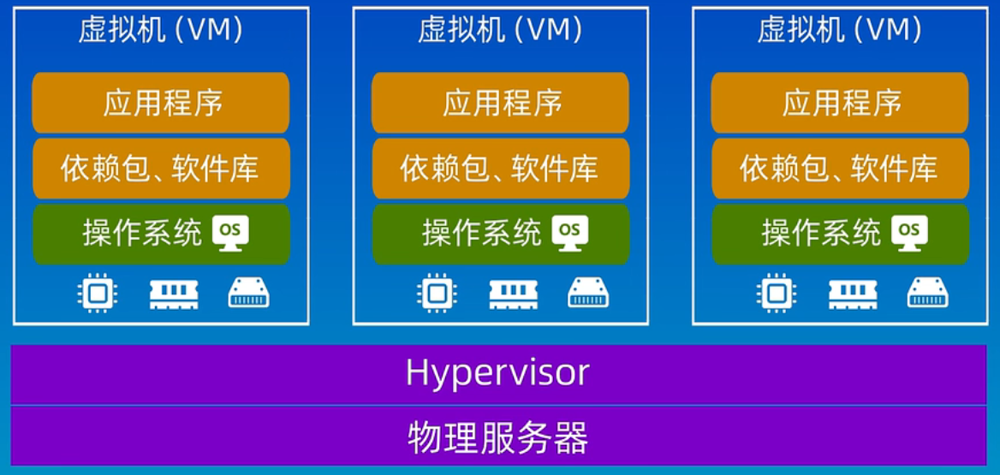
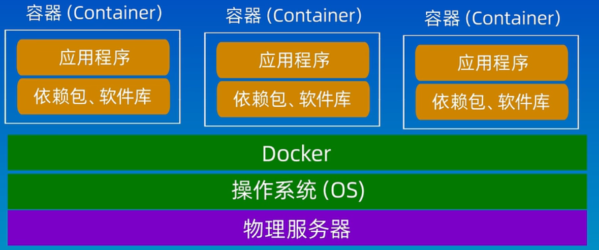
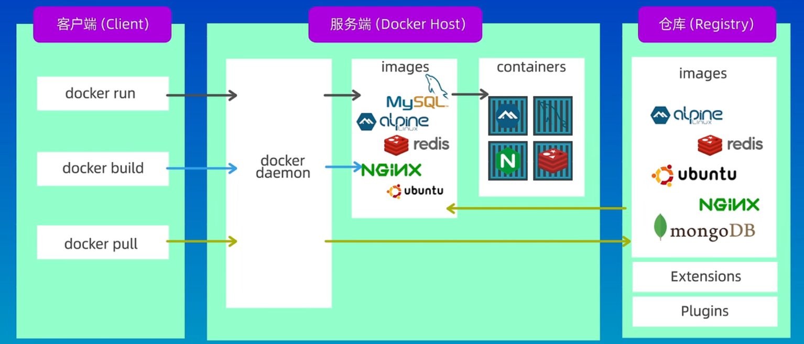
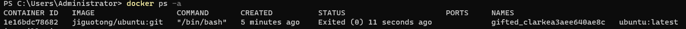

# 一、容器
容器是一种沙盒技术，主要目的是为了将应用运行在其中，与外界隔离；及方便这个沙盒可以被转移到其它宿主机器。本质上，它是一个特殊的进程。
# 二、容器vs虚拟机
虚拟机


容器


# 三、Docker
Docker是一个用于构建、运行、传送应用程序的平台
## （零）Docker安装
1.windows平台
点击 控制面板 - 程序 - 启用或关闭Windows功能，开启Hyper-V。
进入 docker官网 下载Docker Desktop，双击进行安装

2.ubuntu平台

## （一）镜像、容器和仓库
Image：镜像，是一个只读的模板，可以用来创建容器
Containers：容器，是Docker的运行实例，提供了一个独立的可移植环境
Registry：仓库，用来存储Docker镜像的地方，常用的是DockerHub
## （二）docker体系结构
docker采用client-server架构模式

客户端的各种docker命令发送给docker daemon，处理之后再返回给客户端。

## （三）实践
1、下载已有镜像
docker search ubuntu
docker pull ubuntu
2、如何新建自有镜像
（1）利用镜像启动一个容器后进行修改，然后利用commit提交更新后的副本
```cmd
jiguotong> docker run -it ubuntu:latest /bin/bash    # 启动一个容器
# 这里命令行形式变了，表示已经进入了一个新环境
root@72f1a8a0e394/# git --version    # 此时的容器中没有git
bash: git: command not found
root@72f1a8a0e394/# apt update       # 安装git
root@72f1a8a0e394/# apt install git       # 安装git
......
root@72f1a8a0e394/# git --version   # 此时的容器中已经装有git了
git version 1.8.3.1
# 之后退出此容器exit
jiguotong> docker ps -a     # 查看运行中的容器
# 提交副本
docker commit -m "ubuntu with git" -a "jiguotong" 72f1a8a0e394 jiguotong/ubuntu:git

# 运行新容器
jiguotong> docker run -it jiguotong/ubuntu:git /bin/bash    # 启动一个容器
root@49f1a88tea67/# git --version   # 此时的容器中已经装有git了
```


（2）利用Dockerfile创建镜像
Dockerfile是一种配置文件，用来告诉docker build命令应该执行哪些操作。
Dockerfile示例如下：
```docker
# 说明该镜像以哪个镜像为基础
FROM centos:latest

# 构建者的基本信息
MAINTAINER xianhu

# 在build这个镜像时执行的操作
RUN yum update
RUN yum install -y git

# 拷贝本地文件到镜像中
COPY ./* /usr/share/gitdir/
```
有了Dockerfile之后，可以利用build命令进行构建镜像：
docker build -t="xianhu/centos:gitdir" .

3、删除本地镜像
docker rmi jiguotong/ubuntu:git

4、本地与镜像仓库docker.hub的联动
dockerHub官网：https://hub.docker.com/ ，需要注册登陆
推送本地镜像到DockerHub中：docker push jiguotong/ubuntu:git
从仓库中下载镜像：docker pull jiguotong/ubuntu:git

5、docker容器
（1）启动容器
docker run -d -p 80:80 jiguotong/ubuntu:git /bin/bash
+ -d:后台运行
+ -p:指定暴露端口

（2）停止容器运行
docker stop d6340abacfa7 # 容器ID
（3）查看所有运行中和已停止的容器
docker ps -a
（4）启动已停止运行的容器
docker start d6340abacfa7 # 容器ID
docker restart d6340abacfa7 # 容器ID
（5）删除已停止的容器
docker rm d6340abacfa7 # 容器ID

## （四）docker命令大全
列出本地客户端的镜像docker images
运行一个镜像示例    docker run -it ubuntu:latest /bin/bash
查看运行中的容器    docker ps -a

可以存放镜像的公共库dockerHub：https://hub.docker.com/
可以在线运行docker镜像的网站:https://labs.play-with-docker.com/
# 四、参考资料
什么是docker镜像？ - 知乎
https://www.zhihu.com/question/27561972/answer/1386084685

docker官网  
https://docs.docker.com/

dockerHub 官网
https://hub.docker.com/

学习docker
https://zhuanlan.zhihu.com/p/23599229
https://www.amjun.com/1559.html