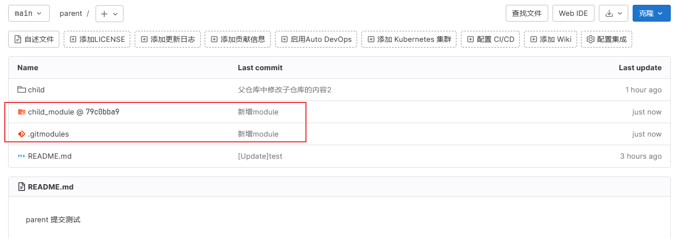
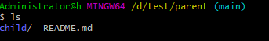
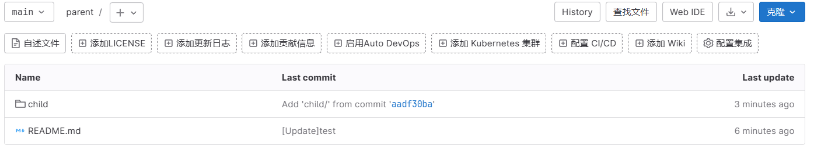

# 一、Git概述
分布式版本控制系统（区别于集中式版本控制系统SVN）
无需联网
内容存储使用的是 SHA-1 哈希算法

# 二、Git安装及配置
## 1.Ubuntu
#执行安装
$apt-get install git
#查看版本
$git --version

## 2.windows、
直接官网下载，安装
https://git-scm.com/download
3.配置
#查询配置信息
$git config --list、
#配置个人信息(--global仅针对当前登录用户)、
$git config --global user.name “jiguotong”
$git config --email user.email 1776220977@qq.com


# 三、Git理论原理
workspace：工作区

staging area：暂存区/缓存区

local repository：版本库或本地仓库

remote repository：远程仓库

当对工作区修改（或新增）的文件执行 git add 命令时，暂存区的目录树被更新，同时工作区修改（或新增）的文件内容被写入到对象库中的一个新的对象中，而该对象的ID被记录在暂存区的文件索引中。

当执行提交操作（git commit）时，暂存区的目录树写到版本库（对象库）中，master 分支会做相应的更新。即 master 指向的目录树就是提交时暂存区的目录树。

# 四、Git基本使用

1.创建版本库

$mkdir git_learning

$git init

2.新建文件并提交至版本库

$touch readme.txt

$git add readme.txt

$git commit -m “提交readme文件”

$git add *.txt    #批量添加所有.txt作文后缀的文件

$git add .   #批量添加当前目录下所有未被添加的文件

3.查看版本库状态

$git status   #可以查看仓库当前的状态

4.查看某个文件的改动部分

$git diff readme.txt

5.查看本仓库的提交日志

$git log

$git log --pretty=oneline

6.回退版本

#head^代表上一个版本，head^^代表上上个版本，head^100代表上一百个版本。

$git reset --hard head^

或者

$git reset --hard [commit id]

如果是不记得commit id，可以用命令git reflog查看，其记录了你的每一个命令。

7.撤销修改

$git checkout -- readme.txt

#将工作区的文件内容撤销到上一次add或者commit的状态，即与暂存区或者版本库同步

8.文件删除与恢复

#删除一个文件

$git rm test.txt

#(只要版本库中有该文件就可恢复)

$git checkout – test.txt

# 五、Git远程仓库

1.Github概念及基础设置

Git是分布式版本控制系统，同一个Git仓库，可以分布到不同的机器上。

本地Git仓库和GitHub仓库之间的传输是通过SSH加密的，所以需要设置密钥/公钥。

第1步：创建SSH Key。在用户主目录下，看看有没有.ssh目录，如果有，再看看这个目录下有没有id_rsa和id_rsa.pub这两个文件，如果已经有了，可直接跳到下一步。如果没有，打开Shell（Windows下打开Git Bash），创建SSH Key：

$ ssh-keygen -t rsa -C 1776220977@qq.com

一路回车，完成后产生id_ras和id_rsa.pub两个文件，id_ras是私钥， id_rsa.pub是公钥。

第2步：打开Github，进行公钥添加

2.Github基本操作

（1）新建库

（2）本地同步到远程仓库

#建立关联

$ git remote add origin git@github.com:jiguotong/gitlearning.git

#本地仓库push到远程仓库

$ git push <远程主机名> <本地分支名>:<远程分支名>

$ git push -u oringin master

#查看关联

$ git remote -v

#断开关联

$ git remote rm origin

（3）远程仓库克隆到本地仓库

$ git clone [url]

（4）远程仓库更新到本地

①直接pull，git pull <远程主机名> <远程分支名>:<本地分支名>

$ git pull origin master

②先fetch，后merge

$ git fetch origin

$ git merge origin/master


# 六、Git分支管理

1.分支基本概念

一个分支代表一条独立的开发线，使用分支意味着从开发主线上分离开来。

2.分支相关命令

#列出分支（当前分支会显示*号）

$ git branch

#创建分支

$ git branch ji

#切换分支

$ git checkout ji

#创建并切换到该分支

$ git checkout -b ji

#合并分支（合并指定分支到当前分支）

$ git merge ji    #合并ji到master，将master指向ji的当前提交

→

#删除分支（分支已被合并）

$ git branch -d ji

#删除分支（分支未被合并，强制删除）

$ git branch -D ji

3.冲突合并

进行分支合并的时候可能会出现冲突，这时候需要进行手动解决冲突。

然后对文件进行一下add

然后再commit

最后删除分支

# 七、Git标签管理

1.发布一个版本时，我们通常先在版本库中打一个标签（tag），这样就唯一确定了打标签时刻的版本.

2.标签相关命令

#查看标签

$ git tag

#创建标签 git tag `<name>`(默认标签是打在最新提交的commit上)

$ git tag V1.0

#给指定commit添加标签

$ git log --pretty=oneline --abbrev-commit     #查看所有提交

$ git tag v0.9 fa9949d

#创建带有说明的标签

$ git tag -a V1.0 -m “This is the first tag!”

#查看标签所指的commit信息

$ git show V1.0

#推送标签到远程 git push <远程主机> <标签名字>

$ git push origin V1.0

#一次性推送全部尚未推送到远程的本地标签

$ git push origin --tags

#删除本地标签

$ git tag -d V1.0

#删除远程标签

$ git push origin :refs/tags/V1.0

# 八、Git其他配置

1、配置别名（开发神器）

git config --global alias.lg "log --color --graph --pretty=format:'%Cred%h%Creset -%C(yellow)%d%Creset %s %Cgreen(%cr) %C(bold blue)<%an>%Creset' --abbrev-commit"

# 九、Git子项目管理
git提供了两种子仓库使用方式：
git submodule(子模块)
git subtree(子树合并)
从1.5.2版本开始，官方新增Git Subtree并推荐使用这个功能来替代Git Submodule管理仓库共用(子仓库、子项目)
## （一）git submodule
1、概述
2、引入子库
代码：```git submodule add <子库地址> <子库在父库中的相对目录>```
示例：```git submodule add git@192.168.1.3:jiguotong/child.git child_module```
随后在父库中可以看到新增了两个文件：.gitmodule和child_module
随后添加 提交 推送，则远程可看到新增以下内容


3、复制父版本库
方法一：分步操作
```git clone git@192.168.1.3:jiguotong/parent.git```//仅有此步操作子库为空
```git submodule init```
```git submodule update --recursive```
方法二：合并操作
```git clone git@192.168.1.3:jiguotong/parent.git --recursive```
+ --recursive表示递归地克隆git_parent依赖的所有子版本库

4、拉取子仓库的更新
方法一：进入到父库下的子库目录下
```git pull```即可拉取子库的变化
方法二：当父版本库依赖的多个子版本库都发生变化时，可以采用如下方法遍历更新所有子库：
在版本库主目录，执行以下指令：
```git submodule foreach git pull```
随后添加 提交 推送，则远程可以进行更新

5、推送子仓库的更新
只能在子仓库中进行更新，不能在父仓库中推送子仓库的更新！！！

6、删除父版本库
```git rm --cache child_module```
```git rm -rf child_module```
```git rm .gitmodules```

## （二）git subtree
1、概述
submodule存在以下问题：
第一：submodule不能在父版本库中修改子版本库的代码，只能在子版本库中修改，是单向的；
第二：submodule没有直接删除子版本库的功能；
subtree可以解决这两个问题
2、创建子库
远程创建两个库，一个parent，一个child

3、建立关联
在父库中添加子库的远程地址，作为一个分支添加进父库
代码：```git subtree add --prefix=<子仓库在父仓库的相对路径> <子仓库地址> <branch> [--squash]```
示例：```git subtree add --prefix=child git@192.168.1.3:jiguotong/child.git main```

+ 参数--squash: 表示不拉取历史信息，只生成一条commit信息，也就是不拉取子项目完整的历史记录

由此以来，在parent的目录下产生了一个新目录child，子仓库就相当于父仓库的一个普通目录。

此时，若执行```git push```则会在远程仓库中看到child目录。


4、拉取子仓库的更新
在子库中创建一个新文件world并推送到远程子库之后，利用以下命令同步子库的变化到本地父仓库之中
```git subtree pull --prefix=child git@192.168.1.3:jiguotong/child.git main```
再利用```git push```同步到远程父仓库之中

5、推动子仓库的修改
在父仓库修改了子仓库的内容后，使用以下命令推送到子仓库的远程之中
```git subtree push --prefix=child git@192.168.1.3:jiguotong/child.git main```
同时利用```git push```推送到远程父仓库中

6、删除对子仓库的依赖
直接当普通文件删了即可。
```git rm -rf child```
```git commit -m "remote child"```
```git push```

# 十、Git问题汇总

1、小乌龟push的时候出现git did not exit cleanly exit code 128

解决方法：“TortoiseGit” --> "Settings" --> "Network"

将C:\Program Files\TortoiseGit\bin\TortoiseGitPlink.exe改为

D:\Git\usr\bin\ssh.exe即可(D:\Git是我的安装目录)

2、在使用github时，从2021年8月13日已经不支持密码的方式认证，需要用ssh的方式链接解决git push问题。

在GitHub配置ssh公钥/私钥

&学习网址

https://www.liaoxuefeng.com/wiki/896043488029600/899998870925664

https://www.runoob.com/git/git-server.html
