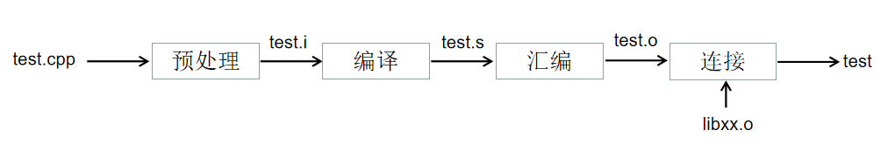
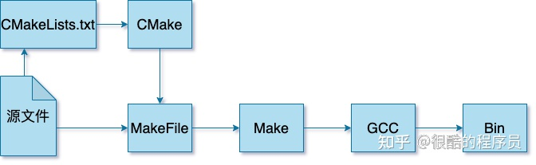
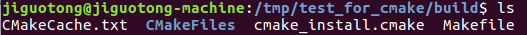
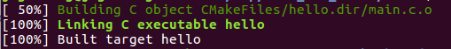
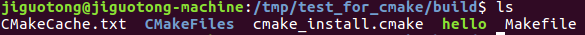

# 一、基础概念解释

## （一）GNU、GCC、gcc、g++、minGW、MSVC

### 1.GNU、GCC

**GNU是一个自由软件运动的项目**，全称为“GNU’s Not Unix”。它的目标是开发出一个完全自由的操作系统，即类Unix的操作系统，但没有使用任何专有软件。这个项目始于1983年，由理查德·斯托曼（Richard Stallman）发起。GNU项目的主要目标是为用户提供自由软件，使用户能够自由地运行、复制、分发、研究、修改和改进软件。GNU项目开发了许多软件工具，包括GNU编译器集合（GCC）、GNU调试器（GDB）、GNU文本编辑器（Emacs）等。虽然GNU项目没有完全实现一个完整的操作系统，但它的工具被广泛地用于构建自由软件的系统，例如**Linux操作系统就是使用了GNU工具**。

**GCC是指GNU编译器集合**（GNU Compiler Collection），是由GNU项目开发的一套开源的编程语言编译器。GCC最初是为C语言开发的，后来逐渐扩展支持了其他编程语言，如C++、Objective-C、Fortran、Ada等。GCC提供了一系列的编译器和工具，包括前端编译器（将源代码翻译为中间表示）、优化器（对中间表示进行优化）、后端编译器（将中间表示翻译为目标机器代码）等。GCC支持多种平台和操作系统，包括Linux、Unix、Windows等。它具有广泛的应用领域，被用于开发各种类型的应用程序，从嵌入式系统到大型服务器应用。GCC是免费、开源的软件，具有良好的可移植性和性能。

### 2.gcc/g++

gcc是GNU的C编译器，g++是GNU的C++编译器，二者都是GCC编译器套件的组成部分。
更准确的说法是：gcc调用了CNU C compiler，而g++调用了CNU C++ compiler



### 3.minGW、MSVC

**MinGW64是一个用于Windows操作系统的开发工具集，它提供了一套用于开发和编译C和C++程序的工具(例如包含GCC GDB等)。**MinGW代表"Minimalist GNU for Windows"，它是一个轻量级的、基于GNU工具集的开发环境，旨在提供一个免费的、开源的替代品，使开发者能够在Windows上进行类Unix的开发。MinGW64是MinGW的64位版本，支持Windows 64位操作系统。MinGW64包含了GCC编译器集合、GNU binutils和其他工具，可以用于编译和构建Windows下的应用程序。与其他编译工具集相比，MinGW64具有较小的体积和较高的兼容性，可以生成与MSVC（Microsoft Visual C++）兼容的可执行文件。

MSVC是指Microsoft Visual C++，是由微软公司开发的C++编译器和集成开发环境（IDE）。MSVC是针对Windows平台的C++开发工具，它提供了强大的开发和调试功能，包括代码编辑、构建、调试、性能分析等。MSVC支持标准的C++语法和扩展，同时还提供了一些微软特有的扩展功能。MSVC还提供了丰富的类库和工具，使开发者能够更轻松地创建Windows应用程序。MSVC是Windows平台上广泛使用的C++开发工具之一，被许多开发者用于开发桌面应用程序、游戏、驱动程序等。**MSVC 使用 Microsoft 的专有编译器，该编译器是 Visual Studio 集成开发环境(IDE)的一部分，通常称为cl.exe**。

## （二）make、cmake、Makefile、CMakefile

### 1.make、Makefile

Make是一种**自动化编译工具**，它能够根据源代码文件的依赖关系，自动地确定需要重新编译哪些文件，并按照预定义的规则进行编译和链接，最终生成可执行文件或库文件。
Make的工作原理是通过读取一个名为**Makefile**的文件来确定编译规则和依赖关系。Makefile中包含了一系列的规则，每个规则定义了一个或多个目标文件、依赖文件和编译命令。当执行make命令时，Make会根据规则中的依赖关系判断哪些文件需要重新编译，并按照规则中定义的编译命令进行编译和链接。
Make的优势在于它能够智能地处理源代码文件的依赖关系，只重新编译有变动的文件，从而提高编译效率。此外，Make还支持并行编译，可以同时编译多个文件，进一步提高编译速度。
Make最初是为Unix系统开发的，但现在已经被广泛应用于各种操作系统和编程语言中。Makefile的语法相对简单，易于编写和维护，使得Make成为开发和构建大型软件项目的重要工具。

### 2.CMkake、CMakeLists.txt

CMake是一种**跨平台的自动化编译工具**，它能够生成适用于不同平台和编译器的构建文件（**如Makefile、Visual Studio项目文件等**），从而实现代码的跨平台编译和构建。
CMake通过读取一个名为**CMakeLists.txt**的文件来确定编译规则和依赖关系。CMakeLists.txt中包含了一系列的命令和变量定义，用于指定源文件、依赖库、编译选项等信息。当执行CMake命令时，CMake会根据CMakeLists.txt中的内容**生成适用于目标平台和编译器的构建文件**。
CMake的优势在于它的跨平台性和灵活性。通过编写一份CMakeLists.txt文件，可以轻松地在不同平台和编译器上构建代码，无需手动编写不同的构建文件。此外，CMake还支持多种生成器（如Makefile、Visual Studio、Xcode等），可以根据需要选择最合适的生成器进行代码构建。
除了生成构建文件，CMake还提供了其他功能，如查找依赖库、定义环境变量、生成安装脚本等。这些功能使得CMake成为开发大型软件项目的强大工具。
CMake最初是为C和C++项目开发的，但现在已经支持多种编程语言，如Java、Python、Rust等。它被广泛应用于各种开源软件项目和商业项目中。

## （三）工具使用流程

GCC将源文件编译（Compile）成可执行文件或者库文件；
而当需要编译的东西很多时，需要说明先编译什么，后编译什么，这个过程称为构建（Build），常用的工具是make，对应的定义构建过程的文件为Makefile；
而编写Makefile对于大型项目又比较复杂，通过CMake就可以使用更加简洁的语法定义构建的流程，CMake定义构建过程的文件为CMakeLists.txt。
它们的大致关系如下图：


使用流程如下：
***有一些源码\*.c \*.h \*.cpp***
***编写CMakeLists.txt，通过cmake命令进行构建----->生成Makefile***
***通过make命令进行多个文件的编译链接（使用到gcc或者g++）------>生成可执行文件***

# 二、gcc/g++基础使用
参考链接：
[c/c++之gcc简明教程](https://zhuanlan.zhihu.com/p/617412967?utm_id=0)
[gcc和gdb的使用技巧](https://www.bilibili.com/video/BV1dP411Q7eJ/?spm_id_from=333.337.search-card.all.click&vd_source=1d204308936e108c95b2ecb8fcdbd781)
## 1.命令选项
```bash
gcc是一个功能强大的编译器，提供了许多命令选项来控制编译过程和生成的目标文件。以下是gcc常用的一些命令选项及其作用：

-E：只执行预处理操作，将预处理结果输出到标准输出。

-S：只进行编译操作，生成汇编代码。

-c：只编译源文件，生成目标文件。

-o ：指定输出文件的名称。

-g：生成调试信息，方便调试程序。

-Wall：打开所有警告提示。

-Werror：将警告视为错误，编译过程中遇到警告将停止。

-O：优化选项，其中可以是0、1、2、3或s，分别表示不优化、一般优化、更多优化、最高优化和大小优化。

-I：指定头文件的搜索路径。

-L：指定库文件的搜索路径。

-l：链接指定的库。

-lm：链接数学库。

-std=：指定使用的C或C++标准，例如-c++11表示使用C++11标准。

-D：定义一个宏。

-U：取消定义一个宏。

-shared：生成共享库。

-static：生成静态库。

-pthread：链接pthread库，支持多线程。

# 这些只是gcc命令选项中的一部分，还有许多其他选项可以用于不同的编译需求。可以通过运行"gcc --help"来查看gcc的完整命令选项列表和详细说明。
```
## 2.简单示例代码
```bash
gcc test.c                  # 直接默认生成a.out
gcc test.c -o test.out      # 生成test.out可执行文件
gcc test.c -S               # 生成test.s汇编文件
gcc test.c -c               # 生成test.o目标文件
gcc test.o -o test.out      # 从对象文件链接成可执行文件

#  对象文件的链接顺序：包含某函数定义的对象文件应该出现在调用该函数的任何文件之后。
gcc main.c function.c -o test.out   # main.c文件中使用了来自function.c的函数，所以要排在前面
# 链接外部库
gcc main.c -lm -o test.out          # -l是链接外部静态库，-lm是链接数学库

```

## 3.设置搜索路径——包含路径(头文件 .h)与链接路径（静态库 .a .lib）

默认情况下，gcc搜索以下目录的头文件：
```bash
/usr/local/include/
/usr/include/
```

以及以下目录的库文件：
```bash
/usr/local/lib/
/usr/lib/
```

（1）包含路径
编译器选项-I在包含路径开头添加新目录(相当于visual studio下的包含目录)
```bash
gcc -I /xxxx/xxxx/include test.c -o test.out 
# 若有多个路径需要添加，linux下用冒号隔开，windows下面用分号隔开
gcc -I /path/to/directory1:/path/to/directory2:/path/to/directory3 main.c -o output
gcc -I "path\to\directory1";"path\to\directory2";"path\to\directory3" main.c -o output
```

（2）链接路径
编译器选项-L在库搜索路径的开头添加新目录。(相当于visual studio下的库目录)
```bash
gcc -L /xxxx/xxxx/lib test.c -o test.out 
# 若有多个路径需要添加，linux下用冒号隔开，windows下面用分号隔开
gcc -I /path/to/directory1:/path/to/directory2:/path/to/directory3 main.c -o output
gcc -I "path\to\directory1";"path\to\directory2";"path\to\directory3" main.c -o output
```

（3）使用环境变量设置包含路径与链接路径
头文件和库的搜索路径也可以通过shell中的环境变量来控制。
```bash
C_INCLUDE_PATH=/opt/gdbm-1.8.3/include   
export C_INCLUDE_PATH

LIBRARY_PATH=/opt/gdbm-1.8.3/lib   
export LIBRARY_PATH
```

⭐当环境变量和命令行选项一起使用时，编译器按以下顺序搜索目录：
- 命令行选项-I和-L，从左到右;
- 由环境变量指定的目录，例如C_INCLUDE_PATH和LIBRARY_PATH;
- 默认系统目录;

## 4.共享库.so和静态库.a
***外部库通常以两种形式提供：静态库和共享库。***

- 静态库是前面看到的.a文件。 当程序与静态库链接时，***程序使用任何外部函数的对象文件中的机器代码将从库复制到最终的可执行文件中***。

- 共享库使用更高级的链接形式处理，这使得可执行文件更小。 它使用扩展名.so，它代表共享对象。与共享库链接的可执行文件只包含它所需要的函数的一个小表，而不是来自外部函数的对象文件的完整机器代码。***在可执行文件开始运行之前，操作系统将外部函数的机器代码从磁盘上的共享库文件复制到内存中——这个过程被称为动态链接。*** 共享库可以在不重新编译使用它的程序的情况下更新库（前提是库的接口不会更改）。gcc 编译程序在大多数系统中默认使用共享库（如果它们是可用的话）。 每当静态库 'libName.a'用选项-lName链接时，编译器首先检查是否具有相同名称和.so扩展的替代共享库。

可执行文件启动时，它加载使用了共享库的程序函数时必须找到共享库才能将其加载到内存中。默认情况下，加载程序只在预定义的系统目录集中搜索共享库，例如‘/usr/local/lib’和‘/usr/lib’。因此，如果共享库不位于预定义的目录中，则必须将其添加到加载路径（Load Path）中。设置加载路径最简单的方法是通过环境变量LD_LIBRARY_PATH。
```bash
LD_LIBRARY_PATH=/opt/gdbm-1.8.3/lib
export LD_LIBRARY_PATH
```

如果一定要用静态链接，可以强制使用gcc 的-static选项，以避免使用共享库。
```bash
gcc -Wall -static -I/opt/gdbm-1.8.3/include/ -L/opt/gdbm-1.8.3/lib/ dbmain.c -lgdbm
```
# 三、gcc/g++进阶使用——make自动化编译工具

## （一）

make -j 参数加快编译效率

# 四、make进阶使用——CMake自动化编译工具

## （一）CMake概述

CMake是一个开源、跨平台的编译、测试和打包工具，它使用比较简单的语言描述编译、安装的过程，输出Makefile或者project文件，再去执行构建。
使用cmake一般流程为：

- 生成构建系统（buildsystem，比如make工具对应的Makefile）；
- 执行构建（比如make），生成目标文件；
- 执行测试、安装或打包。

## （二）CMake基本使用

参考链接：
https://blog.csdn.net/qq_34796146/article/details/108877159

1.文件准备 /home/tmp

```txt
.
└── test_for_cmake
    ├── CMakeLists.txt
    └── main.c
```

***main.c***

```c
#include <stdio.h>
int main(){
    printf("Hello World from Main!\n");
    return 0;
}
```

***CMakeLists.txt***

```cmake
PROJECT(HELLO)
SET(SRC_LIST main.c)
MESSAGE(STATUS "This is BINERY dir: ${HELLO_BINARY_DIR}")
MESSAGE(STATUS "This is SOURCE dir: ${HELLO_SOURCE_DIR}")

ADD_EXECUTABLE(hello ${SRC_LIST})
```

2.构建
->执行cmake
$ cmake -B build  #会将生成的所有临时文件放到build里面，包括Makefile

->执行make
$ cd build
$ make      #会生成hello可执行文件


->执行可执行文件
$ ./hello

## （三）CMakeLists.txt进阶使用

参考链接：
https://blog.csdn.net/qq_34796146/article/details/108877159
https://zhuanlan.zhihu.com/p/500002865

### 1.CMakeLists.txt概述

CMakeLists.txt由命令、注释和空格组成,其中命令是不区分大小写的，符号"#"后面的内容被认为是注释。命令由命令名称、小括号和参数组成，参数之间使用空格进行间隔。
以下为具体的CMakeLists.txt：

```cmake
CMAKE_MINIMUM_REQUIRED(VERSION 3.0)                         # 需要的CMake最低版本
PROJECT(example_person)                                     # 项目名称

SET(CMAKE_CXX_FLAGS "${CMAKE_CXX_FLAGS} -std=c++0x")        # 如果代码需要支持C++11
add_definitions("-Wall -g")                                 # 使得想要生成的可执行文件拥有符号表，可以gdb调试

set(GOOGLE_PROTOBUF_DIR ${PROJECT_SOURCE_DIR}/protobuf)     # 设置变量
set(PROTO_PB_DIR ${PROJECT_SOURCE_DIR}/proto_pb2)
set(PROTO_BUF_DIR ${PROJECT_SOURCE_DIR}/proto_buf)

add_subdirectory(proto_pb2)                                 # 同时构建子文件夹下的CMakeLists.txt

include_directories(${PROJECT_SOURCE_DIR} ${PROTO_PB_DIR} ${PROTO_BUF_DIR}) # 规定.h头文件路径
link_directories(LD_LIBRARY_DIR)                                      # 规定.so/.a库文件路径

add_executable(${PROJECT_NAME} example_person.cpp )         # 生成可执行文件
target_link_libraries(${PROJECT_NAME} general_pb2)          # 进行链接操作
```

### 2.CMakeLists.txt常用命令详解

参考链接：
https://blog.csdn.net/songyuc/article/details/128018692

#### find_path

⭐命令：find_path(\<var> NAMES name PATHS [path1] [path2] [path])

⭐用途：搜索包含某个指定文件的路径，若在以上路径中找到name文件，则将该路径返回给变量var，否则var的值为var-NOTFOUND

⭐示例：find_path(OPENCV_INCLUDE_DIR opencv2.h /usr/include)

⭐注意事项：find_path不会递归搜索，只能在path中搜索，如果想要在path子文件夹中找到文件，可以使用PATH_SUFFIXES修饰符，例find_path(GSLINCLUDE NAMES "fred.h" PATHS /usr/include PATH_SUFFIXES opencv)

#### find_package

⭐命令：

⭐用途：查找依赖包，理想情况下，可以把一整个依赖包的头文件包含路径、库路径、库名字、版本号等情况都获取到。有两种模式，模块模式(Module mode)和配置模式(Config mode)
1）Module模式：
在该模式下，Cmake会搜索一个名为Find\<PackageName>.cmake的文件，其中\<PackageName>为待搜索包的名称。搜索路径的顺序依次是：

- 从变量CMAKE_MODULE_PATH指定的路径中进行查找 预先 set(CMAKE_MODULE_PATH ${CMAKE_CURRENT_SOURCE_DIR})
- 从Cmake安装路径中查找。Cmake会在其安装路径下提供很多.cmake文件，例如/usr/local/cmake/Modules/目录下（不同的系统安装目录可能不一致）

2）Config模式：
要找\<packageName>Config.cmake或\<lower-case-package-name>-config.cmake文件，查找顺序：

- \<packageName>_ROOT变量路径
- \<package_name>_DIR变量路径，有了就不用上面那个了（可以用这个，定义这个变量）

⭐示例：find_package(OpenCV REQUIRED)

⭐注意事项：

#### find_library

⭐命令：find_library(\<var> NAMES name PATHS [path1] [path2] [path])

⭐用途：在指定路径中搜索库的名字，若找到，将路径赋值给var

⭐示例：find_library(OPENCV_LIB_DIR NAMES opencv_core)或find_library(OPENCV_LIB_DIR NAMES libopencv_core.a)

⭐注意事项：

#### set

⭐命令：set(var "content")

⭐用途：将""中的内容赋值给var

⭐示例：set(CMAKE_MODULE_PATH "${PROJECT_SOURCE_DIR}")

⭐注意事项：

#### MESSAGE

⭐命令：MESSAGE([\<mode>] "message text" ...)

⭐用途：在终端显示cmake过程中的信息

⭐示例：#MESSAGE( STATUS "Pangolin_LIBRARIES: " ${Pangolin_LIBRARIES})

⭐注意事项：

#### include_directories

⭐命令：

⭐用途：

⭐示例：

⭐注意事项：

#### add_executable

⭐命令：

⭐用途：

⭐示例：

⭐注意事项：

#### target_link_libraries

⭐命令：

⭐用途：

⭐示例：

⭐注意事项：

### 3.CMakeLists.txt实用案例

```CMake

```
