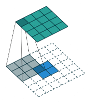

## tensor的切片操作
result=src[a, b, c], src是一个三维的tensor，若a, b, c均是多维tensor，则三者必须拥有同样的维度shape_，且result.shape最终会等于shape_。
用几何的角度来解释就是，在h维度上切成h个面，将这h个面用重复的方式组成a.shape的形式，此时每一个面都需要w维度与c维度的值来确定到底是这个面上的哪个值。因此b与c必须同a有严格相同的shape结构，才能对应到每一个面上。若b或者c是一个一维的数，实际运算时会用到tensor的广播机制，例如 1 -> a.shape; 若b或者c是全部索引:，则代表该维度上所有值。
例如，result = src[a, b, :]，其中src.shape=(h, w, c)，则result.shape=((a.shape, c))

## torch函数应用

1、torch.argmax(input: Tensor, dim: Optional[_int]=None, keepdim: _bool=False, *, out: Optional[Tensor]=None)
返回指定维度最大值的序号（索引）。实际就是以该维度为标准划分为各个队伍，不个队伍的同一位置进行pk，选出最大的值所在的索引。
若x.shape(2,3,4),y=torch.argmax(x,dim=0),则y.shape(3,4)
若x.shape(2,3,4),y=torch.argmax(x,dim=1),则y.shape(2,4)
若x.shape(2,3,4),y=torch.argmax(x,dim=2),则y.shape(2,3)

```python
import torch

x = torch.rand(3,2,3)
print(x)
y0 = torch.argmax(x, dim=0)
print(y0)
y1 = torch.argmax(x, dim=1)
print(y1)
y2 = torch.argmax(x, dim=2)
print(y2)
```


2、DataLoader类
数据加载器，结合了数据集和取样器，并且可以提供多个线程处理数据集。
在训练模型时使用到此函数，用来把训练数据分成多个小组 ，此函数每次抛出一组数据。直至把所有的数据都抛出。就是做一个数据的初始化。


```python
"""
    批训练，把数据变成一小批一小批数据进行训练。
    DataLoader就是用来包装所使用的数据，每次抛出一批数据
"""
import torch
import torch.utils.data as Data

BATCH_SIZE = 5

x = torch.linspace(1, 10, 10)
y = torch.linspace(10, 1, 10)
# 把数据放在数据库中
torch_dataset = Data.TensorDataset(x, y)
loader = Data.DataLoader(
    # 从数据库中每次抽出batch size个样本
    dataset=torch_dataset,
    batch_size=BATCH_SIZE,
    shuffle=True,
    num_workers=2,
)


def show_batch():
    for epoch in range(3):
        for step, (batch_x, batch_y) in enumerate(loader):
            # training
            print("steop:{}, batch_x:{}, batch_y:{}".format(step, batch_x, batch_y))


if __name__ == '__main__':
    show_batch()
```

3、torch.cat()和torch.stack()用法
都是对张量进行拼接操作
torch.cat(): 用于连接两个相同大小的张量，不扩展维度
torch.stack(): 用于连接两个相同大小的张量，并扩展维度

```python
import torch
x=torch.zeros(2,3)
y=torch.ones(2,3)
print(x)
print(y)
print('-------------------------torch.cat---------------------------')
# torch.cat
a=torch.cat([x,y],dim=0)
print(a.shape)
print(a)

print('-------------------------troch.stack---------------------------')
# torch.stack
b = torch.stack((x,y),dim=0)
print(b.shape)
print(b)

print('--------------------------end--------------------------')
```

结果如图：
https://github.com/suhwan-cho/TMO

4、.item()和a.eq(b)
.item()作用是取出单元素张量的元素值并返回该值，保持原元素类型不变。
例如loss是tensor(0.569),若total=loss.item(),则total为0.569，仍然是float类型
.eq()是用于比较的包装器，返回同等维度的True/False合集

5、批量标准化（Batch Normalization）
不仅仅对输入层做标准化处理，还要对 每一中间层的输入(激活函数前) 做标准化处理，使得输出服从均值为 0，方差为 1 的正态分布，从而避免内部协变量偏移的问题。

```python
nn.BatchNorm2d(in_channels)
```

**优点**：

+ 首先，通过对输入和中间网络层的输出进行标准化处理后，减少了内部神经元分布的改变，使降低了不同样本间值域的差异性，得大部分的数据都其处在非饱和区域，从而保证了梯度能够很好的回传，避免了梯度消失和梯度爆炸
+ 其次，通过减少梯度对参数或其初始值尺度的依赖性，使得我们可以使用较大的学习速率对网络进行训练，从而加速网络的收敛
+ 最后，由于在训练的过程中批量标准化所用到的均值和方差是在一小批样本(mini-batch)上计算的，而不是在整个数据集上，所以均值和方差会有一些小噪声产生，同时缩放过程由于用到了含噪声的标准化后的值，所以也会有一点噪声产生，这迫使后面的神经元单元不过分依赖前面的神经元单元。所以，它也可以看作是一种正则化手段，提高了网络的泛化能力，使得我们可以减少或者取消 Dropout，优化网络结构

6.torch.bincount()
``torch.bincount(input, weights=None, minlength=0) → Tensor``

参数：
+ input：输入的一维整数张量
+ weights（可选）：与input张量相同形状的张量，用于为每个值指定权重
+ minlength（可选）：输出张量的最小长度

返回值：**一个具有长度为max(input) + 1的一维长整型张量，其中索引i处的值表示i在输入张量中出现的频次**

示例：
```python

import torch
 
input = torch.tensor([1, 2, 3, 2, 1, 1])    # 1, 2, 3, 2, 1, 1
counts = torch.bincount(input)      # 0, 3, 2, 1，代表着，0出现了0次，1出现了3次，2出现了2次，3出现了1次

```

7.torch.scatter、torch_scatter.scatter、torch_scatter.segment_csr三个函数的递进关系
https://zhuanlan.zhihu.com/p/587975275
https://zhuanlan.zhihu.com/p/544368788
https://pytorch-scatter.readthedocs.io/en/latest/functions/segment_csr.html

8.torch.einsum爱因斯坦求和

**DEFINES:**
- Free Indices：Are the indices specified in the output.
- Summation Indices: All other indices. Those that appear in the input augument but NOT in output specification.

**RULES:**
- 1.Repeating letters in different inputs means those values will be multiplied and those products will be the output.
- 2.Omitting a letter means that axis will be summed.
- 3.We can return the unsummed axis in any order.

**具体总结:**
- 1.当源数组仅为1个，不涉及到相乘，只会是取数或某种求和
- 2.被省略的标记位会被求和规约，沿此维度进行求和
- 3.在不同输入中同时存在的标记位会涉及到相乘
- 4.某些特殊操作下会涉及到自动广播

**代码示例：**
```python
"""""
@Author     :   jiguotong
@Contact    :   1776220977@qq.com
@site       :   
-----------------------------------------------
@Time       :   2024/7/8
@Description:   本脚本用于测试torch.einsum的用法
""" ""

import torch

x = torch.rand((2, 3))

# Permutation of Tensors
torch.einsum("ij->ji", x)

# Summation
torch.einsum("ij->", x)

# Column Sum
torch.einsum("ij->j", x)

# Row Sum
torch.einsum("ij->i", x)

# Matrix-Vector Multiplication
v = torch.rand((1, 3))
torch.einsum("ij, kj->ik", x, v)

# Matrix-Matrix Multiplication
torch.einsum("ij, kj->ik", x, x)  # equal to   x.mm(x.transpose(1,0))

# Dot product first row with first row of matrix
torch.einsum("i,i->", x[0], x[0])

# Dot product with matrix
torch.einsum("ij, ij->", x, x)

# Hadamard Product (element-wise multiplication)，若输入维度不匹配，可自动广播
torch.einsum("ij, ij->ij", x, x)

# Vextor Outer Product
a = torch.rand((3))
b = torch.rand((5))
torch.einsum("i,j->ij", a, b)

# Batch Matrix Multiplication
a = torch.rand((3, 2, 5))
b = torch.rand((3, 5, 3))
torch.einsum("ijk,ikl->ijl", a, b)

# Matrix Diagonal
x = torch.rand((3, 3))
torch.einsum("ii->i", x)

# Matrix Trace
torch.einsum("ii->", x)
```
**参考资料：**
- https://www.youtube.com/watch?v=pkVwUVEHmfI
- https://blog.csdn.net/ViatorSun/article/details/122710515


## 2.7 谈谈各种归一化操作Normalization
### 2.7.0 协变量偏移
在机器学习中，一般会假设模型的输入数据的分布是稳定的。若是输入数据的分布发生变化，这种现象被称为**协变量偏移(covariate shift)。**。同理，在一个复杂的机器学习系统中，也会要求系统的各个子模块在训练过程中输入分布是稳定的。若是不满足这一条件，则会称为**内部协变量偏移(internal covariate shift, ICS)**。每一层隐藏层经过一个批次的前向传播和反向传播，参数会更新，于是下一个批次再进行前向传播的时候，计算参数已经与上一个批次不同，由此数据分布发生变化，产生所谓的协变量偏移。

### 2.7.1 什么是归一化操作
归一化操作就是加入一个新的计算层，对数据的分布进行额外的约束，将一列数据变化到某个固定区间(范围)中。在标准化的基础上，使用其他参数进行修正分布。
常见的归一化操作有：**批归一化(Batch Normalization)**、**层归一化(Layer Normalization)**、**实例归一化(Instance Normalization)**、**组归一化(Group Normalization)**

[归一化类型图解](https://blog.csdn.net/weixin_44492824/article/details/124025689)
[归一化类型以及使用场景](https://zhuanlan.zhihu.com/p/638944399)

### 2.7.2 为什么要有归一化操作
协变量偏移带来的问题：
- 收敛速度慢，学习不稳定
- 产生梯度消失问题

### 2.7.3 如何做归一化操作

注：以批归一化为例
```python
#在PyTorch中，nn.BatchNorm1d是一个用于实现一维输入张量的批标准化（batch normalization）操作的类。
import torch
import torch.nn as nn

# 创建一个批标准化层
batch_norm = nn.BatchNorm1d(64)

# 创建一个随机输入张量
input = torch.randn(32, 64)

# 应用批标准化
output = batch_norm(input)
print(torch.mean(input[:,0]))
print(torch.mean(output[:,0,]))
pass


#在PyTorch中，nn.BatchNorm2d是一个用于实现二维输入张量的批标准化（batch normalization）操作的类，对通道进行归一化
import torch
import torch.nn as nn

# 创建一个批标准化层
batch_norm = nn.BatchNorm2d(64)

# 创建一个随机输入张量
input = torch.randn(32, 64, 28, 28)

# 应用批标准化
output = batch_norm(input)
print(torch.mean(input[:,0,:,:]))
print(torch.mean(output[:,0,:,:]))
pass


#在PyTorch中，nn.BatchNorm3d是一个用于实现三维输入张量的批标准化（batch normalization）操作的类。
import torch
import torch.nn as nn

# 创建一个批标准化层
batch_norm = nn.BatchNorm3d(64)

# 创建一个随机输入张量
input = torch.randn(32, 64, 28, 28, 28)

# 应用批标准化
output = batch_norm(input)

print(torch.mean(input[:,0,:,:,:]))
print(torch.mean(output[:,0,:,:,:]))
pass
```
## 2.8 各类卷积操作

多通道标准卷积 https://blog.csdn.net/weixin_39450742/article/details/122722242
分组卷积 https://zhuanlan.zhihu.com/p/65377955
深度可分离卷积 https://blog.csdn.net/zml194849/article/details/117021815
转置卷积（逆卷积） https://github.com/vdumoulin/conv_arithmetic/tree/master

1.标准多通道卷积


```python
img = torch.randn(16,8,8)
layer = nn.Conv2d(16, 64, kernel_size=3, stride=1, padding=0, bias=False)
out = layer(img)    #(64,6,6)
# 使用的参数量为：3*3*16*64=9216
pass
```

2.分组卷积
将输入特征分成g组，每组单独进行标准卷积，最后将g组的结果进行拼接


```python
img = torch.randn(16,8,8)
layer = nn.Conv2d(16, 64, kernel_size=3, stride=1, padding=0, groups=8, bias=False)
out = layer(img)    #(64,6,6)
# 使用的参数量为：3*3*(16/8)*(64/8)*8=1152
pass
```

3.深度可分离卷积
由深度卷积dw和逐点卷积pw构成
（1）深度卷积dw

本质上是分组卷积，且输出通道数和组数都等于输入通道数，因此通道数没有变化，只有高宽尺寸发生变化，此种操作没有没有有效的利用不同通道在相同空间位置上的feature信息。

（2）逐点卷积pw

本质上是标准卷积，filter的核为1*1，输出通道数为设置的值，因此通道数发生了变化，但高宽尺寸没有发生变化。

综合代码

```python
img = torch.randn(16,8,8)
layer_dw = nn.Conv2d(16, 16, kernel_size=3, stride=1, padding=0, groups=16, bias=False)
out = layer_dw(img)    #(16,6,6)
layer_pw = nn.Conv2d(16,64, kernel_size=1, stride=1, padding=0, bias=False)
out = layer_pw(out)    #(64,6,6)
# 使用的参数量为：3*3*(16/16)*(16/16)*16 + 1*1*16*64 = 114 + 1024 = 1138
pass
```

4.反（逆）卷积
卷积过程的逆过程


```python
import torch
import torch.nn as nn

input = torch.randn(1, 3, 16, 16)
m = nn.ConvTranspose2d(in_channels=3, out_channels=9, kernel_size=3, stride=1, padding=0, bias=False)
output = m(input)       # output.shape(1,9,18,18)
```

ps:所有卷积计算过程，实际上都是对卷积核做了flip（首尾互换）处理，起源于数字信号中的卷积操作。之前没有注意到这个地方。很神奇。互相关运算以及卷积运算的区别。https://blog.csdn.net/qq_42589613/article/details/128297091

## 2.9 PyTorch中的损失函数

（1）交叉熵损失函数

+ BCE(binary_cross_encrypt,二值交叉熵)
  F.binary_cross_entropy_with_logits:该损失函数已经内部自带了计算logit的操作，无需在传入给这个loss函数之前手动使用sigmoid/softmax将之前网络的输入映射到[0,1]之间

```python
from torch.nn import functional as F
bce_loss = F.binary_cross_entropy(F.sigmoid(input), target)
bce_loss = F.binary_cross_entropy_with_logits(boundary_logits, boudary_targets_pyramid)
```

+ dice_loss:Dice Loss常用于语义分割问题中，可以缓解样本中前景背景（面积）不平衡带来的消极影响.
+ 

```python
def dice_loss_func(input, target):
    smooth = 1.
    n = input.size(0)
    iflat = input.view(n, -1)
    tflat = target.view(n, -1)
    intersection = (iflat * tflat).sum(1)
    loss = 1 - ((2. * intersection + smooth) /
                (iflat.sum(1) + tflat.sum(1) + smooth))
    return loss.mean()
```

（2）ohemCELoss
图像分割领域使用的损失函数，其中 Online hard example mining 的意思是，在训练过程中关注 hard example，对其施加更高权重的一种训练策略。cross-entropy loss 就是普通的交叉熵损失函数。

```python
class OhemCELoss(nn.Module):
    """
    Online hard example mining cross-entropy loss:在线难样本挖掘
    if loss[self.n_min] > self.thresh: 最少考虑 n_min 个损失最大的 pixel，
    如果前 n_min 个损失中最小的那个的损失仍然大于设定的阈值，
    那么取实际所有大于该阈值的元素计算损失:loss=loss[loss>thresh]。
    否则，计算前 n_min 个损失:loss = loss[:self.n_min]
    """
    def __init__(self, thresh, n_min, ignore_lb=255, *args, **kwargs):
        super(OhemCELoss, self).__init__()
        self.thresh = -torch.log(torch.tensor(thresh, dtype=torch.float)).cuda()     # 将输入的概率 转换为loss值
        self.n_min = n_min
        self.ignore_lb = ignore_lb
        self.criteria = nn.CrossEntropyLoss(ignore_index=ignore_lb, reduction='none')   #交叉熵
 
    def forward(self, logits, labels):
        N, C, H, W = logits.size()
        loss = self.criteria(logits, labels).view(-1)
        loss, _ = torch.sort(loss, descending=True)     # 排序
        if loss[self.n_min] > self.thresh:       # 当loss大于阈值(由输入概率转换成loss阈值)的像素数量比n_min多时，取所以大于阈值的loss值
            loss = loss[loss>self.thresh]
        else:
            loss = loss[:self.n_min]
        return torch.mean(loss)
```

(3)FocalLoss
https://blog.csdn.net/zhaohongfei_358/article/details/129108869

## 2.10 PyTorch中数据的输入和预处理

1、torch.utils.data.DataLoader()

```python
DataLoader(dataset, batch_size=1, shuffle=False, sampler=None, batch_sampler=None, num_workers=0, collate_fn=None, pin_memory=False, drop_last=False, timeout=0, work_init_fn=None)
```

2、python的类中函数__getitem__的作用及使用方法
__getitem__方法的作用是，可以将类中的数据像数组一样读出，操作符为[]，使用索引访问元素

```python
class Test():
    def __init__(self):
        self.a=[1,2,3,4,5]
    def __getitem__(self,idx):
        return(self.a[idx])
data=Test()
print(data[2])

--------------
>>>3

class Test():
    def __init__(self):
        self.a=[1,2,3,4,5]
    def __getitem__(self,idx):
        return(self.a)
data=Test()
print(data[2])

--------------
>>>[1,2,3,4,5]
```

3、python的内置__getitem__方法与PyTorch的Dataloader结合使用：
https://blog.csdn.net/virus111222/article/details/128210099
过程剖析：
（1）定义一个数据集dataset，要重写__len__函数和__getitem__函数，因为后面要用遍历dataloader（需要用索引获取数组）
（2）定义一个dataloader，用来封装该数据集，并且指定batch_size以及是否打乱顺序等
（3）遍历dataloader时，比如batch_size等于4，那么dataloader就找4个下标（如果没打乱 就是 0 1 2 3 / 4 5 6 7，如果打乱，就会随机下标），去dataset里面通过这4个下标idx从__getitem__获取相应的数据(也可以选择不使用下标)

```python
import torch
import numpy as np
from torch.utils.data import Dataset
 
# 创建MyDataset类
class MyDataset(Dataset):
    def __init__(self, x, y):
        self.data = torch.from_numpy(x).float()
        self.label = torch.LongTensor(y)
 
    def __getitem__(self, idx):
        print("当前idx:{}".format(idx))
        return self.data[idx], self.label[idx], idx
 
    def __len__(self):
        return len(self.data)
 
Train_data = np.array([[1, 2, 3], [4, 5, 6], [7, 8, 9], [10, 11, 12]])
Train_label = np.array([10, 11, 12, 13])
TrainDataset = MyDataset(Train_data, Train_label) # 创建实例对象
print('len:', len(TrainDataset))
 
# 创建DataLoader
loader = torch.utils.data.DataLoader(
    dataset=TrainDataset,
    batch_size=2,
    shuffle=True,
    num_workers=0,
    drop_last=False)
 
# 按batchsize打印数据
for batch_idx, (data, label, index) in enumerate(loader):
    print('batch_idx:',batch_idx, '\ndata:',data, '\nlabel:',label, '\nindex:',index)
    print('---------')
```

输出结果

```python
len: 4
当前idx:0
当前idx:3
batch_idx: 0 
data: tensor([[ 1.,  2.,  3.],
        [10., 11., 12.]]) 
label: tensor([10, 13]) 
index: tensor([0, 3])
---------
当前idx:1
当前idx:2
batch_idx: 1 
data: tensor([[4., 5., 6.],
        [7., 8., 9.]]) 
label: tensor([11, 12]) 
index: tensor([1, 2])
---------
```

## 2.11 PyTorch模型的保存和加载

```python
torch.save(obj, f, pickle_module=pickle, pickle_protocol=2)
torch.load(f, map_location=None, pickle_module=pickle, **pickle_load_args)
```

**obj**：可以被序列化的对象，包括模型和张量等。
f：存储文件的路径
**pickle_module**：序列化的库，默认是pickle
**pickle_protocol**：**对象转为字符串的规范协议
**map_location**：cpu或者cpu，以此支持保存/加载模型时的设备不一样，例如保存的时候是gpu，但是加载的时候只有cpu，此时设map_location='cpu'，若是gpu下，map_location='cuda:0'
**pickle_load_args**：存放参数，指定传给pickle_module.load的参数
使用案例如下：

```python
torch.save(self.model.state_dict(), "checkpoints/TMO.pth")
torch.load("checkpoints/TMO.pth",map_location='cpu')
```

## 2.12 PyTorch的分布式训练

单机多卡及常见问题：https://blog.csdn.net/u013531940/article/details/127858330
多机多卡的基本概念：https://blog.csdn.net/a545454669/article/details/128772522

### 1.PyTorch模型的并行化
PyTorch模型的并行化方法分为**模型并行（Model Parallel）**和**数据并行（DataParallel）**。PyTorch主要支持的是数据并行化的概念，这个概念在PyTorch中分为两种类型，即**数据并行化(Data Parallel, DP)**和**分布式数据并行化(Distributed Data Parallel, DDP)**。

### 2.两种数据并行化方式的说明及使用
（1）DP
使用的是torch.nn.DataParallel类。

``torch.nn.DataParallel(module, device_ids=None, output_device=None, dim=0)``

该类传入一个PyTorch的模块，且这个模块必须是先保存在主GPU上，其工作原理是将模型从主GPU设备上复制到device_ids指定的设备上；dim参数规定了迷你批次的分割方向。
使用示例如下：
```python
import torch.nn as nn
model = ...
model = model.cuda()
model = nn.DataParallel(model, device_ids=[0,1], dim=0)
output = model(input)
```

(2)DDP
使用的是torch.distributed分布式计算包，具体可分为对所有计算进程进行初始化、定义分布式训练的数据采样器、构建分布式数据并行模型。torch.distributed 提供了更好的接口和并行方式，搭配多进程接口 torch.multiprocessing 可以提供更加高效的并行训练。
使用示例如下：
```python
"""""
@Author     :   jiguotong
@Contact    :   1776220977@qq.com
@site       :   
-----------------------------------------------
@Time       :   2024/8/1
@Description:   本代码用来测试torch的DDP使用方法；本代码使用PyTorch版本为2.0.1，不同版本调用方式不同
""" ""

import os
import torch
import torch.nn as nn
import torch.optim as optim
import torch.distributed as dist
from torch.utils.data import Dataset
import torch.multiprocessing as mp
from torch.nn.parallel import DistributedDataParallel as DDP


class TestModel(nn.Module):

    def __init__(self):
        super().__init__()
        self.conv1 = nn.Conv1d(3, 16, 3, 1, 1)
        self.bn1 = nn.BatchNorm1d(16)
        self.conv2 = nn.Conv1d(16, 32, 3, 1, 1)
        self.bn2 = nn.BatchNorm1d(32)
        self.conv3 = nn.Conv1d(32, 3, 3, 1, 1)
        self.relu = nn.ReLU()

    def forward(self, x):
        x = self.relu(self.bn1(self.conv1(x)))
        x = self.relu(self.bn2(self.conv2(x)))
        x = self.relu(self.conv3(x))
        return x


class TestDataset(Dataset):

    def __init__(self, n):
        self.n = n
        pass

    def __len__(self):
        pass
        return self.n

    def __getitem__(self, index):
        data = torch.randn((3, 10000))
        target = torch.randn((3, 10000))
        return data, target


def main_worker(rank, world_size):
    model = TestModel().to(rank)
    train_dataset = TestDataset(100)

    dist.init_process_group(backend="nccl", rank=rank, world_size=world_size)

    # 用于分布式训练的数据采样器
    train_sampler = torch.utils.data.distributed.DistributedSampler(
        train_dataset)

    train_loader = torch.utils.data.DataLoader(train_dataset,
                                               batch_size=4,
                                               sampler=train_sampler)
    # 构建分布式数据并行模型
    model = DDP(model, device_ids=[rank])

    optimizer = optim.SGD(model.parameters(), lr=0.001)
    criterion = nn.CrossEntropyLoss()

    for epoch in range(1000):
        # 避免数据一致
        train_sampler.set_epoch(epoch)
        for batch_idx, (input, target) in enumerate(train_loader):
            input = input.to(rank)
            target = target.to(rank)

            output = model(input)
            loss = criterion(output, target)
            optimizer.zero_grad()
            loss.backward()
            optimizer.step()
        if rank == 0:
            print("current epoch: {} , loss: {} ".format(epoch, loss.item()))
    print("Done!")


if __name__ == '__main__':

    os.environ["MASTER_ADDR"] = "127.0.0.1"
    os.environ["MASTER_PORT"] = "7777"

    world_size = 2

    # 使用torch.multiprocessing开启多个进程
    mp.spawn(main_worker, args=(world_size, ), nprocs=world_size, join=True)

    # pass

```

### 3.参考资料
[pytorch单机多卡及常见问题](https://blog.csdn.net/u013531940/article/details/127858330)

[多机多卡的基本概念](https://blog.csdn.net/a545454669/article/details/128772522)

[PyTorch 多进程分布式训练实战](https://murphypei.github.io/blog/2020/09/pytorch-distributed)

[PyTorch官网-DISTRIBUTED DATA PARALLEL](https://pytorch.org/docs/2.0/notes/ddp.html)


## 3.1 常见网络架构及解析

### 3.1.1 ResNet

https://blog.csdn.net/qq_39770163/article/details/126169080

### 3.1.5 BiseNet

https://blog.csdn.net/rainforestgreen/article/details/85157989
https://blog.csdn.net/lx_ros/article/details/126515733
http://t.csdn.cn/Rv60I

# 3.常用工具学习

Hydra官网：https://hydra.cc/docs/1.3/intro/

## 3.1 Hydra学习————python中用来配置变量的工具

### 3.1.1 安装

pip install hydra-core

### 3.1.2 了解YAML文件和python函数装饰器的使用

YAML文件：https://blog.csdn.net/xikaifeng/article/details/121612180
函数装饰器：https://blog.csdn.net/qq_45476428/article/details/126962919

### 3.1.3 使用Hydra

main.py

```python
import hydra
from omegaconf import DictConfig

@hydra.main(config_path="configs", config_name="config")
def test(config: DictConfig):
    # To access elements of the config
    print(f"The batch size is {config.deeplearning['batch_size']}")
    print(f"The learning rate is {config.User[0]['name']}")

    # 用OmegaConf.to_yaml组织成yaml的可视化格式
    print(OmegaConf.to_yaml(config))

if __name__ == "__main__":
    test()
```

configs/config.yaml

```yaml
### config/config.yaml
deeplearning:
  batch_size: 10
  lr: 1e-4

User:
-  name: jiguotong
-  age: 24
```

### 3.1.4 进阶使用Hydra-group

可以在yaml文件中进行嵌套其他yaml文件
文件结构

```shell
├── configs
│   ├── config_db.yaml
│   └── db
│       ├── mysql.yaml
│       └── postgresql.yaml
└── main.py
```

main.py

```python
import hydra
from omegaconf import DictConfig

@hydra.main(config_path="configs", config_name="config")
def test_for_db(config: DictConfig):
    print(config.db.driver)
    print(config.db.user)
    print(OmegaConf.to_yaml(config))

if __name__ == "__main__":
    test_for_db()
```

configs/config_db.yaml

```yaml
### config/config_db.yaml
defaults:
  - db: mysql
```

configs/db/mysql.yaml

```yaml
driver: mysql
user: mysql_user
password: 654321
timeout: 20
```

configs/db/postgresql.yaml

```yaml
driver: postgresql
user: postgres_user
password: 123456
timeout: 20
```

## 3.2 Hook机制————为所欲为的钩子
https://www.cnblogs.com/ArsenalfanInECNU/p/12871887.html


## 3.3 tensorboard使用
[tensorboardX官方Github](https://github.com/lanpa/tensorboardX)

1.安装
若使用pytorch框架，pip install tensorboardX
若使用tensorflow框架，pip install tensorboard

2.基础使用
首先用SummaryWriter创建用于写events的对象，然后用add_scalar向该对象内写入数据，最后关闭写对象。可以将不同阶段(如训练与验证)写到一个写对象中，更方便对比。
train.py
```python
from tensorboardX import SummaryWriter

...

# 一个写对象就对应着一个event
train_log_path = '.'    # 在当前工作目录下保存，当前工作目录即os.getcwd()所得到的目录    
valid_log_path = '.'    
train_writer = SummaryWriter(train_log_path, filename_suffix='TRAIN')
val_writer = SummaryWriter(valid_log_path, filename_suffix='VAL')

...

for epoch in range(0, max_epochs):
    
    ...

    for batch_idx, batch in enumerate(train_dataloader):
        ...
        loss1=...
        loss2=...
        n_batchsize = len(train_dataloader)
        step = epoch * n_batchsize + batch_idx
        train_writer.add_scalar('Loss/Batch/loss1', loss1, step)
        train_writer.add_scalar('Loss/Batch/loss2', loss2, step)
    
    # 计算一个epoch下来平均的指标值
    avg_loss1=total_loss1/n_batchsize
    avg_loss2=total_loss2/n_batchsize
    train_writer.add_scalar('Loss/Epoch/loss1', avg_loss1, epoch)
    train_writer.add_scalar('Loss/Epoch/loss2', avg_loss2, epoch)

train_writer.close()
```

3.进阶使用
```python
# 导出网络结构图
train_writer.add_graph(model, torch.Tensor(1,1024,3), False)

# 导出所有常量为文件
train_writer.export_scalars_to_json("all_scalars.json")
```

4.可视化图表
```bash
# 另开一个终端
tensorboard --logdir="/your/events_path"
```

tensorboard可视化图


## 3.4