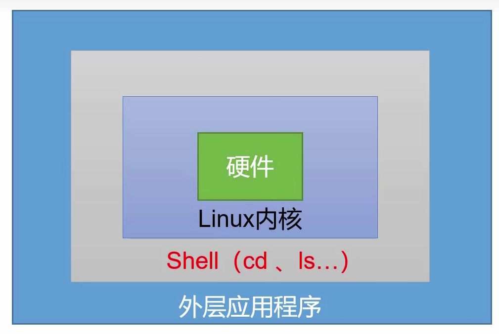
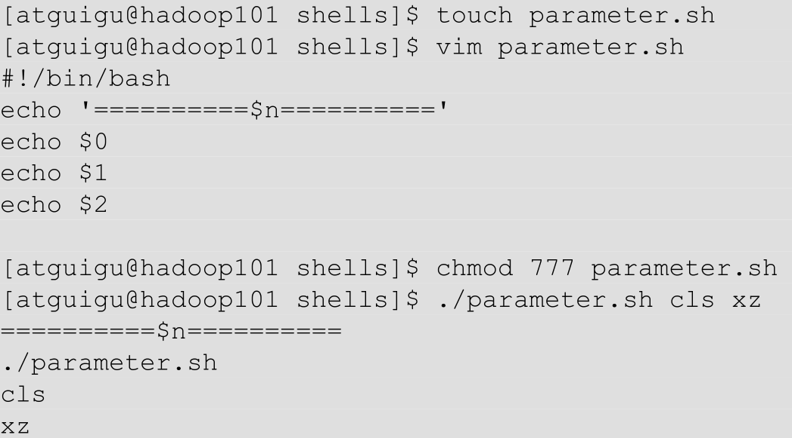
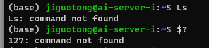
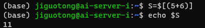
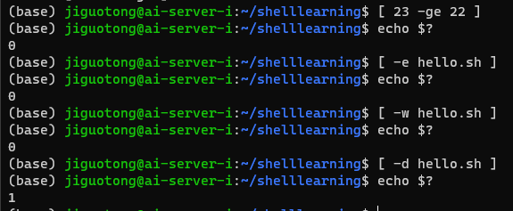

# 一、shell概述

shell是一个**命令行解释器**，它接受应用程序/用户命令，然后调用操作系统内核。
shell也是一个功能强大的编程语言，易编写、易调试、灵活性强。

# 二、Shell基础

## 1.shell运行

shell文件内容如下：
*#!/bin/bash*
*echo "hello world"*

- 方式一
  chmod +x ./test.sh      #添加权限
  ./test.sh               #执行脚本
- 方式二
  sh test.sh            #会新开一个子shell
- 方式三：***直接在当前sh中执行，不会另开子shell***
  source test.sh
  或
  . test.sh

## 2.shell变量

2.1 系统预定义变量
\$HOME  \$PWD   \$SHELL   \$USER   以上变量可以直接使用（加上$符号）
使用*env*命令可查看所有的系统全局变量
使用*set*命令可查看所有的变量

2.2 自定义变量
  2.2.1 基本语法

- 定义变量：变量名=变量值，等号前后不能有空格；若是变量中有空格，要用双引号把整个变量括起来 A="I LOVE YOU"
- 撤销变量：***unset 变量名***
- 声明静态（只读不可改）变量：***readonly变量***，此变量不能unset
- 将局部变量提升为全局环境变量，***export 变量名***
- 局部变量只能本shell使用，全局变量可以供所有子shell使用；改变一个shell中的变量值的时候，只会影响自己以及所有的子shell，不会影响父shell
  *注意：变量默认类型都是字符串类型，不能进行数值运算*

2.3 特殊变量
  2.3.1 **$n**
  n为数字，$0代表脚本名称，$1-$9代表第一到第九个参数，十以上的参数，用\${10}的形式表示。
  例如：
  

  2.3.2 **$#**
  获取所有输入参数个数，不算$0

  2.3.3 **$\*** \$@
  $* 代表命令行中所有的参数，把所有的参数看成一个整体
  $@ 代表命令行中的所有参数，但是把每个参数区分对待

  2.3.4 **$?**
  最后一次执行的命令的返回状态。为0说明正确执行，非0说明未正确执行
  

## 3.运算符

\$((运算式))或$\[(运算式)]

## 4.条件判断
4.1 基本语法
***test condition***或者[ condition ]，注意留空格
4.2 常用判断条件
  4.2.1 两个整数之间比较
  *-eq 等于(equal)*
  *-ne 不等于(not equal)*
  *-lt 小于(less than)*
  *-le 小于等于(less equal)*
  *-gt 大于(greater than)*
  *-ge 大于等于(greater equal)*
  4.2.2 按照文件权限进行判断
  *-r 有读的权限(read)*
  *-w 有写的权限(write)*
  *-x 有执行的权限(execute)*
  4.2.3 按照文件类型进行判断
  -e 文件存在(existence)
  -f 文件存在并且是一个常规的文件(file)
  -d 文件存在并且是一个目录(directory)
4.3 案例实操

## 5.流程控制
5.1 if判断
5.2 case语句
5.3 for循环
5.4 while循环