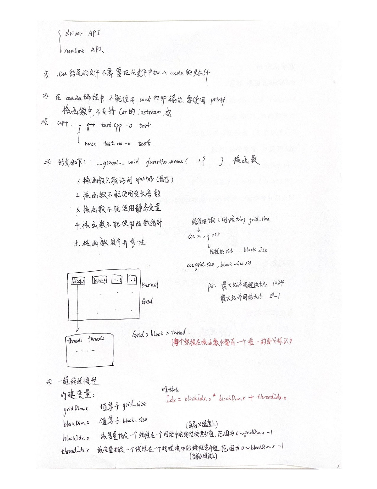
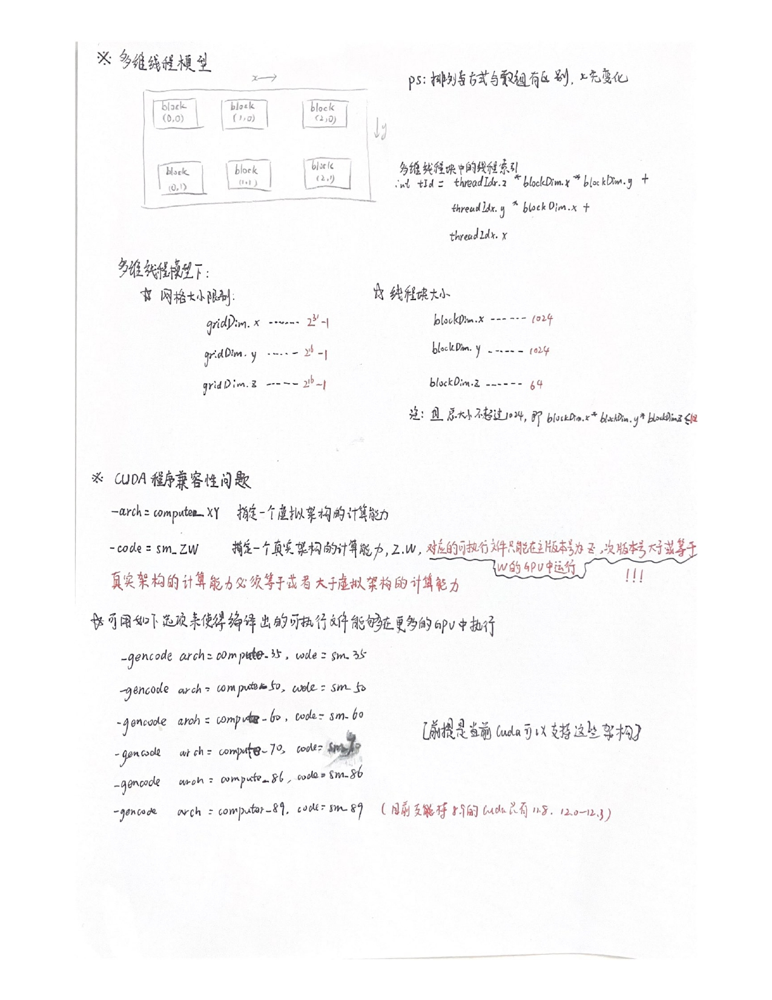
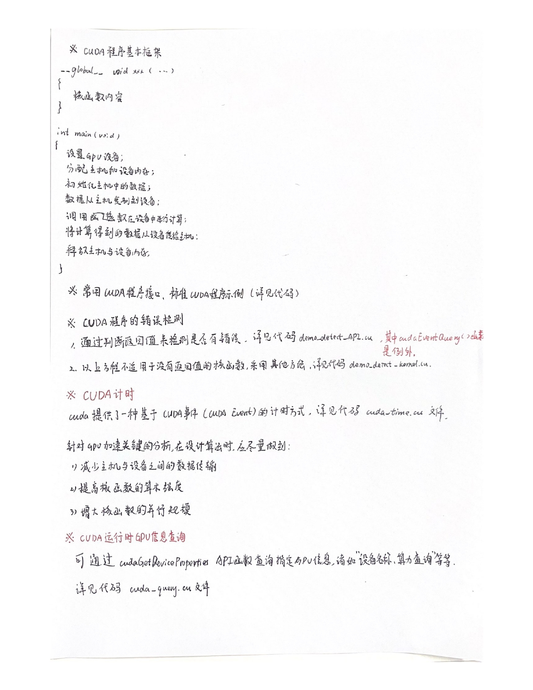
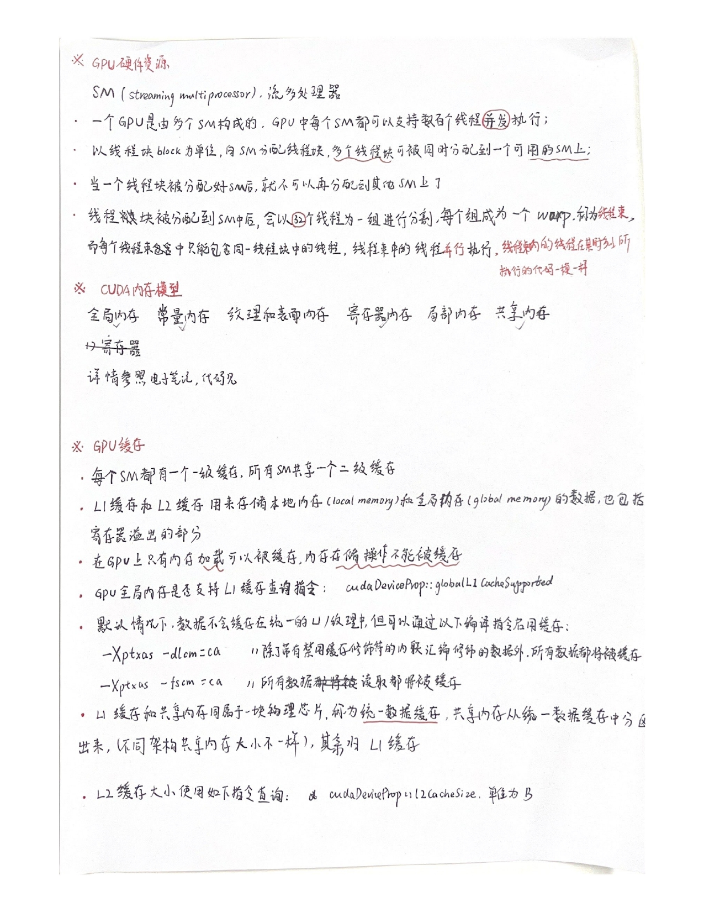
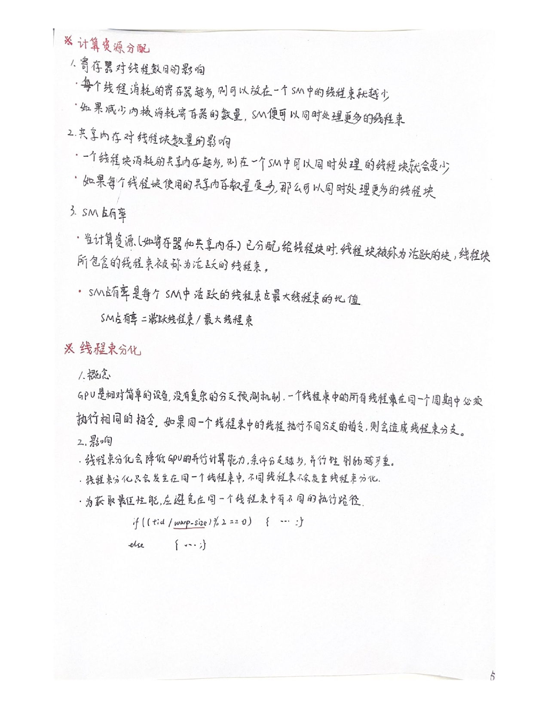

# cuda线程模型

# cuda程序基本框架

# cuda内存模型

## 寄存器内存：
1.寄存器内存在芯片内，具有GPU上最快的访问速度，但是数量有限，属于GPU的稀缺资源。
2.寄存器仅在线程内可见，生命周期也与所属线程一致。
3.核函数中定义的不加任何限定符的变量一般存放在寄存器中。 
4.内建变量存放于寄存器中，如gridDim、blockDim、blockIdx等
5.核函数种定义的不加任何限定符的数组有可能存在于寄存器中，但也有可能存在与本地内存中。
6.寄存器都是32位的，寄存器保存在SM的寄存器文件上
7.计算能力5.0~9.0的GPU，每个SM中都是64K的寄存器数量，总容量是256KB
8.每个线程的最大寄存器数量是255个，Fermi架构是63个。
9.编译时加入选项--resource-usage可以查看寄存器使用情况

## 本地内存(局部内存)：
1.寄存器放不下的内存会存放在本地内存
（1）索引值不能在编译时确定的数组存放于本地内存
（2）可能占用大量寄存器空间的较大本地结构体和数组
（3）任何不满足核函数寄存器限定条件的变量
2.每个线程最多高达可使用512KB的本地内存
3.本地内存从硬件角度看只是全局内存的一部分，延迟也很高，本地内存的过多多使用，会减低程序的性能。

## 全局内存：
1.全局内存在片外，容量最大，延迟最大，使用最多。
2.全局内存中的数据所有线程可见，Host端可见，且具有与程序相同的生命周期。
3.动态全局内存使用cudaMalloc动态声明；静态全局内存使用__device__关键字静态声明全局内存变量，且必须在所有主机和设备函数外部进行定义，使用cudaMemcpyToSymbol和cudaMemcpyFromSymbol两个函数进行主机和设备之间的静态内存通信。

## 共享内存：
1.共享内存在片上，与本地内存和全局内存相比具有更高的带宽和更低的延迟
2.共享内存中的数据在线程块内所有线程可见，可用于线程间通信，共享内存的生命周期也与所属线程块一致。 
3.使用__shared__修饰的变量存放于共享内存中，共享内存可定义动态和静态两种
4.每个SM的共享内存数量是一定的，如果在单个线程块中分配过度的共享内存，将会限制活跃线程束的数量。
5.访问共享内存必须加入同步机制：线程块内同步 void __syncthreads();
6.静态共享内存作用域：若在核函数中声明，静态共享内存作用域局限在这个核函数中；若在文件核函数外声明，静态共享内存作用域对所有核函数有效。
7.静态共享内存在编译时就要确定内存大小。
8.动态共享内存使用关键字extern 修饰，且不能规定大小，例如extern __shared__ float s_arrry[]；大小在调用核函数的时候，在尖括号的第三个元素赋值。

## 常量内存：
1.常量内存是有常量缓存的全局内存，数量有限，大小仅为64KB，由于有缓存，线程束在读取相同的常量内存数据时，访问速度比全局内存快。
2.使用__constant__修饰的变量存放于常量内存中，不能定义在核函数中，且常量内存是静态定义的，
3.常量内存仅可读，不可写。
4.给核函数传递数值参数时，这个变量就存放于常量内存。
5.常量内存必须在主机端使用cudaMemcpyToSymbol进行初始化，同全局内存，

# cuda计算资源分配与线程束
