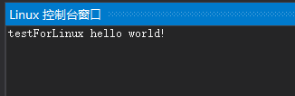
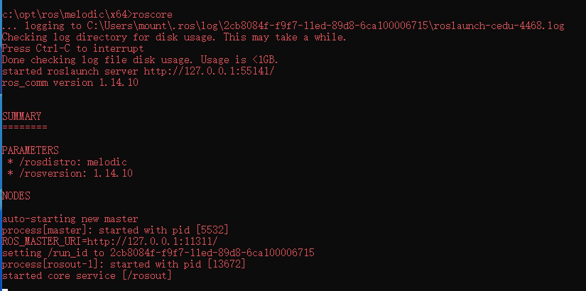
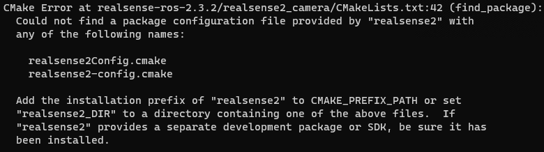
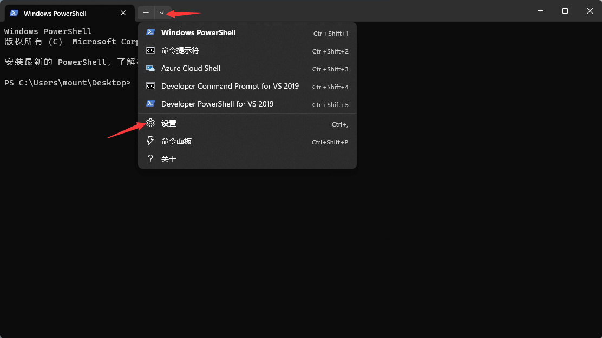

# 一、Linux下编译iDFusion

## （一）环境准备

虚拟机Ubuntu18.04
ROS melodic

## （二）ROS melodic安装配置

参考网址：[ROS配置](https://blog.csdn.net/KIK9973/article/details/118755045)
1、安装ROS melodic
->设置国内源
$ sudo sh -c '. /etc/lsb-release && echo "deb http://mirrors.ustc.edu.cn/ros/ubuntu/ `lsb_release -cs` main" > /etc/apt/sources.list.d/ros-latest.list'
->设置ros密钥
$ sudo apt-key adv --keyserver 'hkp://keyserver.ubuntu.com:80' --recv-key C1CF6E31E6BADE8868B172B4F42ED6FBAB17C654
->确保debian package最新
$ sudo apt-get update
->安装ROS melodic
$ sudo apt-get install ros-melodic-desktop-full
->设置环境变量
$ echo "source /opt/ros/melodic/setup.bash" >> ~/.bashrc
$ source ~/.bashrc
->下载其他功能部件
$ sudo apt install python-rosdep python-rosinstall python-rosinstall-generator python-wstool build-essential

2、初始化rosdep
$ sudo rosdep init
出现报错：

```
ERROR: cannot download default sources list from:
https://raw.githubusercontent.com/ros/rosdistro/master/rosdep/sources.list.d/20-default.list
Website may be down.
```

错误原因：
初始化的这一步将会从外国的网站raw.githubusercontent.com拉取一些信息和文件。这个网站现在被墙了，导致这一步出错。
解决方法：
（1）方法一
翻墙运行即可
（2）方法二
国内有人已经整理好了在国内源的rosdepc，可从国内源直接获取
$ sudo apt-get install python3-pip
$ sudo pip3 install rosdepc
$ sudo rosdepc init
$ rosdepc update
（3）方法三——修改配置文件
$ sudo gedit /etc/hosts
将以下内容拷贝到文件末尾

```
199.232.28.133 raw.githubusercontent.com
192.30.253.118 gist.github.com
185.199.110.153 github.io
151.101.113.194 github.global.ssl.fastly.net
52.216.227.168 github-cloud.s3.amazonaws.com
52.74.223.119 github.com
199.232.28.133 avatars1.githubusercontent.com
199.232.28.133 avatars2.githubusercontent.com
199.232.28.133 avatars0.githubusercontent.com
199.232.28.133 avatars3.githubusercontent.com
199.232.28.133 user-images.githubusercontent.com
199.232.28.133 avatars.githubusercontent.com
199.232.28.133 github.map.fastly.net
199.232.28.133 avatars7.githubusercontent.com
54.239.31.69 aws.amazon.com
54.239.30.25 console.aws.amazon.com
54.239.96.90 ap-northeast-1.console.aws.amazon.com
54.240.226.81 ap-southeast-1.console.aws.amazon.com
54.240.193.125 ap-southeast-2.console.aws.amazon.com
54.239.54.102 eu-central-1.console.aws.amazon.com
177.72.244.194 sa-east-1.console.aws.amazon.com
176.32.114.59 eu-west-1.console.aws.amazon.com
54.239.31.128 us-west-1.console.aws.amazon.com
54.240.254.230 us-west-2.console.aws.amazon.com
54.239.38.102 s3-console-us-standard.console.aws.amazon.com
54.231.49.3 s3.amazonaws.com
52.219.0.4 s3-ap-northeast-1.amazonaws.com
54.231.242.170 s3-ap-southeast-1.amazonaws.com
54.231.251.21 s3-ap-southeast-2.amazonaws.com
54.231.193.37 s3-eu-central-1.amazonaws.com
52.218.16.140 s3-eu-west-1.amazonaws.com
52.92.72.2 s3-sa-east-1.amazonaws.com
54.231.236.6 s3-us-west-1.amazonaws.com
54.231.168.160 s3-us-west-2.amazonaws.com
52.216.80.48 github-cloud.s3.amazonaws.com
54.231.40.3 github-com.s3.amazonaws.com
52.216.20.171 github-production-release-asset-2e65be.s3.amazonaws.com
52.216.228.168 github-production-user-asset-6210df.s3.amazonaws.com
```

$ sudo gedit /etc/resolv.conf
将原有的nameserver那一行注释，并添加以下两行后保存：

```
nameserver 8.8.8.8 #google域名服务器
nameserver 8.8.4.4 #google域名服务器
```

然后执行初始化
$ sudo rosdep init

3、rosdep update更新
$ rosdepc update
报错：read operation timed out
原因：raw.githubusercontent.com这个网站被墙，国内网拉取信息网速缓慢。
解决方法：
（1）方法一
翻墙
（2）方法二——下载文件到本地
链接: https://pan.baidu.com/s/1PhTCqtvScV_XGf9ac0CcCg 提取码: w3ix
->提取文件到/etc/ros/下面
$ sudo cp -r ../ros_github/ /etc/ros/
->修改相关文件配置
$ sudo gedit /usr/lib/python2.7/dist-packages/rosdistro/__init__.py
->将第68行代码替换为
DEFAULT_INDEX_URL = 'file:///etc/ros/ros_github/index-v4.yaml'
$ sudo gedit /etc/ros/rosdep/sources.list.d/20-default.list
->将原有内容全部注释，添加以下内容

```
#os-specific listings first
yaml file:///etc/ros/ros_github/osx-homebrew.yaml osx
#generic
yaml file:///etc/ros/ros_github/base.yaml
yaml file:///etc/ros/ros_github/python.yaml
yaml file:///etc/ros/ros_github/ruby.yaml
gbpdistro file:///etc/ros/ros_github/fuerte.yaml fuerte
#newer distributions (Groovy, Hydro, …) must not be listed anymore, they are being fetched from the rosdistro index.yaml instead
```

->最后再执行rosdep update
$ rosdep update

4、测试ROS安装情况
$ roscore

->打开第二个终端
$ rosrun turtlesim turtlesim_node
->出现小海龟后打开第三个终端
$ rosrun turtlesim turtle_teleop_key
->之后可以通过方向键控制海龟移动，至此安装成功

## （三）编译iDFusion

$ source prepare.sh
$ mkdir build
$ cd build
$ cmake ..
$ make -j
过程中的报错：
1、Pangolin找不到package
需要先编译Pangolin
$ git clone https://github.com/stevenlovegrove/Pangolin.git
$ cd Pangolin
$ mkdir build
$ cd build
$ cmake ..
$ cmake --build .

2、The following variables are used in this project, but they are set to NOTFOUND.
原因：cmake版本落后，安装最新版本
操作：
->备份cmake旧版
$ which cmake
\# /usr/bin/cmake
$ cd /usr/bin
$ sudo mv cmake cmake_bak
->安装最新版cmake
$ sudo snap install cmake --classic

3、Could not find REALSENSE2_FOUND using the following names: realsense2
原因：缺少realsense2
操作：
->注册公钥
$ sudo apt-key adv --keyserver keyserver.ubuntu.com --recv-key F6E65AC044F831AC80A06380C8B3A55A6F3EFCDE || sudo apt-key adv --keyserver hkp://keyserver.ubuntu.com:80 --recv-key F6E65AC044F831AC80A06380C8B3A55A6F3EFCDE
->添加源
$ sudo add-apt-repository "deb https://librealsense.intel.com/Debian/apt-repo $(lsb_release -cs) main" -u
->安装包
$ sudo apt-get install librealsense2-dkms
$ sudo apt-get install librealsense2-utils
$ sudo apt-get install librealsense2-dev
$ sudo apt-get install librealsense2-dbg
->测试安装
$ realsense-viewer      #出现可视化界面
$ modinfo uvcvideo | grep "version:"
*version:        1.1.2.realsense-1.3.18*
*srcversion:     51A4A0210E91BE50A7BA2BB*

4、出现以上报错的原因是因为prepare.sh没有执行成功，由于在prepare.sh中编译选项使用的是make -j，同时编译多条指令，导致系统崩掉（虚拟机性能受阻），只需将所有的-j去掉，便会安装所有的外部依赖。

5、"SOPHUS_INCLUDE_DIR-NOTFOUND"
原因：sophus的目录未找到
操作：在CMakeList.txt中set一下SOPHUS_INCLUDE_DIR的路径

```shell
set(OPENNI2_LIBRARY "/usr/lib/libOpenNI2.so")
set(OPENNI2_INCLUDE_DIR "/usr/include/openni2")
set(SOPHUS_INCLUDE_DIR "/home/jiguotong/Projects/Github/iDFusion/third_party_library/Sophus;/home/jiguotong/Projects/Github/iDFusion/third_party_library/Sophus/sophus;")
```

6、报错No rule to make target '/opt/ros/kinetic/lib/libmessage_filters.so'
原因：此项目依赖的ros环境是kinetic，需要重新安装Ubuntu16.04并且安装与16.04对应的kinetic
😊😊😊

## （四）ROS kinetic安装配置

与melodic过程一致，只需要将命令中的melodic替换为kinetic即可

## （五）二度编译iDFusion

->备份iDFusion项目
$ cp -r iDFusion iDFusion_bak
$ cd iDFusion
将prepare.sh中的所有make -j全部替换为make，执行该脚本
$ source prepare.sh
$ mkdir build
$ cd build
修改一些出错的CMake相关文件：
1、将CMakeLists.txt中的OpenCV_DIR OPENNI2_LIBRARY OPENNI2_INCLUDE_DIR REALSENSE_INCLUDE_DIRS设置正确

```cmake
set(OpenCV_DIR "/usr/include/opencv")
set(OPENNI2_LIBRARY "/usr/lib/libOpenNI2.so")
set(OPENNI2_INCLUDE_DIR "/usr/include/openni2")
set(REALSENSE_INCLUDE_DIRS "/home/jiguotong/Projects/Github/iDFusion/third_party_library/librealsense-master/include")
```

相应的，在下方添加realsense的库目录

```cmake
include_directories(${REALSENSE_INCLUDE_DIRS})
```

2、将FindSophus.cmake文件中的内容改为以下

```cmake
if (SOPHUS_INCLUDE_DIR)
else (SOPHUS_INCLUDE_DIR)
  find_path(SOPHUS_INCLUDE_DIR NAMES sophus
      HINTS ${CMAKE_CURRENT_SOURCE_DIR}/third_party_library/Sophus
    )
endif(SOPHUS_INCLUDE_DIR)

```

->执行cmake命令
$ cmake ..
->执行make命令
$ make
->执行ros
$ roscore
->新开终端，执行af（路径在iDFusion/build下）
./af
->开启测试
rosbag play xxx.bag
其中，.bag文件可由以下步骤生成：

```shell
->第一个终端
$ roscore
->第二个终端
$ rosrun turtlesim turtlesim_node
->第三个终端
$ rosrun turtlesim turtle_teleop_key
->第四个终端
$ cd /home/jiguotong/Projects
$ mkdir bagfile
$ cd bagfile
$ rosbag record -a
之后点到第三个终端，控制小海龟移动，之后在第四个终端ctrl+c，会将录制的.bag文件存在当前文件夹下
```

## （六）搭建VS2019跨平台编写和调试Linux C/C++程序环境

### 1.在虚拟机ubuntu上配置

->安装一系列工具
$ sudo apt-get install openssh-server g++ gdb gdbserver
->修改ssh登录的配置，即/etc/ssh/sshd_config文件，修改为允许root登陆，可以执行命令
$ sudo vim /etc/ssh/sshd_config
将PermitRootLogin这一项改为yes
->重启ssh服务
$ sudo service ssh restart

### 2.在windows下面配置

->在vs2019获取工具和功能————添加“使用C++的Linux开发”
->添加新项目（C++ linux 控制台）
->工具-选项-跨平台中添加远程linux，填写目标ip等信息后，运行按钮上就有了ip地址

->运行，可在右下角看到Linux控制窗口的输出信息


### 3.iDFusion的配置

（1）添加编译选项
项目属性->c/c++->命令行
添加：-O3 -msse2 -msse3  -msse4.1 -Wall -std=c++14  -msse -msse2 -msse3 -msse4 -msse4.1 -msse4.2 -ftree-vectorize -lboost_system -lpthread -lboost_thread -lboost_filesystem -mavx2
（2）

### 4.问题记录

- 附加库路径只能是绝对路径，比如/home/jiguotong/projects/third_party_library/lib
  不能采用$(RemoteRootDir)/third_party_library/lib的方式，而附加包含目录就可以这样写，原因未知
- 报错：DSO missing from command line原因及解决办法：
  原因：共享库配置不正确
  解决方法：包含对应的共享库
- 报错：what(): Pangolin X11: Failed to open X display
  原因：远程ssh连接不能显示图形化界面
  解决方法：暂未解决

## (七)iDFusion代码调试

### (1)配置launch.json配置文件

```json
{
    // Use IntelliSense to learn about possible attributes.
    // Hover to view descriptions of existing attributes.
    // For more information, visit: https://go.microsoft.com/fwlink/?linkid=830387
    "version": "0.2.0",
    "configurations": [
        {
            "name": "(gdb) Launch",
            "type": "cppdbg",
            "request": "launch",
            "program": "${workspaceFolder}/build/af",
            "args": [],
            "stopAtEntry": false,
            "cwd": "${workspaceFolder}/build",
            "environment": [],
            "externalConsole": false,
            "MIMode": "gdb",
            "miDebuggerPath": "/usr/bin/gdb",
            "setupCommands": [
                {
                    "description": "Enable pretty-printing for gdb",
                    "text": "-enable-pretty-printing",
                    "ignoreFailures": true
                },
                {
                    "description": "Set Disassembly Flavor to Intel",
                    "text": "-gdb-set disassembly-flavor intel",
                    "ignoreFailures": true
                }
            ]
        }
    ]
}
```

### (2)修改相机参数

$ sudo gedit /opt/ros/kinetic/share/realsense2_camera/launch/rs_camera.launch

### (3)运行依赖平台

-> 终端1 启动ros平台
$ roscore
-> 终端2 启动Realsense的ros节点
$ roslaunch realsense2_camera rs_camera.launch align_depth:=true

-> 终端3 查看topic
$ rostopic list
-> 终端4 监听topic流量
$ rostopic bw xxxxx
$ rostopic bw /camera/color/image_raw

# 二、Windows下编译iDFusion

## （一）实验环境基础

->基础：
windows10
Visual studio 2019
Git
CMake
OpenNI

->目标：
ROS melodic
librealsense v2.50.0
realsense-ros build2.3.2

## （二）ROS melodic 安装配置

参考资料：
http://wiki.ros.org/Installation/Windows
https://zhuanlan.zhihu.com/p/414874250

### step1:安装包管理工具Chocolatey

打开vs2019自带的命令行工具x64 Native Tools Command Prompt for VS 2019，以管理员身份运行
输入以下安装命令

```shell
@"%SystemRoot%\System32\WindowsPowerShell\v1.0\powershell.exe" -NoProfile -InputFormat None -ExecutionPolicy Bypass -Command "iex ((New-Object System.Net.WebClient).DownloadString('https://chocolatey.org/install.ps1'))" && SET "PATH=%PATH%;%ALLUSERSPROFILE%\chocolatey\bin"
```

可以使用choco -v查看是否安装成功


### step2:安装ros-full

依次在上述命令行工具中输入

```bash
mkdir c:\opt\chocolatey
set ChocolateyInstall=c:\opt\chocolatey
choco source add -n=ros-win -s="https://aka.ms/ros/public" --priority=1
choco upgrade ros-melodic-desktop_full -y --execution-timeout=0
```

静静等待安装… 中间会弹出setup安装界面，不用管
成功之后，将c:\opt\ros\melodic\x64\bin 添加进系统环境变量

### step3:测试ros是否安装成功

-> cd c:\opt\ros\melodic\x64
-> setup.bat
-> roscore

出现上图即成功

## （三）librealsense 源码编译

### step1:下载librealsense源码

从https://github.com/IntelRealSense/librealsense/releases/tag/v2.50.0 下载v2.50.0的源码

### step2:CMake构建

BUILD_WITH_STATIC_CRT取消勾选！！！
BUILD_OPENNI2_BINDINGS选项要勾选！！！
CMAKE_INSTALL_PREFIX改为D:/thirdLibrary/librealsense
直接Configure -> Generate -> Open project

### step3:VS编译

release x64模式下 生成解决方案（如果有个别项目有问题，需要对症解决一下）
（中途libcurl这个项目生成有问题，关掉网络代理再生成就好了）
（rs2_drive是个重要的项目，必须要有，因为后来经过对比，这个在cmake之后没有的话roslaunch会出错）

50个项目除了INSTALL和unintsall之外都生成成功

右键INSTALL项目，生成，以此安装到上面指定的CMAKE_INSTALL_PREFIX路径下

## （四）realsense-ros 源码编译

### step1:编译realsense-ros

打开Windows Powershell

```shell
mkdir -p c:/catkin_ws/src
cd c:/catkin_ws/src/
git clone https://github.com/pal-robotics/ddynamic_reconfigure.git
git clone https://github.com/IntelRealSense/realsense-ros.git
cd realsense-ros
git checkout 2.3.2		#librealsense版本为v2.50.0，经查阅，realsense-ros需要为2.3.2版本，两者之间有严格的对应关系
cd ..
catkin_init_workspace
cd ..
catkin_make clean			#这一步报错，需要先在terminal中运行c:\opt\ros\melodic\x64\setup.bat
catkin_make -DCATKIN_ENABLE_TESTING=False -DCMAKE_BUILD_TYPE=Release
catkin_make install		#安装成功之后会在catkin_ws/install目录下有所有的安装文件，成功
```

过程中出错：

解决方法：
打开源码realsense2_camera文件夹下的CMakeList.txt，在第7行加入

```shell
set(realsense2_DIR "D:/thirdLibrary/librealsense/lib/cmake/realsense2") #这是之前编译好的librealsense
```

### step2:配置ros+realsense终端

打开terminal，进行设置

添加新配置文件 -> 新建空配置文件
名称设置为ros_realsense
命令行中输入

```shell
C:\Windows\System32\cmd.exe /k "C:\Program Files (x86)\Microsoft Visual Studio\2019\Community\Common7\Tools\VsDevCmd.bat" -arch=amd64 -host_arch=amd64&& set ChocolateyInstall=c:\opt\chocolatey&& c:\opt\ros\melodic\x64\setup.bat && c:\catkin_ws\devel\setup.bat
```

保存

## （五）iDFusion依赖环境配置

### 1、open_chisel的编译

①CMakeList.txt里面
string(REGEX MATCHALL "avx2" AVX_STRING ${CPU_INFO})
改为
string(REGEX MATCHALL "avx2" AVX_STRING "${CPU_INFO}")

## （六）iDFusion调试过程（序号不分报错先后顺序）

0、项目属性
附加包含目录
```
C:\opt\ros\melodic\x64\include
C:\opt\ros\melodic\x64\include\eigen3
C:\opt\ros\melodic\x64\include\boost-1_66
C:\opt\ros\melodic\x64\include\xmlrpcpp
C:\opt\ros\melodic\x64\tools\vcpkg\ports\fontconfig\include\win32
..\CHISEL\src
..\GCSLAM\peac
..\third_party_library\Sophus
..\third_party_library\pthread\include
..\third_party_library\OpenNI2\Include
..\third_party_library\librealsense\include
..\third_party_library\pangolin\Pangolin_Release_x64_MD\Pangolin\include
```
链接器依赖项：
```
C:\opt\ros\melodic\x64\lib\opencv_core341.lib
C:\opt\ros\melodic\x64\lib\opencv_imgproc341.lib
C:\opt\ros\melodic\x64\lib\opencv_imgcodecs341.lib
C:\opt\ros\melodic\x64\lib\opencv_features2d341.lib
C:\opt\ros\melodic\x64\lib\opencv_highgui341.lib
C:\opt\ros\melodic\x64\lib\roscpp.lib
C:\opt\ros\melodic\x64\lib\rostime.lib
C:\opt\ros\melodic\x64\lib\roslib.lib
C:\opt\ros\melodic\x64\lib\rosconsole.lib
C:\opt\ros\melodic\x64\lib\console_bridge.lib
C:\opt\ros\melodic\x64\lib\rosconsole_bridge.lib
C:\opt\ros\melodic\x64\lib\rosconsole_log4cxx.lib
C:\opt\ros\melodic\x64\lib\rosconsole_backend_interface.lib
C:\opt\ros\melodic\x64\lib\roscpp_serialization.lib
C:\opt\ros\melodic\x64\lib\rosbag.lib
C:\opt\ros\melodic\x64\lib\rosbag_storage.lib
C:\opt\ros\melodic\x64\lib\rosbag_default_encryption_plugins.lib
C:\opt\ros\melodic\x64\lib\roslz4.lib
C:\opt\ros\melodic\x64\lib\rospack.lib
C:\opt\ros\melodic\x64\lib\rosparam_shortcuts.lib
C:\opt\ros\melodic\x64\lib\ros_filter.lib
C:\opt\ros\melodic\x64\lib\ros_filter_utilities.lib
C:\opt\ros\melodic\x64\lib\ros_type_introspection.lib
C:\opt\ros\melodic\x64\lib\ros_robot_localization_listener.lib
C:\opt\ros\melodic\x64\lib\freeglut.lib
C:\opt\ros\melodic\x64\lib\cpp_common.lib
C:\opt\ros\melodic\x64\lib\log4cxx.lib
C:\opt\ros\melodic\x64\lib\xmlrpcpp.lib
C:\opt\ros\melodic\x64\lib\cv_bridge.lib
C:\opt\ros\melodic\x64\lib\message_filters.lib
C:\opt\ros\melodic\x64\lib\boost_regex-vc141-mt-x64-1_66.lib
C:\opt\ros\melodic\x64\lib\boost_system-vc141-mt-x64-1_66.lib
C:\opt\ros\melodic\x64\lib\boost_thread-vc141-mt-x64-1_66.lib
C:\opt\ros\melodic\x64\lib\boost_chrono-vc141-mt-x64-1_66.lib
C:\opt\ros\melodic\x64\lib\boost_date_time-vc141-mt-x64-1_66.lib
C:\opt\ros\melodic\x64\lib\boost_atomic-vc141-mt-x64-1_66.lib
C:\opt\ros\melodic\x64\lib\boost_filesystem-vc141-mt-x64-1_66.lib
..\CHISEL\lib\chisel.lib
..\third_party_library\OpenNI2\Lib\OpenNI2.lib
..\third_party_library\librealsense\lib\realsense2.lib
..\third_party_library\pangolin\Pangolin_Release_x64_MD\Pangolin\lib\pangolin.lib
..\third_party_library\pangolin\Pangolin_Release_x64_MD\Pangolin\external\glew\lib\glew32s.lib
..\third_party_library\pangolin\Pangolin_Release_x64_MD\Pangolin\external\libjpeg\lib\jpeg.lib
..\third_party_library\pangolin\Pangolin_Release_x64_MD\Pangolin\external\libpng\lib\libpng16_static.lib
..\third_party_library\pangolin\Pangolin_Release_x64_MD\Pangolin\external\zlib\lib\zlibstatic.lib
..\third_party_library\pthread\lib\x64\pthreadVC2.lib
OpenGL32.lib
mf.lib
mfplat.lib
mfreadwrite.lib
mfuuid.lib
strmiids.lib
comdlg32.lib
advapi32.lib
ws2_32.lib
shell32.lib
```
1、项目属性 -> 配置属性 -> 高级 -> 全程序优化
要从“无全程序优化”改为“使用链接时间代码生成”，否则在使用pangolin::CreateWindowAndBind的时候会出错崩溃。
2、error LNK2019: 无法解析的外部符号 “void __cdecl boost::throw_exception(class std::exception const &)
解决方法：https://blog.csdn.net/wu10188/article/details/124709076

3、error C2872: “ACCESS_MASK”: 不明确的符号
原因：opencv3.0或者3.1的using namespace cv和windows.h中ACCESS_MASK定义冲突。
解决方案：注释掉所有的using namespace cv，然后在需要的地方写上cv::

4、win32 gettimeofday替代方案
https://blog.csdn.net/shan165310175/article/details/48933585

5、涉及到sleep/usleep的问题
解决方法：统一改为windows下的Sleep函数，注意参数单位，sleep是秒级，usleep是微妙级，Sleep是毫秒级。

6、windows下配置pthread.h头文件的问题
https://blog.csdn.net/baidu_34785556/article/details/98798351

7、windows下配置dirent.h头文件的问题
https://blog.csdn.net/qq_15751687/article/details/106465022

8、Sophus提示不正交
**原因**：Sophus::SE3d或者Sophus::SO3d的初始化会有一个isOrthogoal的精度检查
https://blog.csdn.net/u013238941/article/details/129507499#comments_26491887
**解决方法**：在初始化之前，先将旋转矩阵转变成四元数，然后归一化，再转成旋转矩阵，这样旋转矩阵能够通过正交检查。

9、Visual Studio屏蔽警告
https://blog.csdn.net/ZHAOJUNWEI08/article/details/84288189

```c
//原代码
Sophus::SO3d SO3_R(matrix_r)
//改后代码
Eigen::Quaterniond tmp(matrix_r);
tmp.normalize();
Sophus::SO3d SO3_R(tmp.toRotationMatrix());
```

## （七）iDFusion运行

### 1、修改roslaunch的配置文件

找到catkin_ws下的src中的rs_camera.launch文件，备份一份。将内容改为以下：

```launch
<launch>
  <arg name="serial_no"           default=""/>
  <arg name="usb_port_id"         default=""/>
  <arg name="device_type"         default=""/>
  <arg name="json_file_path"      default=""/>
  <arg name="camera"              default="camera"/>
  <arg name="tf_prefix"           default="$(arg camera)"/>
  <arg name="external_manager"    default="false"/>
  <arg name="manager"             default="realsense2_camera_manager"/>
  <arg name="output"              default="screen"/>
  <arg name="respawn"              default="false"/>

  <arg name="fisheye_width"       default="640"/>
  <arg name="fisheye_height"      default="480"/>
  <arg name="enable_fisheye"      default="false"/>

  <arg name="depth_width"         default="640"/>
  <arg name="depth_height"        default="480"/>
  <arg name="enable_depth"        default="true"/>

  <arg name="confidence_width"    default="640"/>
  <arg name="confidence_height"   default="480"/>
  <arg name="enable_confidence"   default="true"/>
  <arg name="confidence_fps"      default="-1"/>

  <arg name="infra_width"         default="640"/>
  <arg name="infra_height"        default="480"/>
  <arg name="enable_infra"        default="true"/>
  <arg name="enable_infra1"       default="true"/>
  <arg name="enable_infra2"       default="true"/>
  <arg name="infra_rgb"           default="true"/>

  <arg name="color_width"         default="640"/>
  <arg name="color_height"        default="480"/>
  <arg name="enable_color"        default="true"/>

  <arg name="fisheye_fps"         default="-1"/>
  <arg name="depth_fps"           default="30"/>
  <arg name="infra_fps"           default="30"/>
  <arg name="color_fps"           default="30"/>
  <arg name="gyro_fps"            default="200"/>
  <arg name="accel_fps"           default="200"/>
  <arg name="enable_gyro"         default="true"/>
  <arg name="enable_accel"        default="true"/>

  <arg name="enable_pointcloud"         default="false"/>
  <arg name="pointcloud_texture_stream" default="RS2_STREAM_COLOR"/>
  <arg name="pointcloud_texture_index"  default="0"/>
  <arg name="allow_no_texture_points"   default="false"/>
  <arg name="ordered_pc"                default="false"/>

  <arg name="enable_sync"               default="true"/>
  <arg name="align_depth"               default="true"/>

  <arg name="publish_tf"                default="true"/>
  <arg name="tf_publish_rate"           default="0"/>

  <arg name="filters"                   default=""/>
  <arg name="clip_distance"             default="-2"/>
  <arg name="linear_accel_cov"          default="0.01"/>
  <arg name="initial_reset"             default="false"/>
  <arg name="reconnect_timeout"         default="6.0"/>
  <arg name="wait_for_device_timeout"   default="-1.0"/>
  <arg name="unite_imu_method"          default=""/>
  <arg name="topic_odom_in"             default="odom_in"/>
  <arg name="calib_odom_file"           default=""/>
  <arg name="publish_odom_tf"           default="true"/>

  <arg name="stereo_module/exposure/1"  default="7500"/>
  <arg name="stereo_module/gain/1"      default="16"/>
  <arg name="stereo_module/exposure/2"  default="1"/>
  <arg name="stereo_module/gain/2"      default="16"/>
  
  

  <group ns="$(arg camera)">
    <include file="$(find realsense2_camera)/launch/includes/nodelet.launch.xml">
      <arg name="tf_prefix"                value="$(arg tf_prefix)"/>
      <arg name="external_manager"         value="$(arg external_manager)"/>
      <arg name="manager"                  value="$(arg manager)"/>
      <arg name="output"                   value="$(arg output)"/>
      <arg name="respawn"                  value="$(arg respawn)"/>
      <arg name="serial_no"                value="$(arg serial_no)"/>
      <arg name="usb_port_id"              value="$(arg usb_port_id)"/>
      <arg name="device_type"              value="$(arg device_type)"/>
      <arg name="json_file_path"           value="$(arg json_file_path)"/>

      <arg name="enable_pointcloud"        value="$(arg enable_pointcloud)"/>
      <arg name="pointcloud_texture_stream" value="$(arg pointcloud_texture_stream)"/>
      <arg name="pointcloud_texture_index"  value="$(arg pointcloud_texture_index)"/>
      <arg name="enable_sync"              value="$(arg enable_sync)"/>
      <arg name="align_depth"              value="$(arg align_depth)"/>

      <arg name="fisheye_width"            value="$(arg fisheye_width)"/>
      <arg name="fisheye_height"           value="$(arg fisheye_height)"/>
      <arg name="enable_fisheye"           value="$(arg enable_fisheye)"/>

      <arg name="depth_width"              value="$(arg depth_width)"/>
      <arg name="depth_height"             value="$(arg depth_height)"/>
      <arg name="enable_depth"             value="$(arg enable_depth)"/>

      <arg name="confidence_width"         value="$(arg confidence_width)"/>
      <arg name="confidence_height"        value="$(arg confidence_height)"/>
      <arg name="enable_confidence"        value="$(arg enable_confidence)"/>
      <arg name="confidence_fps"           value="$(arg confidence_fps)"/>

      <arg name="color_width"              value="$(arg color_width)"/>
      <arg name="color_height"             value="$(arg color_height)"/>
      <arg name="enable_color"             value="$(arg enable_color)"/>

      <arg name="infra_width"              value="$(arg infra_width)"/>
      <arg name="infra_height"             value="$(arg infra_height)"/>
      <arg name="enable_infra"             value="$(arg enable_infra)"/>
      <arg name="enable_infra1"            value="$(arg enable_infra1)"/>
      <arg name="enable_infra2"            value="$(arg enable_infra2)"/>
      <arg name="infra_rgb"                value="$(arg infra_rgb)"/>

      <arg name="fisheye_fps"              value="$(arg fisheye_fps)"/>
      <arg name="depth_fps"                value="$(arg depth_fps)"/>
      <arg name="infra_fps"                value="$(arg infra_fps)"/>
      <arg name="color_fps"                value="$(arg color_fps)"/>
      <arg name="gyro_fps"                 value="$(arg gyro_fps)"/>
      <arg name="accel_fps"                value="$(arg accel_fps)"/>
      <arg name="enable_gyro"              value="$(arg enable_gyro)"/>
      <arg name="enable_accel"             value="$(arg enable_accel)"/>

      <arg name="publish_tf"               value="$(arg publish_tf)"/>
      <arg name="tf_publish_rate"          value="$(arg tf_publish_rate)"/>

      <arg name="filters"                  value="$(arg filters)"/>
      <arg name="clip_distance"            value="$(arg clip_distance)"/>
      <arg name="linear_accel_cov"         value="$(arg linear_accel_cov)"/>
      <arg name="initial_reset"            value="$(arg initial_reset)"/>
      <arg name="reconnect_timeout"        value="$(arg reconnect_timeout)"/>
      <arg name="wait_for_device_timeout"  value="$(arg wait_for_device_timeout)"/>
      <arg name="unite_imu_method"         value="$(arg unite_imu_method)"/>
      <arg name="topic_odom_in"            value="$(arg topic_odom_in)"/>
      <arg name="calib_odom_file"          value="$(arg calib_odom_file)"/>
      <arg name="publish_odom_tf"          value="$(arg publish_odom_tf)"/>
      <arg name="stereo_module/exposure/1" value="$(arg stereo_module/exposure/1)"/>
      <arg name="stereo_module/gain/1"     value="$(arg stereo_module/gain/1)"/>
      <arg name="stereo_module/exposure/2" value="$(arg stereo_module/exposure/2)"/>
      <arg name="stereo_module/gain/2"     value="$(arg stereo_module/gain/2)"/>

      <arg name="allow_no_texture_points"  value="$(arg allow_no_texture_points)"/>
      <arg name="ordered_pc"               value="$(arg ordered_pc)"/>
  
    </include>
  </group>
</launch>
```

### 2、开启相机

打开ros-realsense终端，输入
roslaunch realsense2_camera rs_camera.launch align_depth:=true
报错：

```cmd
1684994184.727220600 ERROR /camera/realsense2_camera_manager [D:\ws\src\nodelet_core\nodelet\src\loader.cpp:301(Loader::load)] [topics: /rosout] The error before refreshing the cache was: Failed to load library C:/catkin_ws/devel\bin/realsense2_camera.dll. Make sure that you are calling the PLUGINLIB_EXPORT_CLASS macro in the library code, and that names are consistent between this macro and your XML. Error string: Could not load library (Poco exception = C:/catkin_ws/devel\bin/realsense2_camera.dll)
```

出现这个问题不知道是什么原因，最后是重新换了工作空间的名字重新编译的realsense-ros工具包，最终可以roslaunch成功了，妈的。

### 3、运行iDFusin程序

ok!
