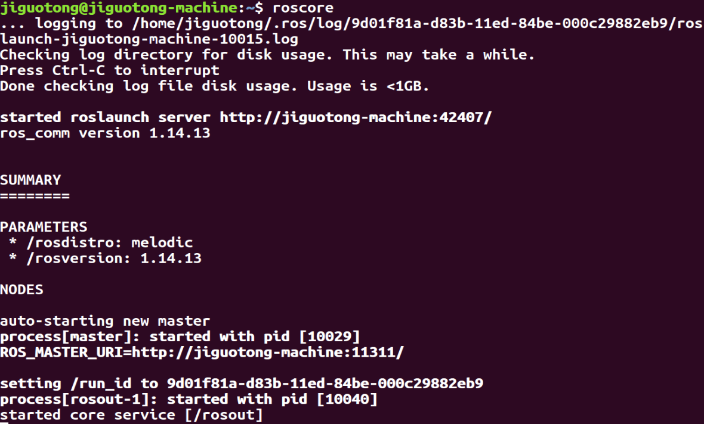

# 一、Linux下编译iDFusion

## （一）环境准备

虚拟机Ubuntu18.04
ROS melodic

## （二）ROS melodic安装配置

参考网址：[ROS配置](https://blog.csdn.net/KIK9973/article/details/118755045)
1、安装ROS melodic
->设置国内源
$ sudo sh -c '. /etc/lsb-release && echo "deb http://mirrors.ustc.edu.cn/ros/ubuntu/ `lsb_release -cs` main" > /etc/apt/sources.list.d/ros-latest.list'
->设置ros密钥
$ sudo apt-key adv --keyserver 'hkp://keyserver.ubuntu.com:80' --recv-key C1CF6E31E6BADE8868B172B4F42ED6FBAB17C654
->确保debian package最新
$ sudo apt-get update
->安装ROS melodic
$ sudo apt-get install ros-melodic-desktop-full
->设置环境变量
$ echo "source /opt/ros/melodic/setup.bash" >> ~/.bashrc
$ source ~/.bashrc
->下载其他功能部件
$ sudo apt install python-rosdep python-rosinstall python-rosinstall-generator python-wstool build-essential

2、初始化rosdep
$ sudo rosdep init
出现报错：

```
ERROR: cannot download default sources list from:
https://raw.githubusercontent.com/ros/rosdistro/master/rosdep/sources.list.d/20-default.list
Website may be down.
```

错误原因：
初始化的这一步将会从外国的网站raw.githubusercontent.com拉取一些信息和文件。这个网站现在被墙了，导致这一步出错。
解决方法：
（1）方法一
翻墙运行即可
（2）方法二
国内有人已经整理好了在国内源的rosdepc，可从国内源直接获取
$ sudo apt-get install python3-pip
$ sudo pip3 install rosdepc
$ sudo rosdepc init
$ rosdepc update
（3）方法三——修改配置文件
$ sudo gedit /etc/hosts
将以下内容拷贝到文件末尾

```
199.232.28.133 raw.githubusercontent.com
192.30.253.118 gist.github.com
185.199.110.153 github.io
151.101.113.194 github.global.ssl.fastly.net
52.216.227.168 github-cloud.s3.amazonaws.com
52.74.223.119 github.com
199.232.28.133 avatars1.githubusercontent.com
199.232.28.133 avatars2.githubusercontent.com
199.232.28.133 avatars0.githubusercontent.com
199.232.28.133 avatars3.githubusercontent.com
199.232.28.133 user-images.githubusercontent.com
199.232.28.133 avatars.githubusercontent.com
199.232.28.133 github.map.fastly.net
199.232.28.133 avatars7.githubusercontent.com
54.239.31.69 aws.amazon.com
54.239.30.25 console.aws.amazon.com
54.239.96.90 ap-northeast-1.console.aws.amazon.com
54.240.226.81 ap-southeast-1.console.aws.amazon.com
54.240.193.125 ap-southeast-2.console.aws.amazon.com
54.239.54.102 eu-central-1.console.aws.amazon.com
177.72.244.194 sa-east-1.console.aws.amazon.com
176.32.114.59 eu-west-1.console.aws.amazon.com
54.239.31.128 us-west-1.console.aws.amazon.com
54.240.254.230 us-west-2.console.aws.amazon.com
54.239.38.102 s3-console-us-standard.console.aws.amazon.com
54.231.49.3 s3.amazonaws.com
52.219.0.4 s3-ap-northeast-1.amazonaws.com
54.231.242.170 s3-ap-southeast-1.amazonaws.com
54.231.251.21 s3-ap-southeast-2.amazonaws.com
54.231.193.37 s3-eu-central-1.amazonaws.com
52.218.16.140 s3-eu-west-1.amazonaws.com
52.92.72.2 s3-sa-east-1.amazonaws.com
54.231.236.6 s3-us-west-1.amazonaws.com
54.231.168.160 s3-us-west-2.amazonaws.com
52.216.80.48 github-cloud.s3.amazonaws.com
54.231.40.3 github-com.s3.amazonaws.com
52.216.20.171 github-production-release-asset-2e65be.s3.amazonaws.com
52.216.228.168 github-production-user-asset-6210df.s3.amazonaws.com
```

$ sudo gedit /etc/resolv.conf
将原有的nameserver那一行注释，并添加以下两行后保存：

```
nameserver 8.8.8.8 #google域名服务器
nameserver 8.8.4.4 #google域名服务器
```

然后执行初始化
$ sudo rosdep init

3、rosdep update更新
$ rosdepc update
报错：read operation timed out
原因：raw.githubusercontent.com这个网站被墙，国内网拉取信息网速缓慢。
解决方法：
（1）方法一
翻墙
（2）方法二——下载文件到本地
链接: https://pan.baidu.com/s/1PhTCqtvScV_XGf9ac0CcCg 提取码: w3ix
->提取文件到/etc/ros/下面
$ sudo cp -r ../ros_github/ /etc/ros/
->修改相关文件配置
$ sudo gedit /usr/lib/python2.7/dist-packages/rosdistro/__init__.py
->将第68行代码替换为
DEFAULT_INDEX_URL = 'file:///etc/ros/ros_github/index-v4.yaml'
$ sudo gedit /etc/ros/rosdep/sources.list.d/20-default.list
->将原有内容全部注释，添加以下内容

```
#os-specific listings first
yaml file:///etc/ros/ros_github/osx-homebrew.yaml osx
#generic
yaml file:///etc/ros/ros_github/base.yaml
yaml file:///etc/ros/ros_github/python.yaml
yaml file:///etc/ros/ros_github/ruby.yaml
gbpdistro file:///etc/ros/ros_github/fuerte.yaml fuerte
#newer distributions (Groovy, Hydro, …) must not be listed anymore, they are being fetched from the rosdistro index.yaml instead
```

->最后再执行rosdep update
$ rosdep update

4、测试ROS安装情况
$ roscore

->打开第二个终端
$ rosrun turtlesim turtlesim_node
->出现小海龟后打开第三个终端
$ rosrun turtlesim turtle_teleop_key
->之后可以通过方向键控制海龟移动，至此安装成功

## （三）编译iDFusion

$ source prepare.sh
$ mkdir build
$ cd build
$ cmake ..
$ make -j
过程中的报错：
1、Pangolin找不到package
需要先编译Pangolin
$ git clone https://github.com/stevenlovegrove/Pangolin.git
$ cd Pangolin
$ mkdir build
$ cd build
$ cmake ..
$ cmake --build .

2、The following variables are used in this project, but they are set to NOTFOUND.
原因：cmake版本落后，安装最新版本
操作：
->备份cmake旧版
$ which cmake
\# /usr/bin/cmake
$ cd /usr/bin
$ sudo mv cmake cmake_bak
->安装最新版cmake
$ sudo snap install cmake --classic

3、Could not find REALSENSE2_FOUND using the following names: realsense2
原因：缺少realsense2
操作：
->注册公钥
$ sudo apt-key adv --keyserver keyserver.ubuntu.com --recv-key F6E65AC044F831AC80A06380C8B3A55A6F3EFCDE || sudo apt-key adv --keyserver hkp://keyserver.ubuntu.com:80 --recv-key F6E65AC044F831AC80A06380C8B3A55A6F3EFCDE
->添加源
$ sudo add-apt-repository "deb https://librealsense.intel.com/Debian/apt-repo $(lsb_release -cs) main" -u
->安装包
$ sudo apt-get install librealsense2-dkms
$ sudo apt-get install librealsense2-utils
$ sudo apt-get install librealsense2-dev
$ sudo apt-get install librealsense2-dbg
->测试安装
$ realsense-viewer      #出现可视化界面
$ modinfo uvcvideo | grep "version:"
*version:        1.1.2.realsense-1.3.18*
*srcversion:     51A4A0210E91BE50A7BA2BB*

4、出现以上报错的原因是因为prepare.sh没有执行成功，由于在prepare.sh中编译选项使用的是make -j，同时编译多条指令，导致系统崩掉（虚拟机性能受阻），只需将所有的-j去掉，便会安装所有的外部依赖。

5、"SOPHUS_INCLUDE_DIR-NOTFOUND"
原因：sophus的目录未找到 
操作：在CMakeList.txt中set一下SOPHUS_INCLUDE_DIR的路径
```shell
set(OPENNI2_LIBRARY "/usr/lib/libOpenNI2.so")
set(OPENNI2_INCLUDE_DIR "/usr/include/openni2")
set(SOPHUS_INCLUDE_DIR "/home/jiguotong/Projects/Github/iDFusion/third_party_library/Sophus;/home/jiguotong/Projects/Github/iDFusion/third_party_library/Sophus/sophus;")
```

6、报错No rule to make target '/opt/ros/kinetic/lib/libmessage_filters.so'
原因：此项目依赖的ros环境是kinetic，需要重新安装Ubuntu16.04并且安装与16.04对应的kinetic
:blush::blush::blush:
