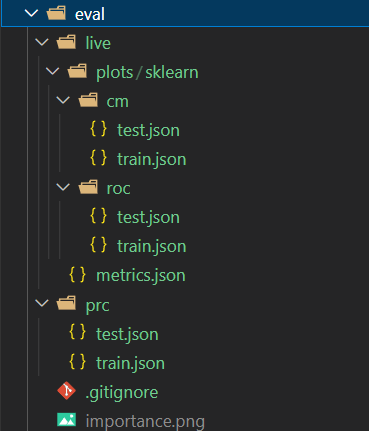

### yield关键字

https://blog.csdn.net/weixin_44726976/article/details/109058763

### 列表推导式

https://blog.csdn.net/weixin_43790276/article/details/90247423

### 进度条使用相关

在列表的外层套一个tqdm（python封装好的进度条类）

```python
from tqdm import tqdm
list = range(0,5)
for i in tqdm(list):
    pass
```

### pycharm使用技巧，包含远程开发

https://blog.csdn.net/weixin_38037405/article/details/120550201

### 使用numpy的where功能可以进行条件处理数组

```python
target = np.array([1,2,3,4,5,6,7,8,9,10])
print(target)

# 对小于4的数组元素赋值0，对大于7的元素赋值255
target[target<4]=0
target[target>7]=255
print(target)
# 对介于[4,7]的元素进行减1再进行平方，非此区间内元素保持不变
target = np.where((target>=4) & (target<=7),(target-1)*2,target)
print(target)
```

### Python中的isinstance()函数

https://blog.csdn.net/qq_36998053/article/details/122682397

### Python函数装饰器的使用

https://blog.csdn.net/qq_45476428/article/details/126962919

### def main() -> None: 的作用是声明该函数返回类型为None，即没有返回值，如果是 -> def main() -> int:则说明返回值是int类型 


# 3.常用工具学习
Hydra官网：https://hydra.cc/docs/1.3/intro/

## 3.0 Python的数据类————@dataclass 基于装饰器 仅限Python3.7及以上
https://blog.csdn.net/be5yond/article/details/119545119
https://zhuanlan.zhihu.com/p/555359585
基本使用
```python
from dataclasses import dataclass
from dataclasses import field
from typing import Any
from typing import List

@dataclass
class Player():
    name: str
    age: int
    description: str='player'
    skills: List[str]= field(default_factory = list)

# 使用
player1 = Player('Justin',24,skills=['eat','sleep','deeplearning','C++'])
print(player1.name)
print(player1)
```
## 3.1 Hydra学习————python中用来配置变量的工具
### 3.1.1 安装
pip install hydra-core
### 3.1.2 了解YAML文件和python函数装饰器的使用
YAML文件：https://blog.csdn.net/xikaifeng/article/details/121612180
函数装饰器：https://blog.csdn.net/qq_45476428/article/details/126962919

### 3.1.3 使用Hydra
main.py
```python
import hydra
from omegaconf import DictConfig

@hydra.main(config_path="configs", config_name="config")
def test(config: DictConfig):
    # To access elements of the config
    print(f"The batch size is {config.deeplearning['batch_size']}")
    print(f"The learning rate is {config.User[0]['name']}")

    # 用OmegaConf.to_yaml组织成yaml的可视化格式
    print(OmegaConf.to_yaml(config))

if __name__ == "__main__":
    test()
```
configs/config.yaml
```yaml
### config/config.yaml
deeplearning:
  batch_size: 10
  lr: 1e-4

User:
-  name: jiguotong
-  age: 24
```
### 3.1.4 进阶使用Hydra-group
可以在yaml文件中进行嵌套其他yaml文件
文件结构
```shell
├── configs
│   ├── config_db.yaml
│   └── db
│       ├── mysql.yaml
│       └── postgresql.yaml
└── main.py
```
main.py
```python
import hydra
from omegaconf import DictConfig

@hydra.main(config_path="configs", config_name="config")
def test_for_db(config: DictConfig):
    print(config.db.driver)
    print(config.db.user)
    print(OmegaConf.to_yaml(config))

if __name__ == "__main__":
    test_for_db()
```

configs/config_db.yaml
```yaml
### config/config_db.yaml
defaults:
  - db: mysql
```

configs/db/mysql.yaml
```yaml
driver: mysql
user: mysql_user
password: 654321
timeout: 20
```

configs/db/postgresql.yaml
```yaml
driver: postgresql
user: postgres_user
password: 123456
timeout: 20
```

### 3.1.5 Hydra搭配数据类@dataclass的使用
test.py
```python
#!/usr/bin/env python
#  -*- encoding: utf-8 -*-

from typing import List
from dataclasses import dataclass
from dataclasses import field

import hydra
from hydra.core.config_store import ConfigStore
from omegaconf import OmegaConf

# 申明数据类
@dataclass
class Player():
    name: str
    age: int
    description: str='player'
    skills: List[str]= field(default_factory = list)

# 存储示例
cs = ConfigStore.instance()

# 使用类 即config1指向Player类
cs.store(name="config1", node=Player)

# 使用hydra装饰函数
@hydra.main(version_base=None, config_name="config1")
def main_config(cfg: Player) -> None:
    print('main_config1--->')
    print(OmegaConf.to_yaml(cfg))
    pass

# ----------------------------------------------------------------------
# 小结
if __name__ == '__main__':
    main_config()
```

## 3.2 DVC——数据版本管理工具，基于Git使用
参考网址：https://dvc.org/doc
### 3.2.1 安装
pip install dvc
pip install dvclive

### 3.2.2 基本使用
#### 0.基本命令
```bash
# dvc version 查看dvc版本
dvc version

# dvc list 查看远程git库中被dvc管理的项目
dvc list https://github.com/jiguotong/DVC data
## 若是访问dvc库需要用户名密码，则可加上如下配置
dvc list https://github.com/jiguotong/DVC -R --remote-config user=jiguotong password=123456 >> tmp.txt

# dvc get 获取git库或者dvc库的内容，单纯获取，不进行追踪，且可以不是一个dvc项目
## 获取未被dvc追踪的文件/文件夹
dvc get https://github.com/jiguotong/DVC train.py
dvc get https://github.com/jiguotong/DVC scripts
## 获取被dvc追踪的文件/文件夹
dvc get https://github.com/jiguotong/DVC model.onnx --remote-config user=jiguotong password=123456
dvc get https://github.com/jiguotong/DVC data/val --remote-config user=jiguotong password=123456 -o data/val
## --remote-config 后面追加访问dvc仓库所需要的凭据
## -o 指定将get到的文件/文件夹以什么名称存放在本地

# dvc import 导入其他git库中的内容，并且进行追踪，必须在一个dvc项目中进行使用
dvc import https://github.com/jiguotong/DVC data/model.onnx --remote-config user=jiguotong password=123456
dvc import https://github.com/jiguotong/DVC data/val --remote-config user=jiguotong password=123456 -o data/val
# 如果源项目中的文件发生改变，可以使用dvc update target的形式进行更新
dvc udpate model.onnx
dvc update data/val


## 将github仓库换成本地仓库，git@192.168.1.3:jiguotong/DVC
```
#### 1.数据版本管理
```bash
# 在git项目的根目录进行dvc初始化
dvc init    
git commit -m "Initial DVC" && git push

# 配置dvc远程仓库
## 使用ssh方式
pip install dvc-ssh
dvc remote add -d ssh-storage ssh://192.168.1.140/home/jiguotong/Projects/dvc_storage/DVC
dvc remote modify --local ssh-storage user jiguotong
dvc remote modify --local ssh-storage password 123456

## 使用webdav方式
pip install dvc_webdav
dvc remote add -d webdav-storage webdav://192.168.1.2:5005/home/jiguotong/Projects/dvc_storage/DVC
dvc remote modify --local webdav-storage user jiguotong
dvc remote modify --local webdav-storage password 123456

dvc remote list # 可以查看目前有的remote列表
dvc remote default ssh-storage # 可以设置默认的远程dvc仓库是哪个

## git上传配置信息，其中config.local会被ignore
git add .dvc/config
git commit -m "configure dvc remote url" && git push

# 增加一个文件STDC.onnx
dvc add STDC.onnx
dvc push
git add STDC.onnx.dvc
git commit -m "Add .dvc files" && git push

# 其他主机进行获取
git pull

## 需要设置一下自己对远程dvc仓库地址的访问凭据，才能进行拉取
dvc remote list
dvc remote modify --local ssh-storage user xxxxx
dvc remote modify --local ssh-storage password xxxxx

dvc remote modify --local webdav-storage user xxxxx
dvc remote modify --local webdav-storage password xxxxx

dvc pull
```

#### 2.数据流程版本管理
类似于脚本，定义了一系列操作，成为一个流水线。
```bash
wget https://code.dvc.org/get-started/code.zip
unzip code.zip && rm -f code.zip
dvc get https://github.com/iterative/dataset-registry get-started/data.xml -o data/data.xml
pip install -r src/requirements.txt

# dvc stage add增加一个步骤
dvc stage add -n prepare \
                -p prepare.seed,prepare.split \
                -d src/prepare.py -d data/data.xml \
                -o data/prepared \
                python src/prepare.py data/data.xml

dvc stage add -n featurize \
                -p featurize.max_features,featurize.ngrams \
                -d src/featurization.py -d data/prepared \
                -o data/features \
                python src/featurization.py data/prepared data/features

dvc stage add -n train \
                -p train.seed,train.n_est,train.min_split \
                -d src/train.py -d data/features \
                -o model.pkl \
                python src/train.py data/features model.pkl

# 会生成一个dvc.yaml文件，里面包含了运行的命令信息、依赖项、输出项
# 使用dvc repro执行dvc.yaml中的所有阶段
dvc repro

# 会生成一个dvc.lock文件，对应于dvc.yaml，用于记录pipeline的状态并帮助跟踪输出。
```
命令详解
-n 操作的名称
-p 配置，可以是多个，文件或者文件夹
-d 操作依赖的数据，脚本和模型等，可以是多个，文件或者文件夹
-o 操作的输出，可以是多个，文件或者文件夹
command：执行操作的命令如python -u train.py

#### 3.指标，参数，绘图管理
```bash
# 增加-评估-阶段
dvc stage add -n evaluate \
  -d src/evaluate.py -d model.pkl -d data/features \
  -M eval/live/metrics.json \
  -O eval/live/plots -O eval/prc -o eval/importance.png \
  python src/evaluate.py model.pkl data/features
# -m 输出的指标的目录
dvc repro
```
产生的目录如下：


```bash
# 查看指标统计
dvc metrics show
```
添加以下内容在dvc.yaml中
```yaml
# 配置绘图 dvc.yaml
plots:
  - ROC:
      template: simple
      x: fpr
      y:
        eval/live/plots/sklearn/roc/train.json: tpr
        eval/live/plots/sklearn/roc/test.json: tpr
  - Confusion-Matrix:
      template: confusion
      x: actual
      y:
        eval/live/plots/sklearn/cm/train.json: predicted
        eval/live/plots/sklearn/cm/test.json: predicted
  - Precision-Recall:
      template: simple
      x: recall
      y:
        eval/prc/train.json: precision
        eval/prc/test.json: precision
  - eval/importance.png
```
进行绘图
```bash
dvc plots show
```

# 【python】关于import相关知识总结
https://blog.csdn.net/BIT_Legend/article/details/130775553
```python
# py文件：所有以.py结尾的文件
# py脚本：不被import，能直接运行的py文件，一般会import别的py文件
# python包：被import使用，一般不能直接运行的py文件，一般只包含函数/类，调试时需要调用if __main__语句
 
 
# 搜索路径
# 指python以 绝对路径 形式导入包时的所有可能路径前缀，整个程序不管在哪个py文件里 搜索路径 是相同的
# 默认 搜索路径 按顺序包括：程序入口py脚本的当前路径、python包安装路径，当存在重名时，注意顺序问题
# 程序入口py脚本的当前路径只有一个，指整个程序入口的唯一py脚本的当前路径，如下是 搜索路径 查看方式
import sys
print(sys.path)                 # 整个程序不管import多少个python包，其程序入口只有一个py脚本
# sys.path.append("/xx/xx/xx")  # 增加 搜索路径 的方式
 
 
# 绝对路径
# 是以 搜索路径 为前缀，拼接下面xxx后形成完整的python包调用路径
import xxx                      # xxx可以是文件夹/py包文件
from xxx import abc             # xxx可以是文件夹/py包文件，abc可以是文件夹/py包文件/变量/函数/类
 
# 相对路径
# 是以 当前执行import语句所在py文件的路径 为参考，拼接下面的.xxx/..xxx后形成完整的python包调用路径
# ⭐但是需要注意，相对路径 只能在python包中使用，不能在程序入口py脚本里使用，否则会报错
# 当单独调试python包时，调用if __main__语句，相对路径同样报错，原因是此时py文件变py脚本不再是python包
from .xxx import xxx            # 当前路径
from ..xxx import xxx           # 当前路径的上一级路径
```