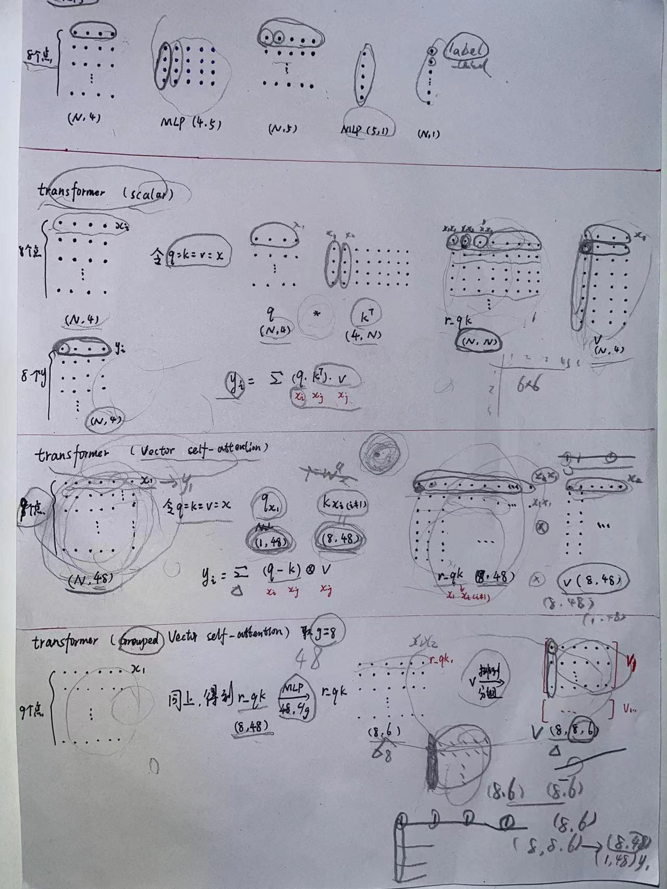

# 一、名词概述
注意力机制：“瓶子电脑”理论
自注意力机制：
```python
import math
import torch
import torch.nn as nn


class SelfAttention(nn.Module):

    def __init__(self, dim_q, dim_k, dim_v):
        super(SelfAttention, self).__init__()
        self.dim_q = dim_q
        self.dim_k = dim_k
        self.dim_v = dim_v

        # 定义线性变换函数
        self.linear_q = nn.Linear(dim_q, dim_k, bias=False)
        self.linear_k = nn.Linear(dim_q, dim_k, bias=False)
        self.linear_v = nn.Linear(dim_q, dim_v, bias=False)
        self._norm_fact = 1 / math.sqrt(dim_k)

    def forward(self, d):
        batch, n, dim_q = x.shape
        assert dim_q == self.dim_q

        q = self.linear_q(x)
        k = self.linear_k(x)
        v = self.linear_v(x)

        score = torch.matmul(q, k.transpose(1, 2)) * self._norm_fact
        score = torch.softmax(score, dim=-1)
        att = torch.matmul(score, v)

        return att


if __name__ == '__main__':
    x = torch.rand(4, 1024, 16)
    model = SelfAttention(16, 32, 1)
    att = model(x)
    pass

    C = torch.tensor([[[1, 2], [3, 4]], [[5, 6], [7, 8]]])
    pass
```

多头注意力机制

向量注意力：参考Point Transformer系列论文

分组向量注意力：参考Point Transformer系列论文

# 二、各种注意力计算过程


