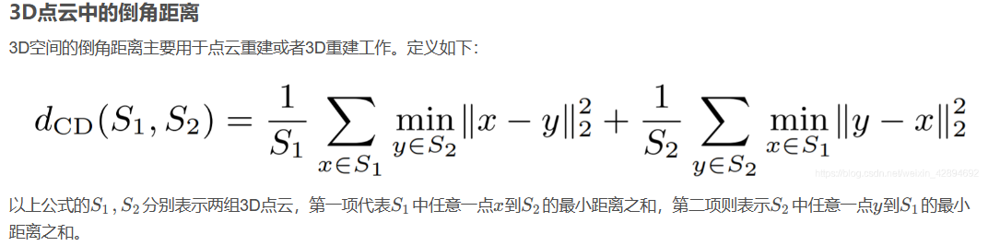

# 一、occupancy_networks

## 1.配置
[论文地址](https://www.cvlibs.net/publications/Mescheder2019CVPR.pdf)
[Github项目地址](https://github.com/autonomousvision/occupancy_networks)

[conda环境配置 ONet.yaml配置目录](./ONet.yaml)

注：[vscode不再支持python3.6及以下的版本的debug功能！](https://blog.csdn.net/jst100/article/details/125783925)因此使用python3.7环境。

⭐若安装torch较慢，手动下载torch-1.4.0-cp37-cp37m-linux_x86_64.whl之后
``pip install torch-1.4.0-cp37-cp37m-linux_x86_64.whl``
``conda install pyembree==0.1.4``

⭐若提示fatal error: numpy/arrayobject.h: No such file or directory
则在setup.py中添加numpy的include环境，include_dirs=[numpy.get_include()]
例如：
```python
# setup.py
# 原先内容
setup(
    ext_modules=cythonize(ext_modules),
    cmdclass={
        'build_ext': BuildExtension
    }
)
# 改为以下内容
setup(
    ext_modules=cythonize(ext_modules),
    cmdclass={
        'build_ext': BuildExtension
    },
    include_dirs=[numpy_include_dir]
)  
```

## 2.流程剖析
### 1.数据集
ShapeNet数据说明（经由occupancy network处理之后）：
pointscloud.npz
 - points:物体的真实点云(100000,3)
 - normals:每个点的法向量 (100000,3)
 - loc:坐标原点 (3,)
 - scale：比例(1,)

points.npz
 - points:物体真实点云周围的包围框的点 (100000,3)
 - occpancied:物体真实点云周围的包围框的点的占用情况.0/1表示，8位二进制数字组合为一个十进制数字(压缩存储). (12500,3)
 - loc:坐标原点(3,1)
 - scale:比例(1,)

model.binvox:32*32*32大小的体素信息，可使用viewvox.exe可视化查看

### 2.训练流程
原始点云采样300个点，送进encoder，编码产生一个512的向量；点云周围的体素化点云采样2048个点，每一个点单独与该512向量送进decoder，产生一个0/1的占用预测值logit，该值与真实值ground truth进行计算loss，继而进行反向传播。

### 3.推理流程
原始点云采样300个点，送进encoder，编码产生一个512的向量；用指定分辨率产生一个角点grid立方体，不断将该立方体所有角点grid与该512向量送进网络，判断是否占用，若一个立方体的8个角点有的占用有的未占用，则将该立方体作为活跃cube，继续分成8个小立方体，直至没有活跃cube。然后利用marching cube算法提取出mesh，然后refine，继而输出。

***ONet总结：作用输入一个点P(x,y,z)以及一个点云（或者mesh 或者体素），判断这个点位于点云内部还是外部。***


## 3.其他要素
1.MISE算法
Multiresolution IsoSurface Extraction (MISE), 多分辨率表面提取算法
https://blog.csdn.net/qq_34342853/article/details/120078510
https://blog.csdn.net/MARCOLU6/article/details/129746949

- 把要判断的范围按一个粗粒度的初始分辨率分成grid。每个grid有一些角点（三维的话相当于一个cube，有8个顶点）
- 所有这些角点，用训练好的网络计算出occupancy value (0-1之间的实数).
- 网络超参数τ \tauτ，物体厚度。大于等于τ \tauτ的为occupied，否则为un occupied. （可以认为边界点的occupancy value 为τ \tauτ。）
- 如果一个grid，他有的角点是occupied，有的是unoccupied，那他就是active的grid，后面要继续考察。（淡红色的那些grid）
- 把所有active的grid再次细分，（对半分，最后一共八个）。重复以上步骤，直到满足目标分辨率。

2.Marching cube算法
marching cubes算法是一种以无限逼近所要求分辨率方式绘制等值面的算法，把二维图像或三维物体进行栅格化，判断角点是否处于物体内部（判断方式用函数或者占用网络），最后根据角点的关系查找边表，进而得到面片的位置关系，从而绘制出来。

[Marching cubes算法解析（MC）](https://zhuanlan.zhihu.com/p/644376623)

[MarchingCube算法详解](https://www.bilibili.com/video/BV1Ev411r7vx/?spm_id_from=333.337.search-card.all.click&vd_source=1736ad4cd5552b038f168b38660123d6)

## 4.参考网址：
[occupancy_networks demo复现](https://blog.csdn.net/GODLwc/article/details/130637560)

[读论文CVPR2019: Occupancy Networks: Learning 3D Reconstruction in Function Space](https://blog.csdn.net/qq_34342853/article/details/120078510)

[Occupancy Networks：基于学习函数空间的三维重建表示方法](https://zhuanlan.zhihu.com/p/156910207)

[<论文阅读>(八)Occupancy Networks Learning 3D Reconstruction in Function Sapce](https://hideoninternet.github.io/2019/12/21/b040bbb5/)

[Marching cubes算法解析（MC）](https://zhuanlan.zhihu.com/p/644376623)

[MarchingCube算法详解](https://www.bilibili.com/video/BV1Ev411r7vx/?spm_id_from=333.337.search-card.all.click&vd_source=1736ad4cd5552b038f168b38660123d6)

# 二、if-net
## 1.配置
[论文地址](https://arxiv.org/pdf/2003.01456.pdf)
[Github项目地址](https://github.com/jchibane/if-net)

⭐报错triangle_hash.cpp:641:10: fatal error: numpy/arrayobject.h: No such file or directory
在setup.py中加入numpy的include路径变为
```python
setup(name = 'libmesh',
      ext_modules = cythonize("*.pyx"),
      include_dirs=[numpy.get_include()])
```
⭐需要安装meshlab软件，后续使用到meshlabserver命令
``sudo apt install meshlab``
如果是在无界面的服务器上操作，还需要安装虚拟屏幕xvfb
``sudo apt install xvfb``

## 2.数据集处理
```bash
# 将.obj格式转为.off格式，同时将mesh进行平移缩放，存到isosurf_scaled.off文件中
python data_processing/convert_to_scaled_off.py

# 将scaled_mesh体素化为指定分辨率的voxel，并进行位压缩，存进voxelization_32.npy文件中
python data_processing/voxelize.py -res 32

# 将scaled_mesh生成采样后的点云，并计算其在32*32*32的grid中的占用情况，一并存进voxelized_point_cloud_32res_300points.npz文件中
python data_processing/voxelized_pointcloud_sampling.py -res 32 -num_points 300

# 将scaled_mesh生成采样后的点云100000，并且进行表面点云正态分布偏移，boundary_0.1_samples.npz文件中
python data_processing/boundary_sampling.py -sigma 0.1

# 将voxelization_32重新构建成VoxelGrid,并且导出成mesh，存进voxelization_32.off中，供可视化
python data_processing/create_voxel_off.py -res 32

# 将voxelized_point_cloud_32res_300points.npz重新构建成点云，并将点云输出到voxelized_point_cloud_32res_300points.off文件中，供可视化
python data_processing/create_pc_off.py -res 32 -num_points 300
```

## 3.训练流程
python train.py -std_dev 0.1 0.1 -res 32 -m ShapeNetPoints -batch_size 16

稠密点云附近的抖动离散点与原始点云采样300个点一起送进网络，产生这些离散点的占用情况logit，该值与真实值occ进行计算loss，继而进行反向传播。

## 4.推理流程
python generate.py -std_dev 0.1 0.1 -res 32 -m ShapeNetPoints -checkpoint 10 -batch_points 50

指定分辨率产生的立方体离散点与原始点云采样300个点一起送进网络，获得这些离散点的占用情况，之后通过marching cube算法提取出mesh，然后输出。


# 三、PointCloud Completion Net
## 1.配置
[PCN_PyTorch Github地址](https://github.com/qinglew/PCN-PyTorch)

⭐报错ValueError: Unknown CUDA arch (8.9) or GPU not supported
pytorch 1.7版本不支持RTX4090的显卡，提升pytroch到1.13

⭐报错emd_kernel.cu:14:10: fatal error: THC/THC.h: No such file or directory
pytorch 1.11之后取消掉了THC.h，https://github.com/CoinCheung/pytorch-loss/pull/37，将THCudaCheck -> AT_CUDA_CHECK

⭐报错emd_kernel.cu(382): error: identifier "CHECK_EQ" is undefined
pytorch 1.11之后[Replace all CHECK_ and DCHECK_ with TORCH](https://github.com/pytorch/pytorch/pull/82032),用TORCH_CHECK_EQ 代替 CHECK_EQ

## 2.数据集处理
.stl -> .ply -> mesh2points -> split_dataset -> create_list
最终将数据集分散在train，valid，test三个文件夹中，每个文件夹内部又分为complete和partial两个文件夹，存放的是完整的点云数据和有洞的点云数据。

## 3.训练流程
### 训练执行
python train.py --exp_name cedu_PCN_16384 --lr 0.0001 --epochs 5000 --batch_size 4 --coarse_loss cd --num_workers 8
### loss计算
PCN的loss计算有两个计算过程
(1)倒角距离Chamfer Distance

:book: [参考](https://blog.csdn.net/weixin_42894692/article/details/106148094)

(2)地动距离Earth move's Distance
将P中所有点移动到Q中所有点位置的总花费的最小的调度距离。
:book: [参考](https://cloud.tencent.com/developer/article/1746230?areaSource=102001.6&traceId=BbN-W7y3WqmrWTrX9OVq4)

## 4.推理流程

# 四、convolutional_occupancy_networks

## 1.配置

（1）[torch_scatter下载失败的解决方案：](https://www.jianshu.com/p/96cfae6377da)

（2）如若报错yaml.load缺少Loader，则是因为新老版本yaml兼容性不足导致的，可以使用yaml.load(xx, Loader=yaml.SafeLoader)代替


# 五、三维数据格式剖析
## (一).obj格式
.obj是一种常见的三维模型文件格式，它使用文本格式来存储模型的几何形状和相关信息。以下是.obj格式的数据结构介绍：

1. 顶点数据（Vertices）：.obj文件中以 "v" 开头的行描述了模型的顶点信息。每一行包含三个浮点数，表示顶点的X、Y、Z坐标。

2. 纹理坐标数据（Texture Coordinates）：.obj文件中以 "vt" 开头的行描述了贴图的纹理坐标信息。每一行包含两个浮点数，通常表示为U、V分量，用于映射纹理到模型表面。

3. 法线数据（Normals）：.obj文件中以 "vn" 开头的行描述了模型的法线信息。每一行包含三个浮点数，表示法线的X、Y、Z分量。法线用于计算光照效果和渲染阴影。

4. 面片数据（Faces）：.obj文件中以 "f" 开头的行描述了模型的面片（三角形或多边形）信息。每一行包含一系列的顶点索引，用于指示顶点、纹理坐标和法线在之前描述的数据中的索引位置。

5. 材质和纹理信息：.obj文件中可以包含关于材质和纹理的信息。以"usemtl"开头的行用于指定使用的材质名称，而"mtllib"开头的行用于指定使用的材质库文件。

除了上述主要数据类型外，.obj文件还支持其他指令和注释，以提供更多的模型描述和控制。例如，文件开头可以包含注释行（以"#"开头）和对象定义行（以"g"开头），用于分组和命名模型中的不同部分。

.obj文件的文本格式具有易读性和广泛的软件支持，使得它成为了一种常用的三维模型数据交换格式。

## (二).off格式
.off文件是一种常见的三维模型文件格式，它使用二进制格式来存储模型的几何形状和相关信息。以下是.off格式的数据结构介绍：

1. 文件头信息：.off文件的开头包含有关模型的描述信息。典型的文件头行为"OFF"，它指示了文件类型。接下来的行可能包含有关顶点数、面片数和边数的信息。

2. 顶点数据（Vertices）：在.off文件中，顶点数据使用一系列浮点数进行表示，每个顶点由X、Y和Z三个分量组成。这些顶点数据以二进制的形式存储在文件中，可以通过偏移量和字节数来读取。

3. 面片数据（Faces）：.off文件中的面片数据描述了模型的拓扑结构。每个面片由顶点索引构成，指示了组成面片的顶点。这些顶点索引以二进制的形式存储在文件中，可以通过偏移量和字节数来读取。

4. 面片的连接关系：面片数据描述了面片的几何形状，而面片的连接关系描述了它们如何相互连接。在.off文件中，面片之间的连接关系可以通过逐个读取面片的顶点索引来建立。

.off文件相对于.obj文件采用了二进制格式存储数据，因此通常会占用较少的存储空间。它适用于存储较大规模的三维模型，能够高效地描述复杂的几何和拓扑结构。然而，相对于.obj文件的文本格式，.off文件可能不太容易阅读和修改。

## (三).off格式