## 课程目录

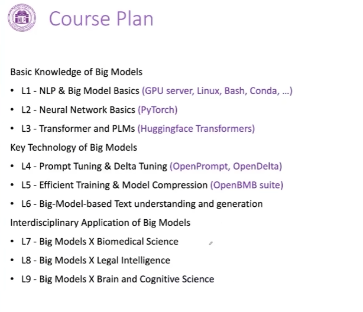

## 循环神经网络RNN

### 一、网络概述

1.**特点**：RNN对具有序列特性的数据非常有效，它能挖掘数据中的时序信息以及语义信息
2.基本循环神经网络可画为：
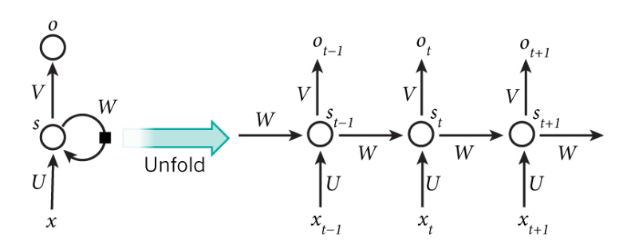
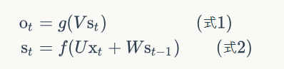
3.在基本循环神经网络基础上有双向循环神经网络和深度循环神经网络。

### 二、前向传播与反向传播推导示例

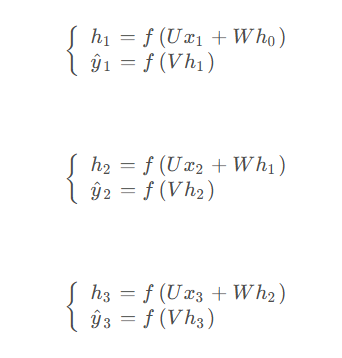
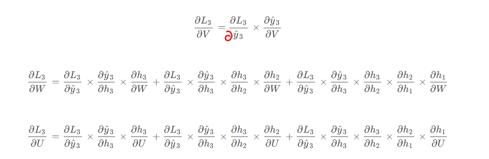
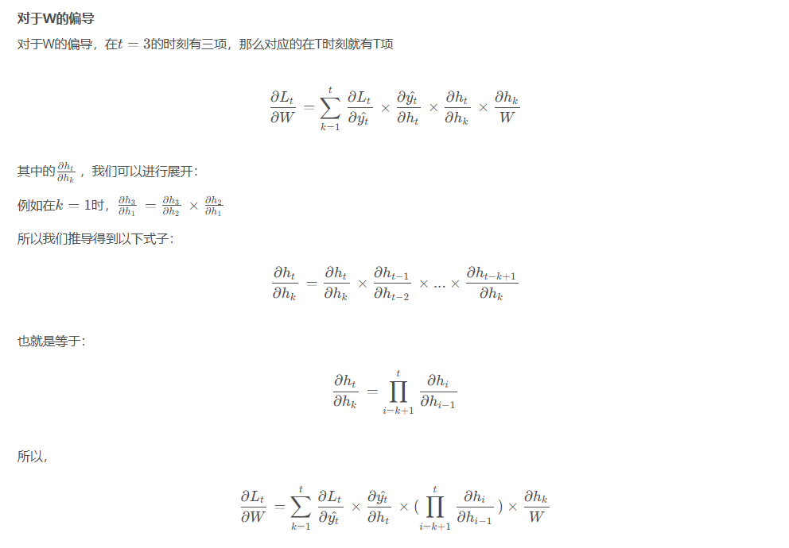
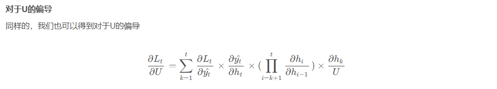
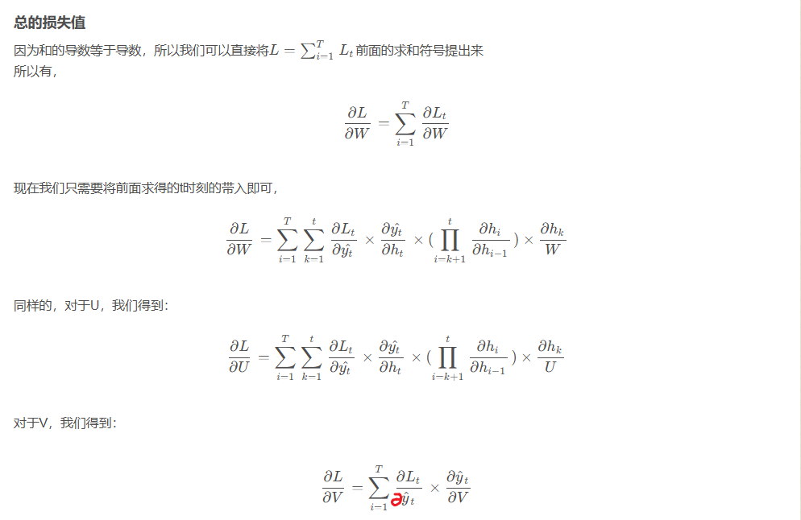

### 三、RNN缺点及其改进

1.**缺点**：RNN在训练过程中很容易发生梯度爆炸和梯度消失。
经公式推导，存在连乘项，易发生指数型增长或减小，从而产生梯度（损失函数对应某变量的偏导也即曲线的斜率）爆炸或者梯度消失。
详细参考：https://blog.csdn.net/qq_22841387/article/details/139283146

2.GRU(Gate Recurrent Unit, 门控循环单元)
GRU的核心在于它试图解决标准RNN的梯度消失问题，同时保留长期依赖信息。

3.LSTM(Long Short-Term Memory Network, 长短时记忆网络)
专门设计用于解决长期依赖的问题，即在处理序列数据时能够记住较长时间间隔的信息。

### 四、GRU(Gata Recurrent Unit, 门控循环单元)

1.GRU通过两种门组件和两种记忆状态解决了梯度消失
（1）四大组件
①重置门（reset gate），这个门决定了上一时间步的记忆状态如何影响当前时间步的候选记忆内容，有过滤作用，丢弃与预测无关的历史信息。
②更新门（updata gate），这个门决定了上一时间步得记忆状态有多少传递到当前时间步，以及当前的输入信息有多少需要加入到新的记忆状态中。
③候选记忆状态（candidate memory），基于当前输入、上一时间步隐藏状态以及重置门的输出共同得到的。
④最终记忆状态（hidden state），通过结合更新门的输入和候选记忆状态以及上一时间步的记忆状态得到的。
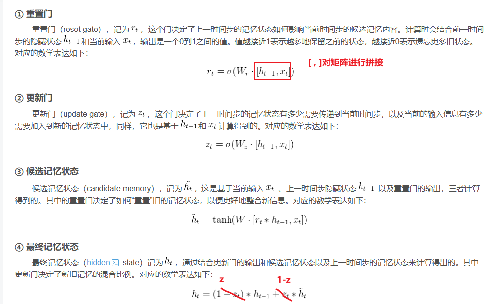
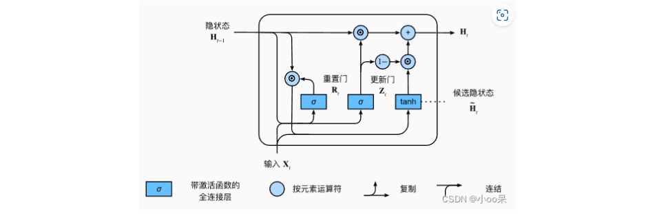

根据
https://www.bilibili.com/video/BV1Bx4YeEEEU/?spm_id_from=333.337.search-card.all.click&vd_source=1d204308936e108c95b2ecb8fcdbd781
分析得知，

**重置门有助于捕获序列中的短期依赖关系**

**更新门有助于捕获序列中的长期依赖关系**

### 五、LSTM(Long Short-Term Memory Network, 长短时记忆网络)

1.LSTM的基本结构由四个主要组件构成：输入门、遗忘门、输出门以及记忆细胞（也称为细胞状态）。还有一个额外的概念是候选记忆状态
(1)基本组件
①遗忘门（Forget Gate），确定细胞状态中哪些信息应当被遗忘。
②输入门（Input Gate），决定当前输入中哪些部分应当被更新到细胞状态
③候选细胞状态（Candidata cell state），基于当前输入、上一时间步隐藏状态得到
④细胞状态（Cell state），LSTM的核心，一个能够存储长期信息的向量。它通过点积运算结合遗忘门和前一时间步的细胞状态，以及输入门和一个新的候选记忆状态来更新。
⑤输出门（Output Gate），是控制细胞状态中哪些信息应当被用于生成当前时间步的输出。
⑥当前隐藏状态（hidden state），最终输出到下一个时间步的状态。

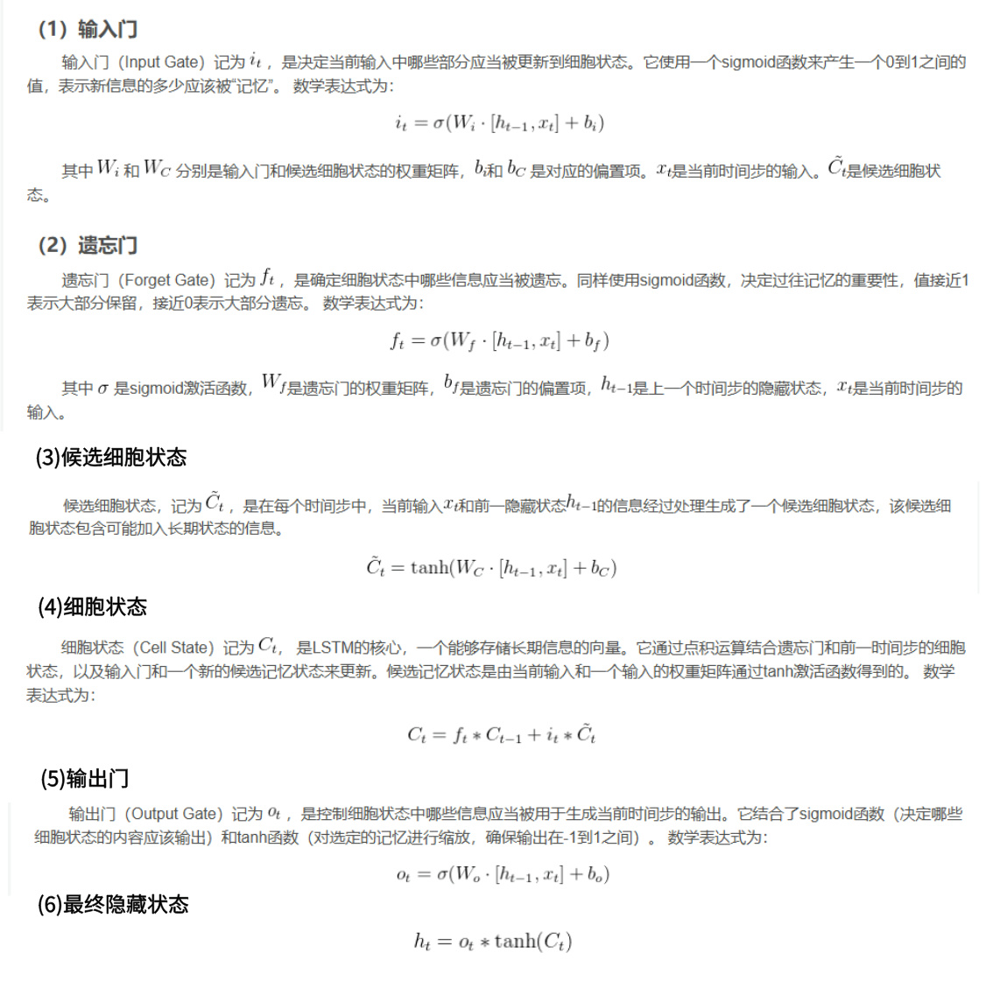
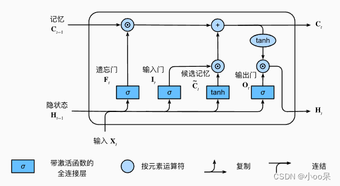

### 六、NLP实例项目

Github：https://github.com/jiguotong/NLPLearn
笔记：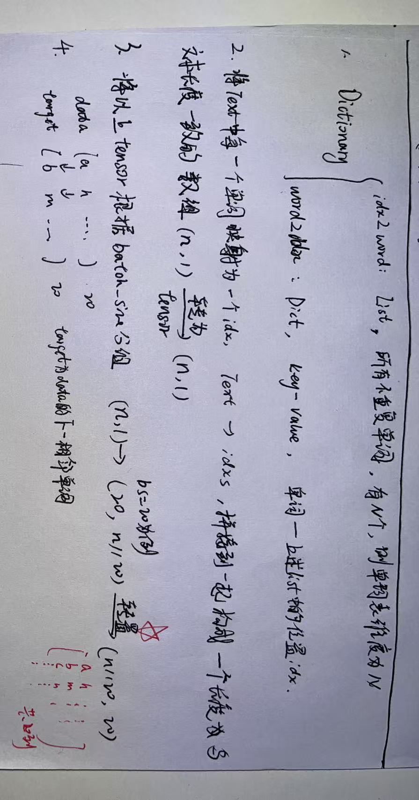

## seq2seq

### 一、编码器-解码器结构 Encoder-Decoder

1.编码器：将输入编程为中间表达形式（特征）
解码器：将中间表示解码成输出
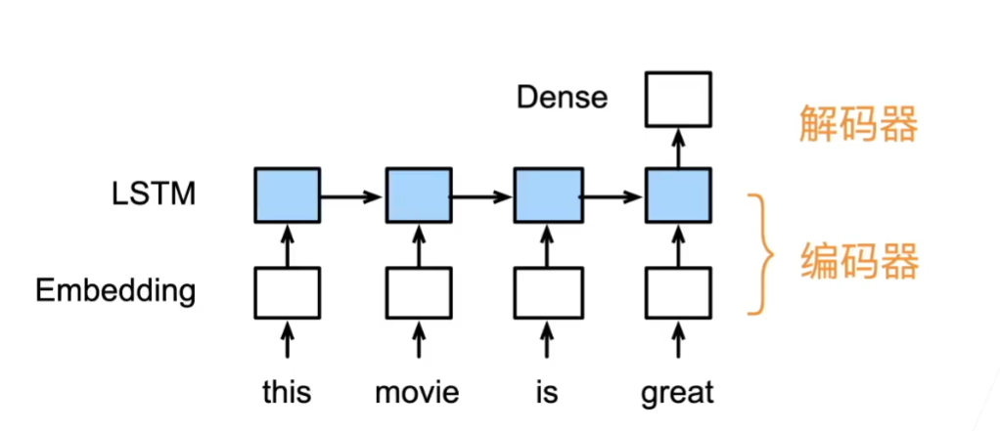

2.基本代码

```pyhton
from torch import nn

class Encoder(nn.Module):
    """编码器-解码器结构的基本编码器接口。"""
    def __init__(self, **kwargs):
        super(Encoder, self).__init__(**kwargs)
    
    def forward(self, X, *args):
        raise NotImplementedError
  
class Decoder(nn.Module):
    """编码器-解码器结构的基本编码器接口。"""
    def __init__(self, **kwargs):
        super(Decoder, self).__init__(**kwargs)
  
    def init_state(self, enc_outputs, *args):
        """enc_outputs是编码器的所有输出，初始化为解码器需要的状态state"""
        raise NotImplementedError

    def forward(self, X, state):
        """X为编码器的额外输入"""
        raise NotImplementedError
```

### 二、seq2seq

1.通俗解释
序列到序列模型，是一种能够根据给定的序列，通过特定的生成方法生成另一个序列的方法，同时这两个序列可以不等长。是一种编码器解码器结构，使用的都是RNN单元，一般为LSTM或GRU。
以下为推理预测示意图：

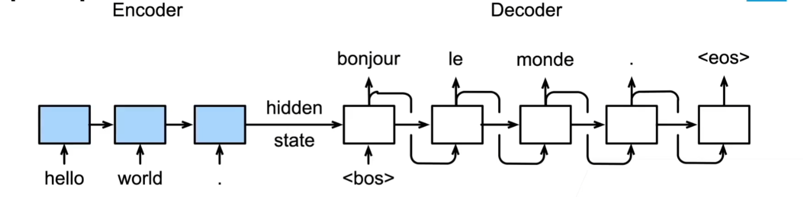

2.训练及推理过程
训练示意图(训练时有明确的input-target)：
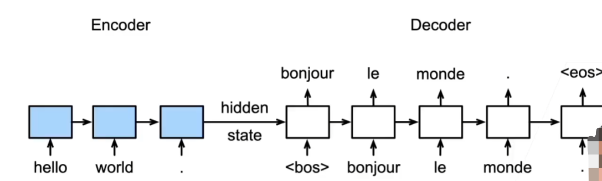

推理示意图(推理时没有明确的input-target)：


## Transfomer

### 一、注意力机制

1.必要性
依据上述以RNN为基本单元的seq2seq模型，神经网络需要能够将源语句的所有必要信息压缩成一个固定长度的向量（hidden state）。这可能会使神经网络难以处理长句，尤其是那些比训练语料库中的句子长的的长句，由此到了一个信息瓶颈问题。

2.原理
不再仅仅依赖唯一一个中间向量，注意力机制通过计算每一步的隐藏向量与输入向量之间的相关性，来为每个输入向量分配一个权重。这个权重反映了该输入在当前上下文中的重要性。
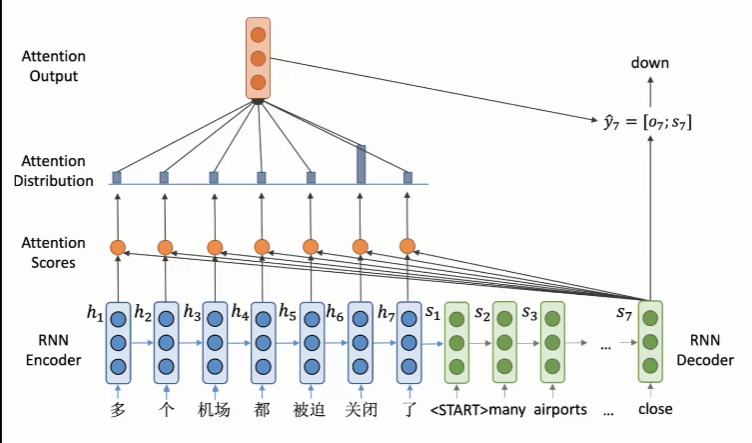
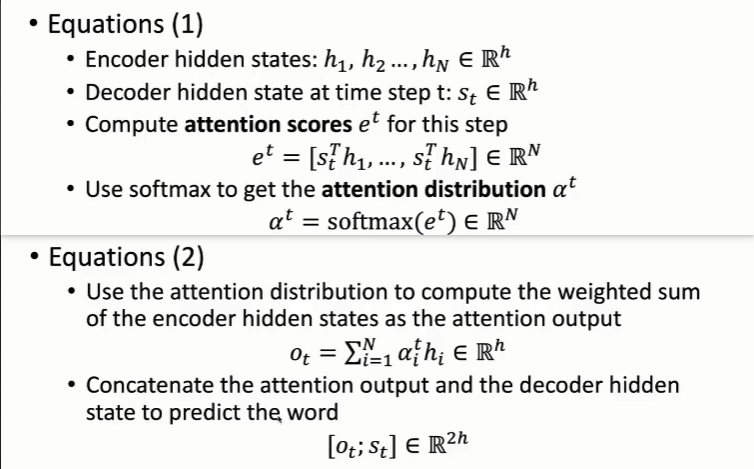

### 二、自注意力机制

1.必要性
加入了注意力机制的seq2seq结构，在时间上仍然是一个串行结构（本质上还是RNN单元），对于并行能力强大的GPU等设备来说，并不友好。（对于循环神经网络来说，由于下一步的计算依赖上一步的输出的隐含状态，前后的计算有相互依赖关系）亟待需要一个能够并行计算的高效结构，由此，自注意力机制应运而生。自注意力机制的计算涉及序列中某一个输入相对于其他所有输入之间的联系，在计算中并没有先后顺序之分，很容易进行并行计算。

2.原理
序列中的每一个向量都可以并行的独自的完成属于自己的Q、K、V的计算，此步计算不需要依赖其他时间步的信息。完成此步之后，可以并行计算每个向量与其他所有向量的注意力分数，并且得到最终的加权平均。
下图为自注意力机制的计算流程：
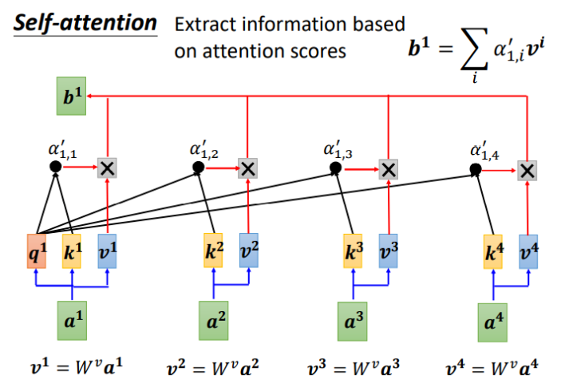

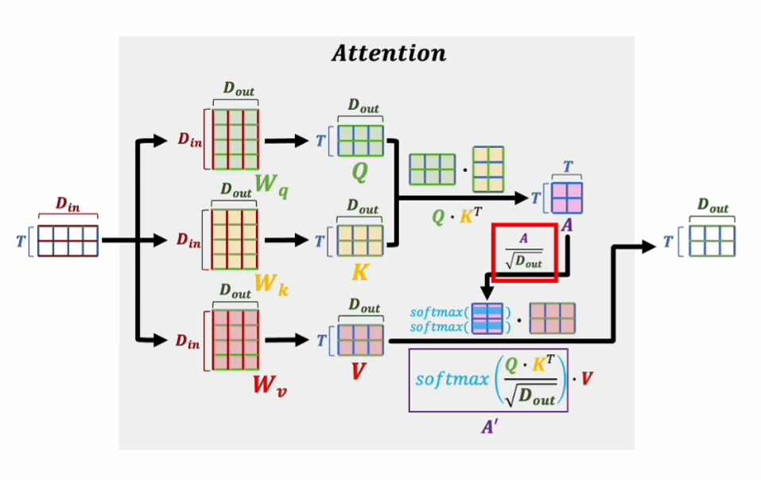

下图为自注意力机制的计算公式：
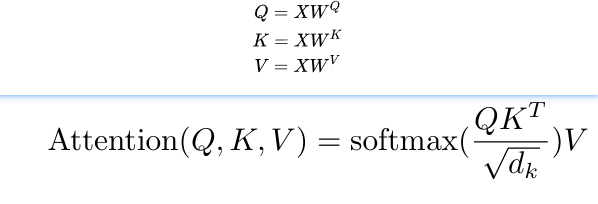

下面网址是动态演变：
https://percent4.github.io/NLP%EF%BC%88%E4%BA%8C%E5%8D%81%E4%B9%9D%EF%BC%89%E4%B8%80%E6%AD%A5%E4%B8%80%E6%AD%A5%EF%BC%8C%E7%90%86%E8%A7%A3Self-Attention/

3.多头注意力——Multihead Attention
使用多个注意力矩阵和多个权重对输入值进行加权平均，最后对加权平均的结果进行拼接。
其与自注意力机制的对比如下图：
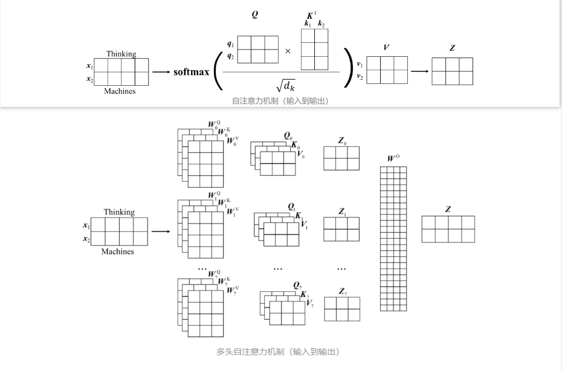

4.掩码注意力——Masked Self-attention
由于自注意力摒弃了前后时间步的依赖关系，需要同时输入所有的向量，统一进行所有向量注意力间的计算，此时产生一个问题，在一个语句中，前面的单词不应该受到后面的单词影响，需要去掉这个注意力。由此，产生了掩码注意力。**Decoder 做 Mask，是为了让训练阶段和测试阶段行为一致，不会出现间隙，不给模型看到未来的信息，避免过拟合。**
按照论文原作者的说法是：This masking ensures that the predictions for position $i$ can depend only on the known outputs at positions less than $i$.
下图为应用mask之后的注意力分数的变化：

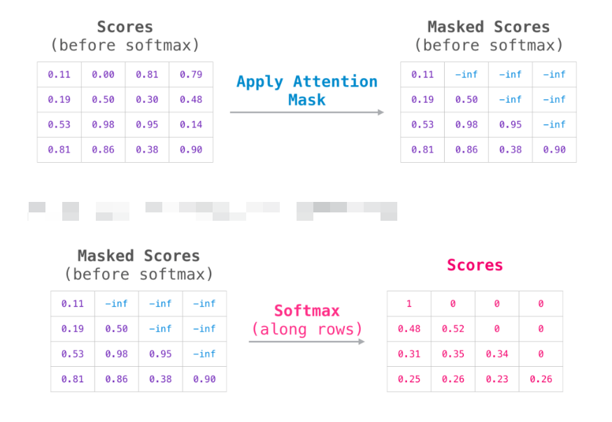

### 三、Transformer（即使用自注意力机制构建的Seq2Seq模型）
1.位置编码positional coding
以attention为核心的Transformer，缺少RNN所固有的序列位置信息，因此引进位置编码，Positional Encoding就是将位置信息添加（嵌入）到Embedding词向量中，让Transformer保留词向量的位置信息。
其计算过程如下：
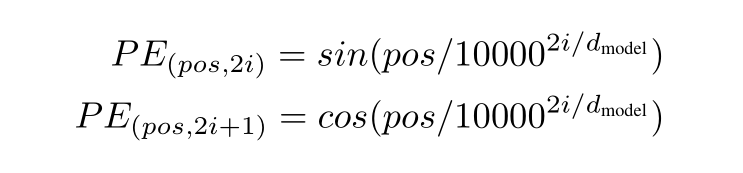
其中，$pos$为当前单词在序列(长为L)中的位置，$pos$=$0,1,…,L-1$，$i$为该单词的位置向量的当前维度，$i=0,1,...,d/2$。i取偶数与奇数时分别用正弦与余弦函数。

以以下语句为例，**Laughter is the antidote to life.**
当计算antidote的位置编码时，$pos=3$，$i$从0到512（假设嵌入向量维度为d=512）,分别计算；其他位置单词同理；**且不同句子的相同位置的位置编码是一致的，因此只需要计算一次。**

示例代码如下：
```python
class PositionalEncoding(nn.Module):
    def __init__(self, d_model, dropout=0.1, max_len=5000):
        super(PositionalEncoding, self).__init__()
        self.dropout = nn.Dropout(p=dropout)
        pos_table = np.array([
            [pos / np.power(10000, 2 * i / d_model) for i in range(d_model)]
            if pos != 0 else np.zeros(d_model) for pos in range(max_len)])
        pos_table[1:, 0::2] = np.sin(pos_table[1:, 0::2])           # 字嵌入维度为偶数时
        pos_table[1:, 1::2] = np.cos(pos_table[1:, 1::2])           # 字嵌入维度为奇数时
        self.pos_table = torch.FloatTensor(pos_table).cuda()        # enc_inputs: [seq_len, d_model]

    def forward(self, enc_inputs):                                  # enc_inputs: [batch_size, seq_len, d_model]
        enc_inputs += self.pos_table[:enc_inputs.size(1), :]
        return self.dropout(enc_inputs.cuda())
```

## 随笔

0.Language Model -> Neural Language Model
前者采用的是N-Gram，每个单词是一个独立的符号；后者采用Word Embedding，每个单词映射为一个词向量。
~~1.word2vec 不同的目标任务中所得到的word2vec是不同的，具有特定性；在训练该目标任务的模型中，最终会得到一个模型以及针对于该模型的单词映射矩阵（反复训练迭代而来），此矩阵即为最终的embedding matrix。~~
2.一般的神经网络训练过程是要得到一个模型，该模型可以完成某个任务，输入经过模型之后得到输出。而word2vec的训练过程是为了得到一个嵌入矩阵embedding matrix，通过该矩阵，可以得到一个输入单词的词向量，有了该词向量，才可以应用于其他神经网络任务。
3.word2vec两种训练思路：CBOW(连续词袋模型)和Skip-Gram。CBOW是根据前后的TOKEN来推断中间的TOKEN，skip是根据给定的TOKEN来推断前后的TOKEN。


4.负例采样与分层softmax解决词表过大的问题。
