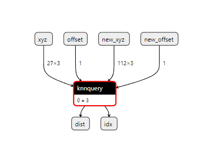
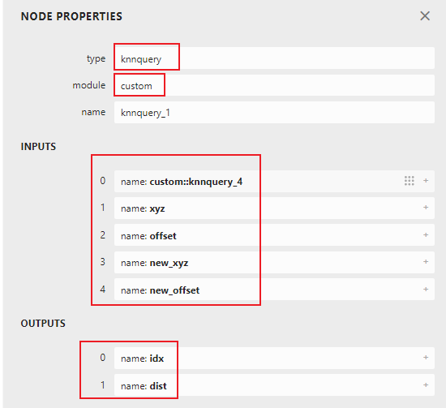

# 一、模型部署之自定义PyTorch算子

## （一）概述

有些时候，PyTorch的官方算子并不能满足我们的需要，这时候，我们需要自己实现某个函数，为PyTorch添加新的算子，进而达到我们的要求。例如在三维点云处理中常用的到的KNNQuery，用于将完整的点云分离出一簇簇点云，由此建立离散点云之间的邻居关系（也是一种拓扑关系）。本案例使用简单函数add作为解释示例，使用KNNQuery作为复杂示例。

## （二）自定义PyTorch算子步骤————为PyTorch添加C++扩展，用torch.autograd.Function做封装

### 1.在C++中实现自定义函数

my_add.cpp

```c
/*
@Author     :   jiguotong
@Contact    :   1776220977@qq.com
@site       :   
-----------------------------------------------
@Time       :   2024/5/15
@Description:   模型部署系统学习：定义C++函数，开放为python接口
*/
#include <pybind11/pybind11.h>
#include <torch/torch.h>

torch::Tensor my_add(torch::Tensor a, torch::Tensor b) 
{ 
    return 2 * a + b; 
} 

PYBIND11_MODULE(my_lib, m) 
{ 
    m.doc() = "pybind11 example plugin"; // optional module docstring
    m.def("my_add", my_add); 
} 
```

### 2.在python中将以上函数打包为可被python程序使用的包

setup.py

```python
"""""
@Author     :   jiguotong
@Contact    :   1776220977@qq.com
@site       :   
-----------------------------------------------
@Time       :   2024/5/14
@Description:   模型部署系统学习：在python环境中安装c++的模块
""" ""
from setuptools import setup
from torch.utils import cpp_extension

setup(name='my_add',
      ext_modules=[
          cpp_extension.CppExtension(name='my_lib', sources=['my_add.cpp'])
      ],
      cmdclass={'build_ext': cpp_extension.BuildExtension})
```

且使用如下命令进行打包：
``python setup.py develop``

### 3.使用torch.autograd.Function对自定义算子做封装

```python
"""""
@Author     :   jiguotong
@Contact    :   1776220977@qq.com
@site       :   
-----------------------------------------------
@Time       :   2024/5/14
@Description:   模型部署系统学习：测试由C++转到python的模块函数调用
""" ""
import torch 
import my_lib 
class MyAddFunction(torch.autograd.Function): 
 
    @staticmethod 
    def forward(ctx, a, b): 
        return my_lib.my_add(a, b)
  
add_function = MyAddFunction.apply
```

## （三）参考资料
1.模型部署系列教程：
https://zhuanlan.zhihu.com/p/498425043
https://www.bilibili.com/video/BV1Xw411f7FW?p=3&vd_source=1d204308936e108c95b2ecb8fcdbd781

2.torch.onnx.export导出时，若输入为字典，如何处理
https://blog.csdn.net/Dteam_f/article/details/122487634?spm=1001.2014.3001.5502

3.torch.jit.trace与torch.jit.script区别
https://zhuanlan.zhihu.com/p/662754635

4.torch.onnx算子符号文件
https://github.com/pytorch/pytorch/blob/v2.3.0/torch/onnx/symbolic_opset9.py

5.
ONNX官网API文档：https://onnxruntime.ai/docs/api/c/index.html
TensorRT官网API文档：https://docs.nvidia.com/deeplearning/tensorrt/api/c_api/annotated.html
onnx->tensorrt示例(动态输入输出)：https://blog.csdn.net/qq_40243750/article/details/136935985

# 二、模型部署之注册onnx算子

## （一）概述

如果我们在PyTorch环境下可以顺利推理某个网络结构，并不意味着可以顺利导出onnx模型，因为onnx有自己的算子框架，PyTorch也有自己的算子框架，如果要想将torch模型转变为onnx模型，需要对网络结构中所使用到的算子一一映射为onnx中已有的算子。如果在已有的onnx版本中缺少某个对torch算子的映射，则会转换失败。

## （二）为PyTorch注册为onnx算子，建立映射关系

### 1.为已有的torch::aten算子与已有的onnx算子建立映射关系

```python
from torch.onnx import register_custom_op_symbolic
from torch.onnx.symbolic_helper import parse_args

@parse_args("v")
def asinh_symbolic(g, input, *, out=None): 
    return g.op("Asinh", input) 

register_op('asinh', asinh_symbolic, '', 9)  

# 其中，Asinh为onnx算子文档中定义的算子名称，而asinh是torch::aten中定义的算子名称，本操作的根本目的是将torch算子映射为onnx算子，即建立二者的映射关系。

```

### 2.为torch插件中的算子注册为自定义onnx算子————以torch_cluster::grid算子为例

```python
from torch.onnx import register_custom_op_symbolic
from torch.onnx.symbolic_helper import parse_args

@parse_args("v", "v", "v", "v")
def torch_cluster_grid_symbolic(g, pos, size, start, end):
    if torch.onnx.symbolic_helper._is_none(end):
        return g.op("custom::torch_cluster_grid", pos, size, start)
    return g.op("custom::torch_cluster_grid", pos, size, start, end)

register_custom_op_symbolic("torch_cluster::grid", torch_cluster_grid_symbolic, 9)

# 其中，custom::torch_cluster_grid为自定义onnx算子的名称，torch_cluster::grid为torch插件cluster中已经实现的算子。
```

### 3.为由torch.autograd.Function封装的函数注册为自定义onnx算子————以KNNQuery为例

```python
class KNNQuery(Function):
    @staticmethod
    def forward(ctx, nsample, xyz, offset, new_xyz=None, new_offset=None):
        """
        input: coords: (n, 3), new_xyz: (m, 3), offset: (b), new_offset: (b)
        output: idx: (m, nsample) -1 is placeholder, dist2: (m, nsample)
        """
        if new_xyz is None or new_offset is None:
            new_xyz = xyz
            new_offset = offset
        assert xyz.is_contiguous() and new_xyz.is_contiguous()
        m = new_xyz.shape[0]
        idx = torch.cuda.IntTensor(m, nsample).zero_()              # 接受计算后的数据——索引
        dist2 = torch.cuda.FloatTensor(m, nsample).zero_()          # 接受计算后的数据——距离
        knn_query_cuda(
            m, nsample, xyz, new_xyz, offset.int(), new_offset.int(), idx, dist2
        )
        return idx, torch.sqrt(dist2)

    @staticmethod
    def symbolic(g: torch._C.Graph, nsample: int, xyz: torch._C.Value, offset: torch._C.Value, 
                 new_xyz: torch._C.Value=None, new_offset: torch._C.Value=None)-> torch._C.Value:
        nsample = g.op("Constant", value_t=torch.tensor(nsample))
        if new_xyz is None or new_offset is None:
            return g.op("custom::knnquery", nsample, xyz, offset, outputs=2)        # g.op的个数必须要与forward中的对应

        else:
            return g.op("custom::knnquery", nsample, xyz, offset, new_xyz, new_offset, outputs=2)

# 注意事项：
# 1.非tensor类型要先转为tensor类型，例如类型为int的nsample，需要转换
# 2.outputs=?标记该自定义onnx算子有多少个输出

```

## （三）onnx算子可视化




# 三、模型部署之在onnxruntime平台实现onnx算子

## （一）概述
成功自定义onnx算子继而导出onnx模型之后，我们可以在Netron上查看该onnx的可视化结构。当我们想要使用此onnx模型进行推理时，这些自定义算子不一定会在推理平台上实现，此时需要在该推理平台上自定义算子实现过程。
## （二）在onnxruntime平台上实现onnx算子
custom_op.h
```c
// 定义定制算子的核
struct MyCustomKernel {
    MyCustomKernel(Ort::CustomOpApi ort, const OrtKernelInfo* /*info*/, void* compute_stream)
        : ort_(ort), compute_stream_(compute_stream) {
    }

    void Compute(OrtKernelContext* context);

private:
    Ort::CustomOpApi ort_;
    void* compute_stream_;
};

// 定义定制算子的各种操作，各个成员函数均已实现，其中 CreateKernel 会返回前面定义的算子核对象
struct MyCustomOp : Ort::CustomOpBase<MyCustomOp, MyCustomKernel> {
    explicit MyCustomOp(const char* provider, void* compute_stream) : provider_(provider), compute_stream_(compute_stream) {}

    void* CreateKernel(Ort::CustomOpApi api, const OrtKernelInfo* info) const { 
        return new MyCustomKernel(api, info, compute_stream_); 
    };

    const char* GetName() const { return "Foo"; };
    const char* GetExecutionProviderType() const { return provider_; };

    // 获取输入个数
    size_t GetInputTypeCount() const { return 2; };
    ONNXTensorElementDataType GetInputType(size_t /*index*/) const {
        // Both the inputs need to be necessarily of float type
        return ONNX_TENSOR_ELEMENT_DATA_TYPE_FLOAT;
    };

    // 获取输出个数
    size_t GetOutputTypeCount() const { return 1; };
    ONNXTensorElementDataType GetOutputType(size_t /*index*/) const {
        return ONNX_TENSOR_ELEMENT_DATA_TYPE_FLOAT;
    };

private:
    const char* provider_;
    void* compute_stream_;
};
```

custom_op.cpp
```c
void MyCustomKernel::Compute(OrtKernelContext* context) {
    // Setup inputs
    const OrtValue* input_X = ort_.KernelContext_GetInput(context, 0);
    const OrtValue* input_Y = ort_.KernelContext_GetInput(context, 1);
    const float* X = ort_.GetTensorData<float>(input_X);
    const float* Y = ort_.GetTensorData<float>(input_Y);

    // Setup output
    OrtTensorDimensions dimensions(ort_, input_X);
    OrtValue* output = ort_.KernelContext_GetOutput(context, 0, dimensions.data(), dimensions.size());
    float* out = ort_.GetTensorMutableData<float>(output);

    OrtTensorTypeAndShapeInfo* output_info = ort_.GetTensorTypeAndShape(output);
    int64_t size = ort_.GetTensorShapeElementCount(output_info);
    ort_.ReleaseTensorTypeAndShapeInfo(output_info);

    // Do computation
#ifdef USE_CUDA
  // Launch on stream 0 or user provided stream
    cuda_add(size, out, X, Y, compute_stream_ == nullptr ? 0 : reinterpret_cast<cudaStream_t>(compute_stream_));
#else
    ORT_UNUSED_PARAMETER(compute_stream_);
    for (int64_t i = 0; i < size; i++) {
        out[i] = X[i] + Y[i];
    }
#endif
}
```

test.cpp 仅选取核心部分，其他推理代码跟普通onnx模型推理一致
```c
MyCustomOp_knnquery custom_op{ onnxruntime::kCpuExecutionProvider, nullptr };
Ort::CustomOpDomain custom_op_domain("custom");             // 添加自定义域
custom_op_domain.Add(&custom_op);                           // 添加自定义算子

session_options.Add(custom_op_domain);                      //
```

## （三）特殊情况说明
### 1.若多个输入或输出有不同的数据类型，该如何定义？
自定义算子中，定义输入时采用如下操作，利用index做判断：
```c
// 获取输入个数
size_t GetInputTypeCount() const { return 2; };
ONNXTensorElementDataType GetInputType(size_t index) const {
    if(index == 0)
        return ONNX_TENSOR_ELEMENT_DATA_TYPE_FLOAT;
    else if(index == 1)
        return ONNX_TENSOR_ELEMENT_DATA_TYPE_INT64;
    else
        return ONNX_TENSOR_ELEMENT_DATA_TYPE_INT8;
};
```

### 2.若是onnx算子包含可选择输入（可有可无），改如何定义？
自定义算子中，定义输入时采用如下操作，利用index做判断：
```c
OrtCustomOpInputOutputCharacteristic GetInputCharacteristic(size_t index) const {
    if (index == 2 || index == 3)
        return OrtCustomOpInputOutputCharacteristic::INPUT_OUTPUT_OPTIONAL;

    return OrtCustomOpInputOutputCharacteristic::INPUT_OUTPUT_REQUIRED;
}
```

## （四）参考资料
1.【推理引擎】如何在 ONNXRuntime 中添加新的算子
https://www.cnblogs.com/xxxxxxxxx/p/16078427.html

2.onnxruntime如何自定义算子以及进行推理官方案例
https://github.com/microsoft/onnxruntime/blob/main/onnxruntime/test/shared_lib/custom_op_utils.cc
https://github.com/microsoft/onnxruntime/blob/main/onnxruntime/test/shared_lib/custom_op_utils.h
https://github.com/microsoft/onnxruntime/blob/main/onnxruntime/test/shared_lib/test_inference.cc

3.自定义算子demo的模型foo_1下载
https://github.com/microsoft/onnxruntime/blob/v1.11.1/onnxruntime/test/testdata/foo_1.onnx

4.Windows10 编译onnxruntime
https://blog.csdn.net/weixin_43937959/article/details/123209629 