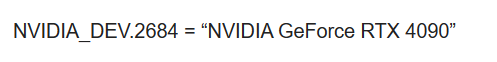
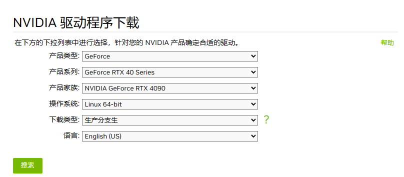
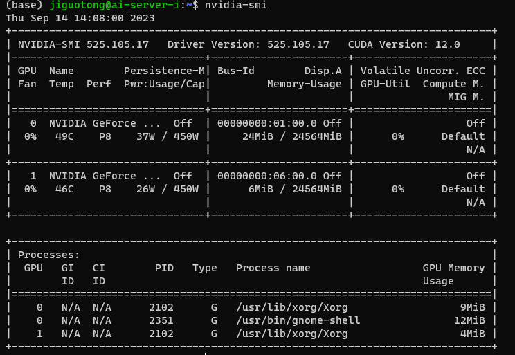
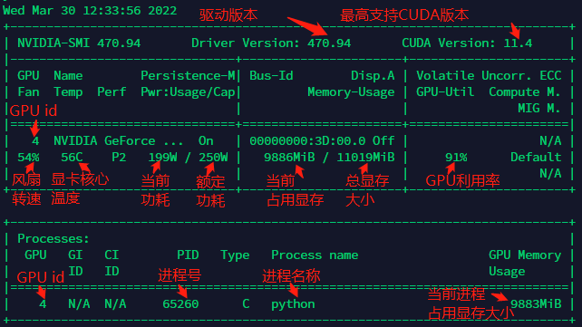
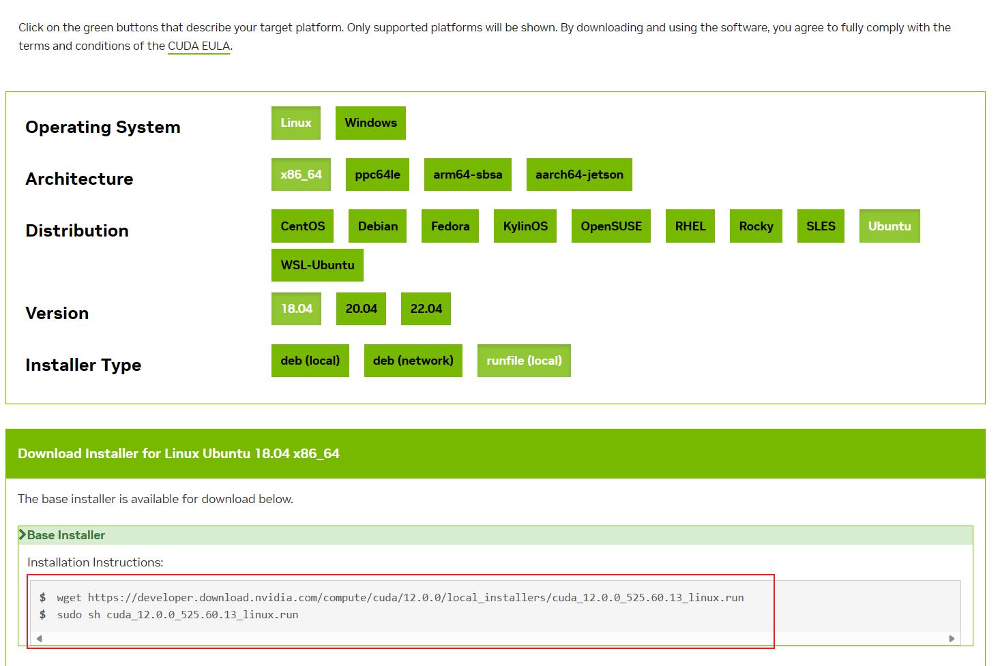
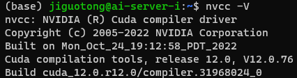

# 一、显卡、显卡驱动、CUDA、cuda toolkit、cudnn、nvcc一览

## （一）显卡

显卡（Video card，Graphics card）全称显示接口卡，又称显示适配器，是计算机最基本配置、最重要的配件之一。显卡作为电脑主机里的一个重要组成部分，是电脑进行数模信号转换的设备，承担输出显示图形的任务。显卡接在电脑主板上，它将电脑的数字信号转换成模拟信号让显示器显示出来，同时显卡还是有图像处理能力，可协助CPU工作，提高整体的运行速度。对于从事专业图形设计的人来说显卡非常重要。 民用和军用显卡图形芯片供应商主要包括AMD(超微半导体)和Nvidia(英伟达)2家。现在的top500计算机，都包含显卡计算核心。在科学计算中，显卡被称为显示加速卡。

查看显卡型号命令：sudo lshw -C display
可以获得显卡ID号，通过查找ID号获取显卡型号



## （二）显卡驱动

显卡驱动是操作系统与显卡之间的软件接口，用于管理和控制显卡的功能和性能。它提供了操作系统与显卡之间的通信桥梁，使操作系统能够正确地识别和与显卡进行交互。
英伟达驱动下载地址：https://www.nvidia.cn/Download/index.aspx?lang=cn

如下图所示，输入显卡型号，可以搜索驱动程序，然后点击下载



下载完之后进行安装
``sh NVIDIA-Linux-x86_64-535.104.05.run  --no-opengl-files``

检验是否成功安装
``nvidia-smi``





由此可以看到此驱动程序支持的最大CUDA是12.0

## (三)CUDA

CUDA（Compute Unified Device Architecture）是由NVIDIA开发的一种并行计算平台和编程模型。它允许开发者利用NVIDIA的GPU来进行通用计算，而不仅仅是图形渲染。通过CUDA，开发者可以使用常规的C/C++编程语言编写并行计算程序，并通过GPU的并行计算能力加速其执行。CUDA提供了一套API和工具，使开发者能够更轻松地利用GPU的超大规模并行计算能力，从而加速诸如科学计算、深度学习、图形处理等计算密集型任务。

## （四）CUDA Toolkit

CUDA Toolkit（Compute Unified Device Architecture工具包）是由NVIDIA开发的一套用于GPU编程和加速计算的软件开发工具。它提供了一系列的库、编译器、调试器和工具，使开发者可以使用CUDA编程模型在NVIDIA GPU上进行并行计算和加速应用程序。

[查看CUDA Toolkit与显卡驱动程序的版本对应关系](https://docs.nvidia.com/cuda/cuda-toolkit-release-notes/index.html#major-components)

选择显卡驱动程序允许的cuda toolkit下载，以上文提到的驱动版本525.105.17为例，可以下载CUDA 12.2.x及以下的版本，此处下载CUDA 12.0.0

[下载地址](https://developer.nvidia.com/cuda-toolkit-archive)

选好各种平台，推荐使用runfile下载。



注意：在安装 cuda toolkit 的时候，若已经安装过驱动，可以跳过驱动的安装。

下载完毕之后，配置环境变量

```bash
vim ~/.bashrc
# 末尾添加以下内容
export PATH=$PATH:/usr/local/cuda/bin
export LD_LIBRARY_PATH=$LD_LIBRARY_PATH:/usr/local/cuda/lib64
export CUDA_HOME=$CUDA_HOME:/usr/local/cuda
export LIBRARY_PATH=$LIBRARY_PATH:/usr/local/cuda/lib64
source ~/.bashrc
```

使用以下命令查看CUDA安装情况。
``nvcc -V``



切换CUDA版本，当电脑中同时存在多个cuda版本时，可以利用以下方式切换cuda版本：

```bash
rm -rf /usr/local/cuda#删除之前创建的软链接
sudo ln -s /usr/local/cuda-11.0/ /usr/local/cuda/
nvcc --version #查看当前 cuda 版本
```

## （五）cudnn

https://blog.csdn.net/qq_28087491/article/details/132635794


## (十)其他问题汇总
1.解决ImportError: /usr/lib/x86_64-linux-gnu/libstdc++.so.6: version `GLIBCXX_3.4.29' not found
https://blog.csdn.net/p942005405/article/details/123540807