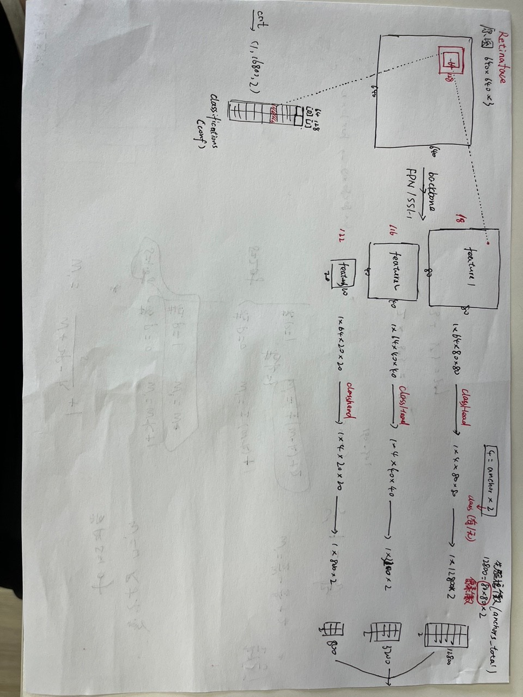

# 二、目标检测

## (一)Retinaface

[retinaface-pytorch源码Github](https://github.com/biubug6/Pytorch_Retinaface)

[pytorch搭建retinaface bilibili](https://github.com/biubug6/Pytorch_Retinaface)

[pytorch搭建retianface csdn](Pytorch搭建Retinaface人脸检测与关键点定位平台)

[retinaface算法精讲bilibili](https://www.bilibili.com/video/BV1dj411F7cQ/?spm_id_from=333.337.search-card.all.click&vd_source=1d204308936e108c95b2ecb8fcdbd781)

### 1.过程解析

（1）对原图进行特征提取 conf、loc、landm，每一个特征都与原图的所有先验框有对应关系。其中conf代表此中心点对应的预测框内有没有目标；loc代表此中心点对应的预测框应该进行的偏移Δcx、Δcy、Δw、Δh；landm代表此中心点对应的预测框内五个关键点的相对坐标。loc是重点。

（2）对loc、landm与先验框prior进行解码decode，获得bbox

（3）依据conf计算scores，从而筛选掉置信度低的索引， 根据scores对loc、landm进行相同操作

（4）对剩下的loc、landm进行排序，此时剩下的都是合格的bbox

（5）以上的bbox可能存在重叠问题，采用非极大值抑制NMS去除掉重复率较高的部分bbox，保留下来的，即为最终bbox。

## (二)facenet

[facenet-pytorch源码Github](https://github.com/timesler/facenet-pytorch)

[pytorch搭建facenet bilibili](https://www.bilibili.com/video/BV1E64y1C7V8/?spm_id_from=333.337.search-card.all.click&vd_source=1d204308936e108c95b2ecb8fcdbd781)

[pytorch搭建retianface csdn](https://blog.csdn.net/weixin_44791964/article/details/108220265)

### 1.过程解析
（1）对数据图片进行预处理（归一化，转换通道顺序，扩张维度），送进网络
（2）facenet先利用深度可分离卷积提取特征向量，后经过全局平均池化是的尺寸变成1x1，通道为1024，再经过全连接层变成128通道。
（3）对以上128维向量进行L2范数标准化，得到最终预测结果。

