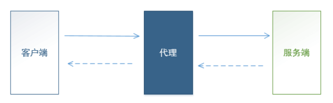
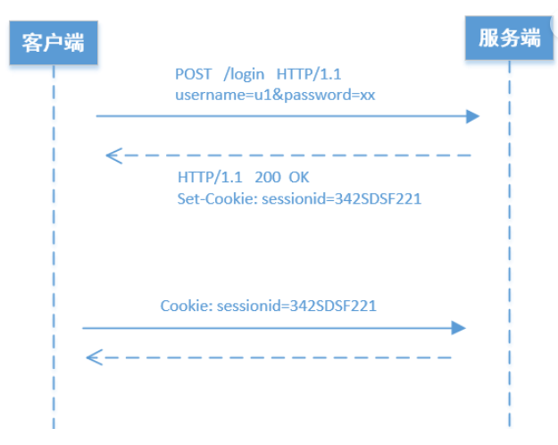

# 一、自动化测试基础知识
⭐http请求组成：
请求行
请求头
请求体
⭐响应消息组成
状态行
响应头
消息体

## (一)requests使用教程

requests库作用：用来发送HTTP请求，接受HTTP响应
用法举例：

```python
import requests

response = requests.get('http://www.baidu.com/')
```

## (二)http和https的区别
https://blog.csdn.net/ITCSDN_/article/details/109362411


## (三)抓包工具fiddler
fiddler是代理式抓包，fiddler启动后，会启动一个代理服务器，监听在8888端口上，http客户端需要设置fiddler作为代理，把http消息发送给fiddler，fiddler再转发http消息给服务端；服务端返回消息也是先返回给fiddler，再由fiddler转发给客户端。


### 1.fiddler使用教程
1.设置过滤器Filter，Filter->use Filters->show only the following Hosts填入目标主机的域名，例如*.baidu.com;127.0.0.1;
2.在浏览器中访问相应网站
3.在fiddler中，在Inspector中查看抓到的包（请求与响应）的详细信息

### 2.如何在python中使用requests库的时候设置fiddler代理
```python
import requests

proxies = {
  'http': 'http://127.0.0.1:8888',
  'https': 'http://127.0.0.1:8888',
}

response = requests.get('http://www.baidu.com/', proxies=proxies)
```

# 二、基于Requests库的测试脚本开发
## (一)构建API请求

### 1.URL参数

⭐什么是url：Uniform Resource Locator,统一资源定位器）。它是www的统一资源定位标志，简单地说URL就是web地址，俗称“网址”。例如https://www.baidu.com/s?wd=iphone&rsv_spt=1

?后面的即为参数，使用Requests发送HTTP请求，url里面的参数，通常可以直接写在url里面。
若是url参数里面有些特殊字符，可以将参数放到一个字典里面

```python
import requests

params = {
    'wd':'iphone&ipad',
    'rsv_spt':'1'
}

response = requests.get('http://www.baidu.com',params=params)

```

### 2.构建消息头
需要自定义消息头的时候，将消息头以键值对的格式存放在字典中即可。
```python
import requests

headers = {
    'wd':'iphone&ipad',
    'rsv_spt':'1'
}

response = requests.get('http://www.baidu.com',headers=headers)
```

### 3.构建消息体
Web API接口中，消息体基本都是文本，文本的格式主要是这3种： urlencoded ，json ， XML。

Requests库的post方法，参数data指明了，消息体中的数据是什么。注意，若发送的是字符串，需要进行编码，默认编码是latin-1，但是此种编码方式不支持中文，中文一般都用utf8进行编码。

1.xml格式
xml是可扩展标记语言的意思。xml可扩展标记语言，是一种简单的数据存储语言。使用一系列简单的标记描述数据，而这些标记可以用方便的方式建立，虽然可扩展标记语言占用的空间比二进制数据要占用更多的空间，但可扩展标记语言极其简单易于掌握和使用。使用xml格式作为消息体示例如下：
```python
import requests

payload = '''
<?xml version="1.0" encoding="UTF-8"?>
<WorkReport>
    <Overall>良好</Overall>
    <Progress>30%</Progress>
    <Problems>暂无</Problems>
</WorkReport>
'''

r = requests.post("http://httpbin.org/post",
                  data=payload.encode('utf8'))
print(r.text)
```
2.urlencoded格式
这种格式的消息体就是一种 键值对的格式存放数据，如下所示
``key1=value1&key2=value2``
可以填入一个字典中作为消息体。
使用urlencoded格式作为消息体示例如下：
```python
import requests

payload = {'key1': 'value1', 'key2': 'value2'}

r = requests.post("http://httpbin.org/post",
                  data=payload)
print(r.text)
```

3.json格式
json是一种轻量级的数据交换格式，是一个对象和集合的嵌套，类似于python的字典，比xml更加简洁、清晰， 所以程序处理起来效率也更高。
可以使用json库的dumps方法构建一个json格式的字符串，示例如下：
```python
import requests, json

# payload是一个字典，并不是一个json，json是一个字符串
payload = {
    "Overall":"良好",
    "Progress":"30%",
    "Problems":[
        {
            "No" : 1,
            "desc": "问题1...."
        },
        {
            "No" : 2,
            "desc": "问题2...."
        },
    ]
}

r = requests.post("http://httpbin.org/post", data=json.dumps(payload))
```

## (二)处理API响应消息
```python
import requests

payload = {'key1': 'value1', 'key2': 'value2'}

r = requests.post("http://httpbin.org/post",
                  data=payload)
print(r.status_code)                  
print(r.text)

# 要获取响应的消息体的文本内容，直接通过response对象 的 text 属性即可获取
# requests 会根据响应消息头（比如 Content-Type）对编码格式做推测，从而将消息体中的字符串解码为字符串
print(r.encoding)
print(r.text)
# 但是可能会预测不准，因此可以指定编码方式
r.encoding = 'utf8'
print(r.text)


# 如果我们要直接获取消息体中的字节串内容，可以使用 content 属性
print(r.content)

# 为了 方便处理 响应消息中json 格式的数据 ，我们通常应该把 json 格式的字符串 转化为 python 中的数据对象——字典。
print(json.loads(r.content.decode('utf8')))
print(type(json.loads(r.content.decode('utf8'))))   # <class 'dict'>
## 前提是知道返回消息是json格式，若是其他格式，则loads的时候就会报错！！！

# 或者可以用requests库提供的json方法
print(r.json()) # 此种方法和上述方法结果一致，也是content的内容
```

## (三)session机制
用户使用客户端登录，服务端进行验证（比如验证用户名、密码）；验证通过后，服务端系统就会为这次登录创建一个session。同时创建一个唯一的sessionid（就是一个字符串），标志这个session。


从上图可以看出， 服务端是通过 HTTP的响应头 Set-Cookie 把产生的 sessionid 告诉客户端的。
客户端的后续请求，是通过 HTTP的请求头 Cookie 告诉服务端它所持有的sessionid的，后续访问该网站，必须在 HTTP的请求头 Cookie 中携带保存的所有cookie数据。

requests库有session的专门使用方法，requests库自动帮我们保存服务端返回的cookie数据， HTTP请求自动 在消息头中放入 cookie 数据。示例如下：（搭配fiddler查看请求/响应消息）
```python
import requests

# 打印HTTP响应消息的函数
def printResponse(response):
    print('\n\n-------- HTTP response * begin -------')
    print(response.status_code)

    for k, v in response.headers.items():
        print(f'{k}: {v}')

    print('')

    print(response.content.decode('utf8'))
    print('-------- HTTP response * end -------\n\n')


# 创建 Session 对象
session = requests.Session()

# 通过 Session 对象 发送请求
response = session.post("http://127.0.0.1/api/mgr/signin",
       data={
           'username': 'byhy',
           'password': '88888888'
       })

printResponse(response)

# 通过 Session 对象 发送请求
response = session.get("http://127.0.0.1/api/mgr/customers",
      params={
          'action'    :  'list_customer',
          'pagesize'  :  10,
          'pagenum'   :  1,
          'keywords'  :  '',
      })

printResponse(response)
```


## xx、示例测试系统——白月黑羽

学习教程：https://www.byhy.net/tut/auto/apitest/01/
B站视频教程：https://www.bilibili.com/video/av68746921/?p=1&vd_source=1d204308936e108c95b2ecb8fcdbd781
API接口文档 https://www.byhy.net/tut/webdev/django/doc_api_v1_0/
